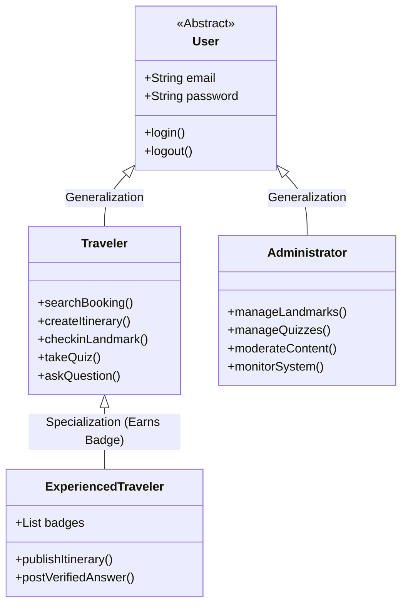

# 01. System Actors & Use Case Catalog

## Nomadix — All-in-one Smart Travel Platform
**Final Year Project (FYP) — University of Greenwich**  
**Student:** Nguyễn Văn Đức  
**Standard:** UML 2.5 Use Case Modeling  
**Phase:** Day 3 — Use Case Analysis  
**Milestone:** `D3 - Use Case Analysis` / `W1 - Requirements & Analysis`  

---

## 1. DANH MỤC CÁC TÁC NHÂN HỆ THỐNG (SYSTEM ACTORS)

Hệ thống **Nomadix** định nghĩa **4 nhóm tác nhân (Actors)** bao gồm người dùng thực tế và các hệ thống dịch vụ bên ngoài:

```text
┌────────────────────────────────────────────────────────────────────────┐
│                        NOMADIX SYSTEM ACTORS                           │
├───────────────────────┬────────────────────────────────────────────────┤
│ Actor                 │ Phân loại & Trách nhiệm chính                  │
├───────────────────────┼────────────────────────────────────────────────┤
│ 1. Traveler           │ Primary User (Người dùng du lịch tự túc)       │
│ 2. Trip Companion     │ Collaborative User (Thành viên nhóm du lịch)   │
│ 3. Experienced User   │ Specialized User (Du khách có Huy hiệu Đã đến) │
│ 4. Administrator      │ System Operator (Quản trị viên & Kiểm duyệt)   │
│ 5. External System    │ Secondary System (Google Maps, Cloudinary, API)│
└───────────────────────┴────────────────────────────────────────────────┘
```

---

### 1.1 Tác Nhân 1: `Traveler` (Người Dùng Du Lịch Tự Túc)
* **Loại tác nhân:** Primary Human Actor.
* **Mô tả:** Đối tượng người dùng chính của ứng dụng, thực hiện toàn bộ vòng đời du lịch:
  * Đăng ký, đăng nhập và quản lý hồ sơ cá nhân.
  * Tìm kiếm, so sánh và lọc vé máy bay, khách sạn từ nhiều nguồn.
  * Lập kế hoạch chuyến đi nhiều ngày, kéo-thả sắp xếp địa điểm và xem lộ trình bản đồ.
  * Di chuyển thực tế, quét GPS Geofence tại địa danh và chụp ảnh check-in.
  * Làm bài trắc nghiệm văn hóa (Cultural Quiz) và tích lũy điểm kinh nghiệm (XP).
  * Đặt câu hỏi và tham gia thảo luận trên Diễn đàn Hỏi đáp.

---

### 1.2 Tác Nhân 2: `Experienced Traveler` (Du Khách Đã Được Xác Thực)
* **Loại tác nhân:** Specialized Human Actor (Kế thừa từ `Traveler`).
* **Mô tả:** Người dùng đã hoàn thành các tiêu chuẩn khám phá tại một thành phố (Check-in $\ge 3$ địa danh + Đạt Quiz) và được cấp **Huy hiệu Thành phố (City Badge)**:
  * Xuất bản lịch trình du lịch cá nhân thành công khai (Public Itinerary) cho người khác tham khảo.
  * Đóng góp câu trả lời trong Diễn đàn thành phố với huy hiệu vàng **"City Verified"** độc quyền.
  * Nhận được sự tin tưởng và lượt Upvote cao từ cộng đồng.

---

### 1.3 Tác Nhân 3: `Administrator` (Quản Trị Viên Hệ Thống)
* **Loại tác nhân:** Secondary Human Actor.
* **Mô tả:** Người vận hành và quản lý dữ liệu nền tảng của hệ sinh thái Nomadix:
  * Quản lý danh mục địa danh văn hóa (Thêm, sửa tọa độ Latitude/Longitude, bán kính Geofence).
  * Quản lý ngân hàng câu hỏi Quiz và đáp án trắc nghiệm văn hóa.
  * Kiểm duyệt nội dung diễn đàn (Xử lý các báo cáo vi phạm, xóa bài spam/xúc phạm).
  * Quản lý cấu hình Mock Provider và giám sát sức khỏe hệ thống qua `/api/v1/health`.

---

### 1.4 Tác Nhân 4: `External API System` (Hệ Thống Dịch Vụ Bên Ngoài)
* **Loại tác nhân:** Secondary Automated System Actor.
* **Các dịch vụ thành phần:**
  * **Google Maps Platform:** Cung cấp bản đồ tương tác, tính toán khoảng cách và thời gian di chuyển (Distance Matrix API).
  * **Cloudinary Media Service:** Lưu trữ, nén tự động và phân phối ảnh đại diện, ảnh check-in qua CDN.
  * **Travel Provider APIs (Amadeus / RapidAPI):** Cung cấp dữ liệu tìm kiếm chuyến bay và khách sạn thời gian thực.

---

## 2. SƠ ĐỒ KẾ THỪA TÁC NHÂN (ACTOR INHERITANCE)



---

## 3. DANH MỤC TỔNG THỂ CÁC USE CASES (USE CASE CATALOG)

| Mã Use Case | Tên Use Case | Module | Tác Nhân Chính (Primary Actor) | Tác Nhân Phụ (Secondary) |
|---|---|---|---|---|
| **`UC-01`** | Đăng ký & Xác thực tài khoản | Auth & Profile | Traveler | — |
| **`UC-02`** | Quản lý Hồ sơ & Tải ảnh đại diện | Auth & Profile | Traveler | Cloudinary |
| **`UC-03`** | Tìm kiếm & So sánh Chuyến bay/Khách sạn | Booking Search | Traveler | Amadeus, RapidAPI, Redis |
| **`UC-04`** | Lọc & Chuyển hướng Đặt vé | Booking Search | Traveler | External Provider Website |
| **`UC-05`** | Lập lịch trình chuyến đi đa ngày | Itinerary | Traveler | Google Maps API |
| **`UC-06`** | Kéo-thả sắp xếp thứ tự lộ trình | Itinerary | Traveler | Google Distance Matrix |
| **`UC-07`** | Chia sẻ & Nhân bản (Clone) chuyến đi | Itinerary | Traveler, Experienced Traveler | — |
| **`UC-08`** | Khám phá danh mục Địa danh văn hóa | Gamification | Traveler | Google Maps |
| **`UC-09`** | Quét GPS Geofence & Xác thực vị trí | Gamification | Traveler | Device Geolocation |
| **`UC-10`** | Chụp ảnh Check-in có Watermark | Gamification | Traveler | Device Camera, Cloudinary |
| **`UC-11`** | Làm bài Trắc nghiệm văn hóa (Quiz) | Gamification | Traveler | — |
| **`UC-12`** | Tích lũy XP & Mở khóa Huy hiệu thành phố | Gamification | Traveler | — |
| **`UC-13`** | Duyệt & Đặt câu hỏi trong Diễn đàn | Community | Traveler | — |
| **`UC-14`** | Trả lời câu hỏi kèm nhãn "City Verified" | Community | Experienced Traveler | PostgreSQL (Badges DB) |
| **`UC-15`** | Báo cáo nội dung vi phạm | Community | Traveler | — |
| **`UC-16`** | Quản lý Danh mục Địa danh & Geofence | Administration | Administrator | — |
| **`UC-17`** | Quản lý Ngân hàng Câu hỏi Quiz | Administration | Administrator | — |
| **`UC-18`** | Kiểm duyệt nội dung báo cáo | Administration | Administrator | — |
| **`UC-19`** | Cấu hình Mock Data & Giám sát hệ thống | Administration | Administrator | PostgreSQL, Mongo, Redis |
| **`UC-20`** | Mời bạn bè & Đồng bộ lịch trình nhóm | Collaboration | Trip Owner, Companion | MongoDB, PostgreSQL |
| **`UC-21`** | Tải lên hóa đơn & Ghi nhận chi tiêu nhóm | Expense Hub | Trip Companion | Cloudinary, PostgreSQL |
| **`UC-22`** | Chia tiền linh hoạt & Quyết toán công nợ | Expense Hub | Trip Companion | Greedy Algorithm Engine |
