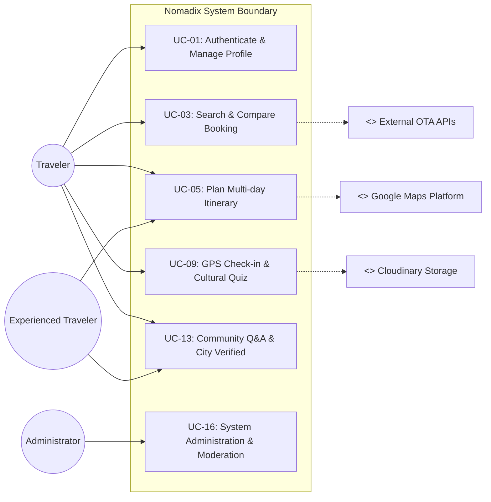
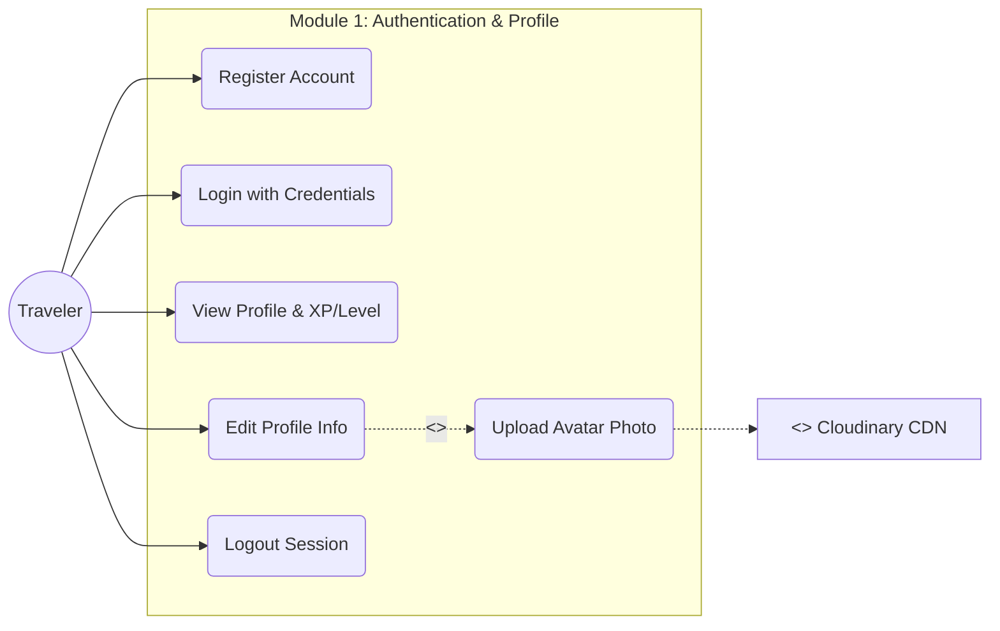
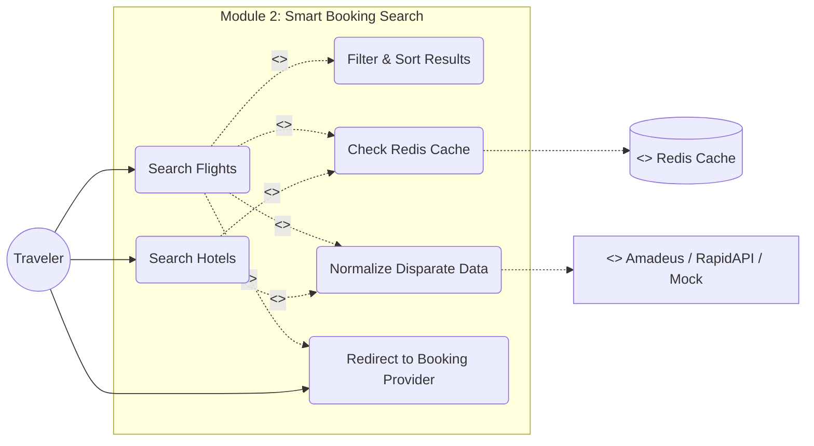
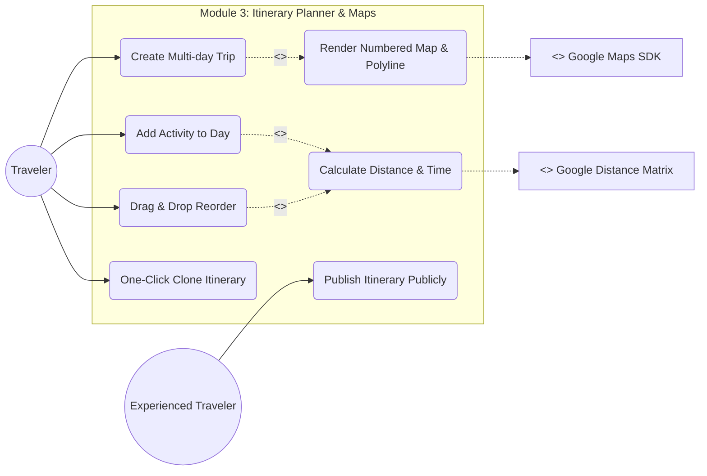
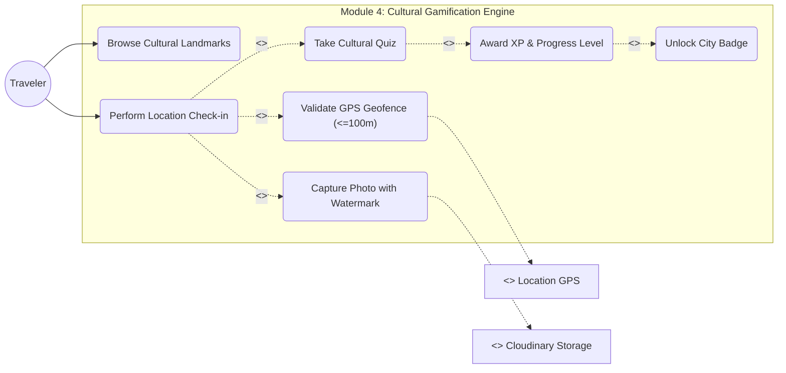
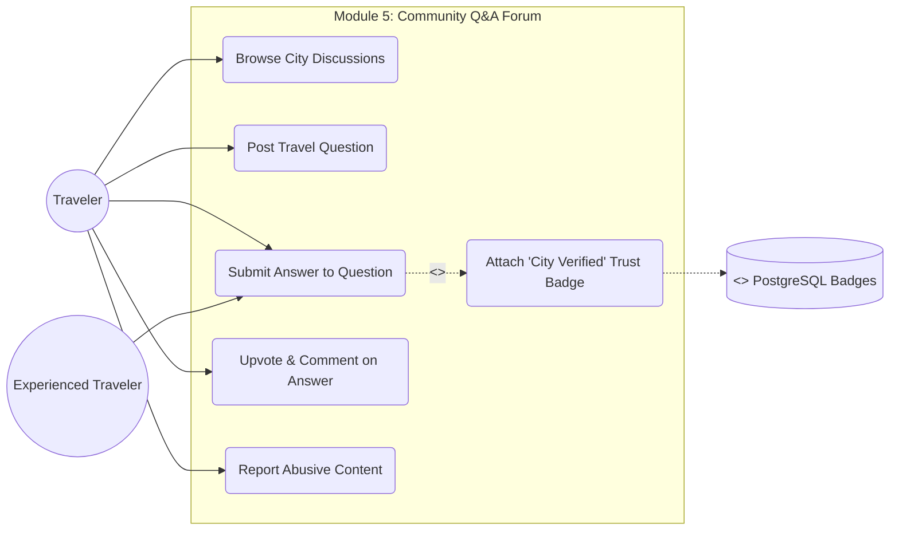
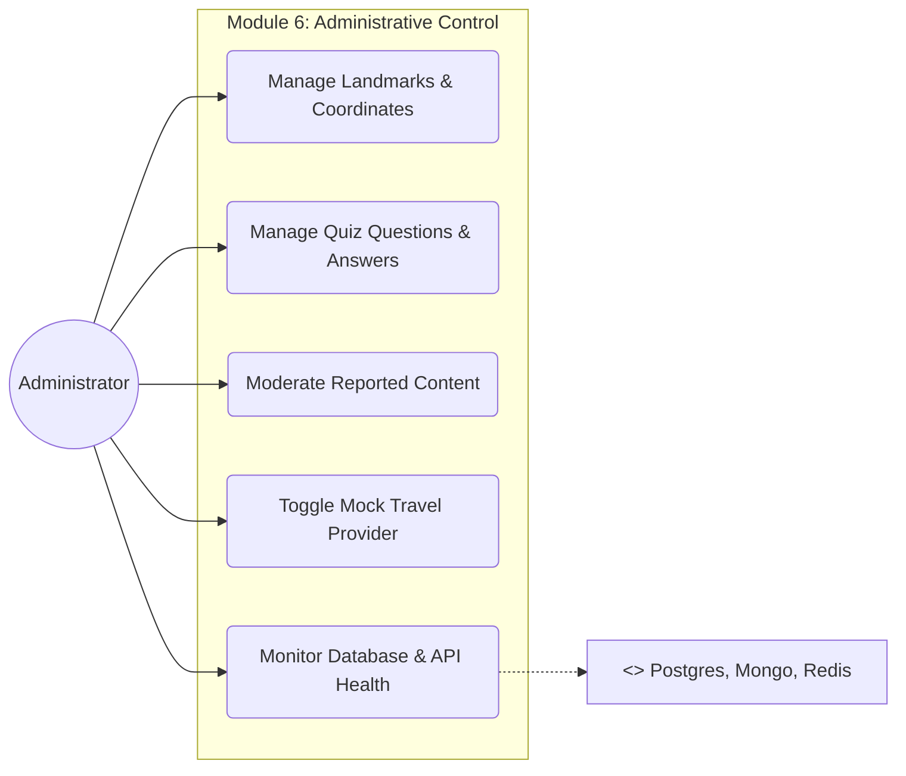

# 02. System & Modular Use Case Diagrams

## Nomadix — All-in-one Smart Travel Platform
**Final Year Project (FYP) — University of Greenwich**  
**Student:** Nguyễn Văn Đức  
**Standard:** UML 2.5 Specification (Mermaid Syntax)  
**Phase:** Day 3 — Use Case Analysis  

---

## 1. SƠ ĐỒ USE CASE TỔNG THỂ HỆ THỐNG (SYSTEM OVERVIEW USE CASE DIAGRAM)

---

## 2. SƠ ĐỒ PHÂN RÃ THEO TỪNG MODULE CHỨC NĂNG

### 🟢 MODULE 1: AUTHENTICATION & PROFILE USE CASE DIAGRAM

---

### 🔵 MODULE 2: SMART BOOKING SEARCH & AGGREGATOR USE CASE DIAGRAM

---

### 🟡 MODULE 3: ITINERARY PLANNER & MAPS USE CASE DIAGRAM

---

### 🟣 MODULE 4: GAMIFICATION, GEOFENCE & BADGES USE CASE DIAGRAM (USP)

---

### 🟡 MODULE 5: COMMUNITY Q&A & VERIFIED TRUST USE CASE DIAGRAM

---

### 🔴 MODULE 6: ADMINISTRATION & MODERATION USE CASE DIAGRAM

