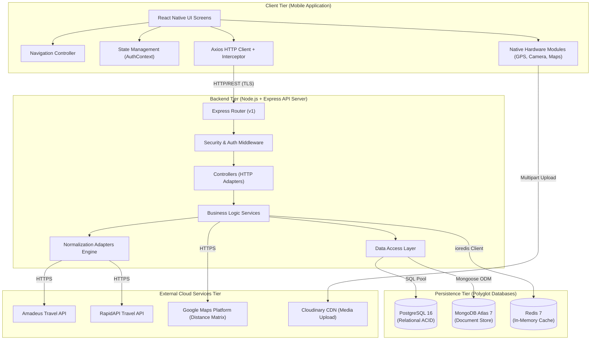

# 02. System Component & Package Diagrams

## Nomadix — All-in-one Smart Travel Platform
**Final Year Project (FYP) — University of Greenwich**  
**Student:** Nguyễn Văn Đức  
**Standard:** UML 2.5 Component Diagram Modeling  
**Phase:** Day 4 — System Architecture Design  

---

## 1. SƠ ĐỒ THÀNH PHẦN HỆ THỐNG (SYSTEM COMPONENT DIAGRAM)

Sơ đồ dưới đây thể hiện các thành phần phần mềm chính trong hệ thống Nomadix và các giao diện kết nối (Interfaces) giữa chúng:



---

## 2. CẤU TRÚC GÓI MÃ NGUỒN BACKEND (SERVER PACKAGE STRUCTURE)

```text
server/src/
├── config/                  # Cấu hình môi trường và kết nối DB
│   ├── database.js          # Kết nối PostgreSQL (pg Pool)
│   ├── mongo.js             # Kết nối MongoDB (Mongoose)
│   ├── redis.js             # Kết nối Redis (ioredis)
│   └── cloudinary.js        # Cấu hình Cloudinary SDK
│
├── controllers/             # Tiếp nhận HTTP Request và gửi Response
│   ├── auth.controller.js
│   ├── user.controller.js
│   ├── flight.controller.js
│   ├── hotel.controller.js
│   ├── itinerary.controller.js
│   ├── collaboration.controller.js # Mời bạn bè & đồng bộ chuyến đi
│   ├── expense.controller.js       # Quản lý hóa đơn & chia tiền nhóm
│   ├── landmark.controller.js
│   ├── checkin.controller.js
│   ├── quiz.controller.js
│   ├── community.controller.js
│   └── admin.controller.js
│
├── services/                # Tầng nghiệp vụ cốt lõi (Pure Business Logic)
│   ├── auth.service.js
│   ├── user.service.js
│   ├── bookingAggregator.service.js
│   ├── itinerary.service.js
│   ├── collaboration.service.js    # Quản lý thành viên & phân quyền
│   ├── expense.service.js          # Tính toán chia tiền & hóa đơn
│   ├── debtSimplifier.service.js   # Thuật toán Greedy tối ưu hóa công nợ
│   ├── map.service.js
│   ├── gamification.service.js
│   ├── badgeEvaluator.service.js
│   ├── community.service.js
│   └── cache.service.js
│
├── adapters/                # Tầng chuẩn hóa dữ liệu & Mock Provider
│   ├── baseProvider.js
│   ├── amadeusProvider.js
│   ├── rapidApiProvider.js
│   ├── mockProvider.js
│   └── normalizers/
│       ├── amadeusNormalizer.js
│       ├── rapidApiNormalizer.js
│       └── mockNormalizer.js
│
├── models/                  # Định nghĩa Lược đồ PostgreSQL & MongoDB
│   ├── postgres/            # Schema DDL & Model PostgreSQL
│   │   ├── user.model.js
│   │   ├── tripMember.model.js     # Thành viên chuyến đi & vai trò
│   │   ├── expense.model.js        # Khoản chi tiêu & hóa đơn
│   │   ├── expenseSplit.model.js   # Chi tiết phân bổ tiền nợ
│   │   ├── settlement.model.js     # Lịch sử quyết toán công nợ
│   │   ├── landmark.model.js
│   │   ├── checkin.model.js
│   │   ├── badge.model.js
│   │   └── quiz.model.js
│   └── mongo/               # Mongoose Schemas MongoDB
│       ├── itinerary.model.js      # Lịch trình & mảng collaborators
│       ├── forumQuestion.model.js
│       ├── forumAnswer.model.js
│       └── report.model.js
│
├── middleware/              # Middleware bảo mật & xác thực
│   ├── auth.middleware.js   # JWT verification
│   ├── restrictTo.js        # RBAC role validation
│   ├── validate.js          # Joi payload validation
│   ├── errorHandler.js      # Global exception handler
│   └── rateLimiter.js       # Redis rate limiting
│
├── utils/                   # Hàm tiện ích dùng chung
│   ├── ApiResponse.js       # Chuẩn hóa payload thành công
│   ├── AppError.js          # Custom Operational Error class
│   ├── catchAsync.js        # Wrapper bắt lỗi async/await
│   ├── geoHelper.js         # Thuật toán Haversine Geofencing
│   ├── gamificationHelper.js# Công thức tính Level/XP
│   ├── cacheKeyHelper.js    # Thuật toán sinh khóa cache xác định
│   └── logger.js            # Winston & Morgan logger
│
└── app.js / server.js       # Khởi tạo Express server
```

---

## 3. CẤU TRÚC GÓI MÃ NGUỒN MOBILE CLIENT (CLIENT PACKAGE STRUCTURE)

```text
client/src/
├── assets/                  # Hình ảnh, Font chữ, SVG Icons
├── components/              # UI Components tái sử dụng (Atomic Design)
│   ├── Common/              # Button, Input, Card, Modal, Loader
│   ├── Booking/             # FlightCard, HotelCard, AirportAutocomplete
│   ├── Itinerary/           # DraggableDayList, ItineraryMapView
│   ├── Gamification/        # LandmarkRadarCard, CameraWatermarkOverlay
│   ├── Community/           # QuestionCard, VerifiedAnswerCard
│   └── DevTools/            # MockLocationInjector
│
├── screens/                 # Các màn hình theo từng luồng nghiệp vụ
│   ├── Auth/                # Login, Register, ForgotPassword
│   ├── Home/                # Dashboard, DiscoveryFeed
│   ├── Booking/             # SearchScreen, FlightResults, HotelResults
│   ├── Itinerary/           # MyTrips, CreateTrip, DayPlanner
│   ├── Gamification/        # ExploreLandmarks, CameraView, QuizScreen
│   ├── Community/           # ForumFeed, QuestionDetail, CreateQuestion
│   ├── Profile/             # ProfileScreen, EditProfile, BadgesModal
│   └── Admin/               # AdminDashboard, ManageLandmarks
│
├── navigation/              # Cấu hình điều hướng React Navigation
│   ├── AppNavigator.js      # Root Switch Navigator
│   ├── AuthStackNavigator.js# Luồng Đăng ký / Đăng nhập
│   └── MainTabNavigator.js  # Bottom Tab 5 màn hình chính
│
├── services/                # Giao tiếp API & Native Modules
│   ├── api.js               # Axios Client với JWT Interceptor
│   ├── locationService.js   # GPS Geolocation wrapper
│   └── storageService.js    # SecureStore & AsyncStorage wrapper
│
├── context/                 # Quản lý trạng thái toàn cục
│   ├── AuthContext.js       # User session & token state
│   └── ThemeContext.js      # Dark / Light mode tokens
│
└── constants/               # Bảng màu, Kích thước font, Layout tokens
```
