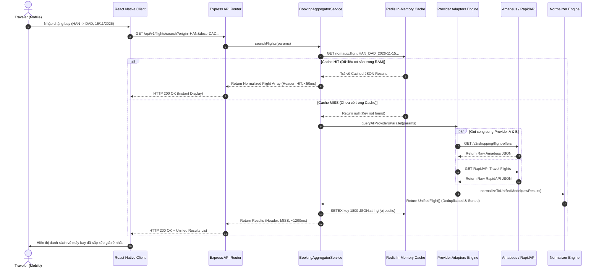
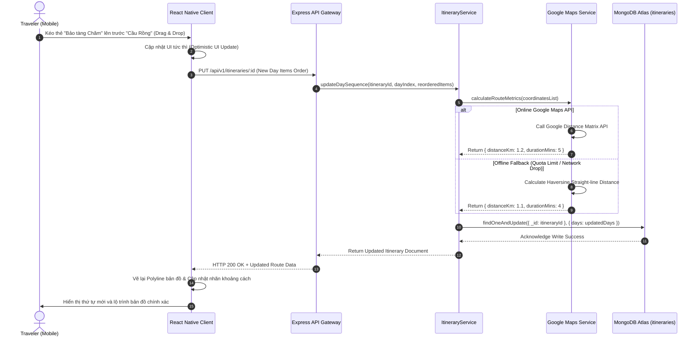
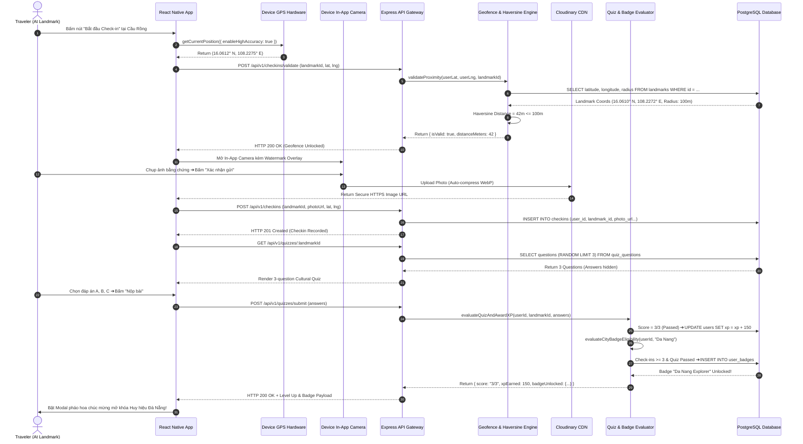
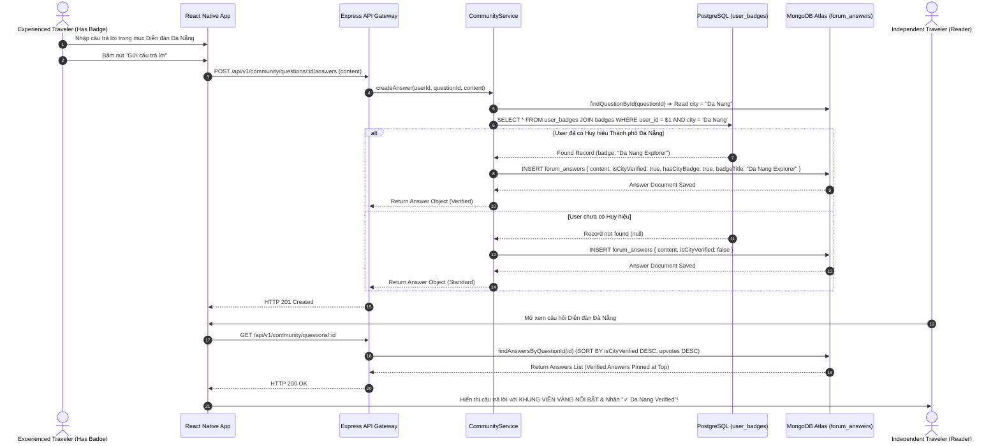

# 03. Data Flow & Sequence Diagrams

## Nomadix — All-in-one Smart Travel Platform
**Final Year Project (FYP) — University of Greenwich**  
**Student:** Nguyễn Văn Đức  
**Standard:** UML 2.5 Sequence Modeling (Mermaid Syntax)  
**Phase:** Day 4 — System Architecture Design  

---

## 1. TỔNG QUAN CÁC SƠ ĐỒ TUẦN TỰ (OVERVIEW)

Tài liệu này mô hình hóa 4 luồng dữ liệu nghiệp vụ quan trọng nhất của hệ thống Nomadix bằng **Sequence Diagrams**, làm cơ sở cho quá trình lập trình ở Month 2, 3 và 4:

```text
┌────────────────────────────────────────────────────────────────────────┐
│                        CORE SYSTEM SEQUENCE FLOWS                      │
├────────┬──────────────────────────────────────┬────────────────────────┤
│ Flow 1 │ Smart Booking Search & Redis Cache   │ Module 2: Booking      │
│ Flow 2 │ Itinerary Drag-and-Drop & Maps Route │ Module 3: Itinerary    │
│ Flow 3 │ GPS Geofence Check-in & Quiz Loop    │ Module 4: Gamification │
│ Flow 4 │ Cross-DB "City Verified" Attachment  │ Module 5: Community    │
└────────┴──────────────────────────────────────┴────────────────────────┘
```

---

## 2. CHI TIẾT CÁC SƠ ĐỒ TUẦN TỰ (SEQUENCE DIAGRAMS)

---

### 🔹 FLOW 1: BOOKING SEARCH WITH REDIS CACHING & ADAPTER NORMALIZATION



---

### 🔹 FLOW 2: ITINERARY DRAG-AND-DROP & ROUTE RE-CALCULATION



---

### 🔹 FLOW 3: GPS GEOFENCE VALIDATION, CAMERA WATERMARK & QUIZ PROGRESSION



---

### 🔹 FLOW 4: CROSS-DATABASE "CITY VERIFIED" COMMUNITY TRUST ATTACHMENT


