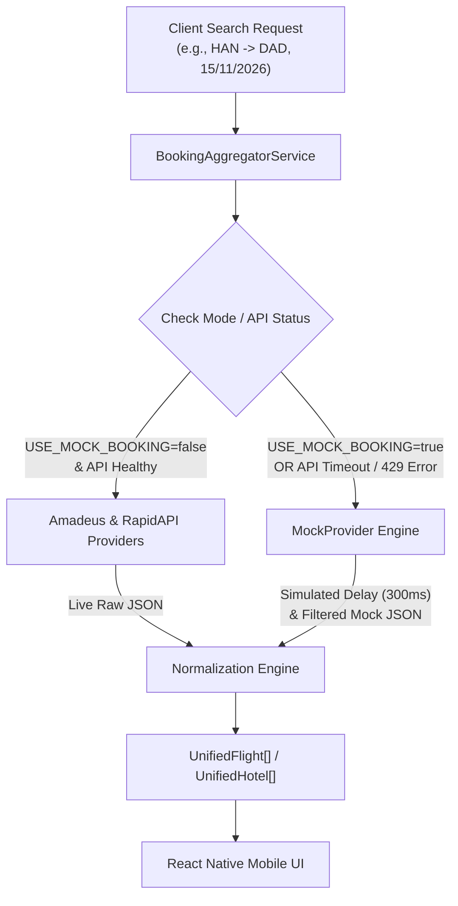

# 03. Mock Data Provider Engine & Fallback Architecture

## Nomadix — All-in-one Smart Travel Platform
**Final Year Project (FYP) — University of Greenwich**  
**Student:** Nguyễn Văn Đức  
**Standard:** Software Fault Tolerance & Resilience Design  
**Phase:** Day 5 — Technology Research & API Feasibility  

---

## 1. MỤC ĐÍCH & Ý NGHĨA HỌC THUẬT (RATIONALE & PURPOSE)

Trong các đồ án tốt nghiệp công nghệ thông tin (FYP), việc phụ thuộc hoàn toàn vào các API thương mại bên thứ ba (Third-party Commercial APIs) là một rủi ro chí mạng. Các nhà cung cấp OTA có thể thay đổi cấu trúc dữ liệu, hết hạn ngạch truy cập miễn phí hoặc chặn kết nối mạng bất ngờ trong buổi bảo vệ trước Hội đồng chấm thi.

**Mock Data Provider Engine** được thiết kế như một chốt chặn bảo vệ kiến trúc (Architectural Safety Guard), mang lại 3 giá trị cốt lõi:
1. **Tính độc lập phát triển:** Cho phép lập trình viên Backend và Frontend phát triển liên tục 24/7 mà không cần lo lắng về Rate Limits hay sự cố mạng.
2. **Khả năng tự phục hồi (Fault Tolerance):** Tự động chuyển mạch khi API thật gặp lỗi mà người dùng không hề nhận biết.
3. **Bảo đảm độ tin cậy khi Demo (Guaranteed Demo Stability):** Đảm bảo 100% kịch bản kiểm thử 19 bước của Hội đồng giám khảo luôn chạy trơn tru, không phụ thuộc vào internet.

---

## 2. KIẾN TRÚC MOCK PROVIDER (MOCK PROVIDER ARCHITECTURE)



---

## 3. CƠ CHẾ TỰ ĐỘNG CHUYỂN MẠCH (AUTOMATED FALLBACK TRIGGER)

Lớp `BookingAggregatorService` được cài đặt cơ chế tự động chuyển mạch (Circuit Breaker / Fallback Switch) theo các điều kiện sau:

```javascript
// server/src/services/bookingAggregator.service.js
async function searchFlights(params) {
  // 1. Kiểm tra cấu hình bắt buộc dùng Mock
  if (process.env.USE_MOCK_BOOKING === 'true') {
    logger.info('[BookingAggregator] Operating in forced MOCK mode');
    return mockProvider.searchFlights(params);
  }

  try {
    // 2. Thử gọi API thật với Timeout tối đa 5 giây
    const liveResults = await Promise.race([
      amadeusProvider.searchFlights(params),
      timeoutPromise(5000)
    ]);
    return liveResults;
  } catch (error) {
    // 3. Tự động Fallback sang Mock Provider khi có lỗi mạng / Timeout / 429
    logger.warn(`[BookingAggregator] Live API failed (${error.message}). Falling back to MOCK Provider.`);
    return mockProvider.searchFlights(params);
  }
}
```

---

## 4. BỘ DỮ LIỆU MẪU ĐƯỢC CHUẨN BỊ (MOCK DATASET SPECIFICATIONS)

Dữ liệu mẫu được xây dựng với độ chân thực $100\%$ dựa trên các hãng hàng không và khách sạn thật tại Việt Nam:

### 4.1 Bộ Dữ Liệu Chuyến Bay Mẫu (`server/src/mockData/mockFlights.json`)
* **Các chặng bay hỗ trợ:**
  * Hà Nội (`HAN`) ⇄ Đà Nẵng (`DAD`)
  * TP. Hồ Chí Minh (`SGN`) ⇄ Đà Nẵng (`DAD`)
  * Hà Nội (`HAN`) ⇄ Phú Quốc (`PQC`)
  * Đà Nẵng (`DAD`) ⇄ Bangkok (`BKK`)
* **Các hãng hàng không:**
  * Vietnam Airlines (`VN`) — Đầy đủ logo, giờ bay, suất ăn, hành lý ký gửi 23kg.
  * Vietjet Air (`VJ`) — Giá vé tiết kiệm, nhiều khung giờ bay trong ngày.
  * Bamboo Airways (`QH`) — Hạng phổ thông và thương gia.
* **Tính năng lọc động:** Tự động điều chỉnh giá vé theo số lượng hành khách và ngày bay được chọn.

---

### 4.2 Bộ Dữ Liệu Khách Sạn Mẫu (`server/src/mockData/mockHotels.json`)
* **Các thành phố hỗ trợ:** Đà Nẵng, Hà Nội, Hội An, TP. Hồ Chí Minh.
* **Danh sách khách sạn phong phú:**
  * *Novotel Danang Premier Han River* (5 sao, Điểm đánh giá: 9.1, Tọa độ thật cạnh sông Hàn).
  * *InterContinental Danang Sun Peninsula Resort* (5 sao, Bán đảo Sơn Trà).
  * *Mường Thanh Luxury Da Nang* (4 sao, cạnh Bãi biển Mỹ Khê).
  * *San Marino Boutique Danang* (3 sao, giá tiết kiệm cho sinh viên).
* **Thông tin kèm theo:** Danh sách 5 ảnh HD chất lượng cao, danh mục tiện ích (Hồ bơi vô cực, Wifi miễn phí, Bữa sáng miễn phí, Đưa đón sân bay).

---

## 5. GIẢ LẬP ĐỘ TRỄ MẠNG (REALISTIC LATENCY SIMULATION)

Để đảm bảo các bài kiểm thử hiệu năng và trải nghiệm người dùng chân thực nhất, `MockProvider` tự động chèn một khoảng thời gian chờ ngẫu nhiên từ $200\text{ms}$ đến $400\text{ms}$ mô phỏng độ trễ đường truyền thực tế:

```javascript
// server/src/adapters/mockProvider.js
class MockProvider extends BaseBookingProvider {
  async searchFlights(params) {
    // Giả lập độ trễ mạng thực tế
    await new Promise(resolve => setTimeout(resolve, 300));
    
    // Lọc dữ liệu mẫu theo điểm đi, điểm đến và ngày bay
    return mockFlightsData.filter(flight => 
      flight.origin.airportCode === params.origin &&
      flight.destination.airportCode === params.destination
    );
  }
}
```
