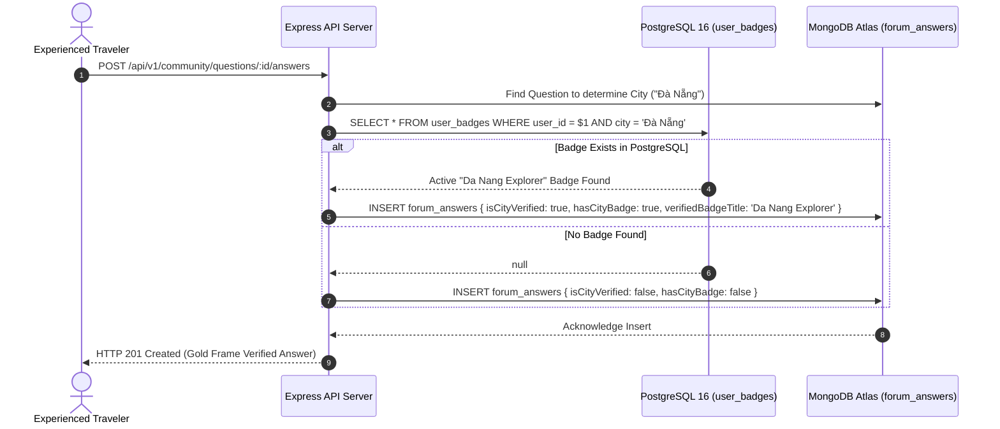

# 00. Master Database Specification & Schema Architecture

## Nomadix — All-in-one Smart Travel Platform
**Final Year Project (FYP) — University of Greenwich**  
**Student:** Nguyễn Văn Đức  
**Standard:** Polyglot Persistence Architecture & 3NF Relational Standards  
**Phase:** Day 6 — Database Analysis & Schema Finalization  
**Engines:** PostgreSQL 16 (Relational ACID) | MongoDB Atlas 7.0 (Document Store) | Redis 7 (In-Memory Cache)  

---

## 1. POLYGLOT DATABASE RESPONSIBILITY MATRIX

The **Nomadix** platform implements a **Polyglot Persistence Architecture** where each data store manages the exact domain matching its fundamental technical strengths:

```
┌──────────────────────────────────────────────────────────────────────────────────────────────────┐
│                                 NOMADIX MASTER POLYGLOT BOUNDARY                                 │
├───────────────────┬──────────────┬───────────────────────────────┬───────────────────────────────┤
│ Database Engine   │ Data Model   │ Primary Domain & Entities     │ Justification & Guarantees    │
├───────────────────┼──────────────┼───────────────────────────────┼───────────────────────────────┤
│ **PostgreSQL 16** │ Relational   │ • Identity, Auth & RBAC       │ Strict ACID compliance, 3NF   │
│ (Port 5432)       │ (3NF Strict) │ • Gamification & Geofencing   │ normalization, coordinate math│
│                   │              │ • Bookings, Passports & Money │ protection, anti-cheat rules  │
├───────────────────┼──────────────┼───────────────────────────────┼───────────────────────────────┤
│ **MongoDB Atlas** │ Document     │ • Multi-Day Itineraries       │ 1:Few embedded hierarchy,     │
│ (Port 27017)      │ (JSON/BSON)  │ • Community Q&A & Comments    │ polymorphic activity items,   │
│                   │              │ • Moderation Reports Queue    │ GeoJSON 2dsphere indexing     │
├───────────────────┼──────────────┼───────────────────────────────┼───────────────────────────────┤
│ **Redis 7**       │ Key-Value    │ • Live Flight/Hotel Cache     │ Microsecond RAM lookups,      │
│ (Port 6379)       │ (In-Memory)  │ • Rate Limiting Counters      │ sub-50ms query latency,       │
│                   │              │ • Short-lived Auth Nonces     │ automated TTL expiration      │
└───────────────────┴──────────────┴───────────────────────────────┴───────────────────────────────┘
```

---

## 2. MASTER POLYGLOT ARCHITECTURE DIAGRAM

```mermaid
erDiagram
    USERS ||--|| USER_PREFERENCES : "1:1 settings"
    USERS ||--o{ USER_REFRESH_TOKENS : "active_sessions"
    USERS ||--o{ TRAVELER_PROFILES : "saved_passengers"
    USERS ||--o{ BOOKINGS : "places_order"
    USERS ||--o{ CHECKINS : "verified_visits"
    USERS ||--o{ USER_BADGES : "unlocked_achievements"
    USERS ||--o{ TRIP_MEMBERS : "joined_trips"
    USERS ||--o{ TRIP_EXPENSES : "paid_expenses"
    USERS ||--o{ TRIP_EXPENSE_SPLITS : "owed_splits"
    USERS ||--o{ TRIP_SETTLEMENTS : "debtor_or_creditor"
    
    ROLES ||--o{ USERS : "assigned_role"
    ROLES ||--|{ ROLE_PERMISSIONS : "contains"
    PERMISSIONS ||--|{ ROLE_PERMISSIONS : "granted_via"

    LANDMARKS ||--o{ CHECKINS : "geofenced_at"
    LANDMARKS ||--|| QUIZZES : "1:1 cultural_quiz"
    QUIZZES ||--o{ QUIZ_QUESTIONS : "composed_of"
    USERS ||--o{ QUIZ_ATTEMPTS : "takes_evaluation"

    BADGES ||--o{ USER_BADGES : "awarded_to"

    BOOKINGS ||--o{ FLIGHT_BOOKINGS : "flight_segments"
    BOOKINGS ||--o{ HOTEL_BOOKINGS : "hotel_stays"
    BOOKINGS ||--o{ BOOKING_PASSENGERS : "manifest_passengers"
    BOOKINGS ||--o{ PAYMENT_TRANSACTIONS : "financial_ledger"

    TRIP_EXPENSES ||--|{ TRIP_EXPENSE_SPLITS : "divided_into"

    USERS }o..o{ ITINERARIES : "cross_db_owner_userId"
    TRIP_MEMBERS }o..o{ ITINERARIES : "cross_db_trip_binding"
    TRIP_EXPENSES }o..o{ ITINERARIES : "cross_db_expense_binding"
    USERS }o..o{ FORUM_QUESTIONS : "cross_db_author_userId"
    USERS }o..o{ FORUM_ANSWERS : "cross_db_replier_userId"
    
    BOOKINGS }o..o{ ITINERARIES : "cross_db_booking_binding"
    USER_BADGES }o..o{ FORUM_ANSWERS : "cross_db_city_verified_bridge"

    FORUM_QUESTIONS ||--o{ FORUM_ANSWERS : "has_replies"
    FORUM_ANSWERS ||--o{ FORUM_COMMENTS : "threaded_comments"
    FORUM_QUESTIONS ||--o{ COMMUNITY_REPORTS : "moderation_queue"
```



*Standalone diagram export available at:* [`documentation/06-database-analysis/diagrams/master-polyglot-erd.mmd`](file:///Users/3o/Documents/Study/FYP/documentation/06-database-analysis/diagrams/master-polyglot-erd.mmd).

---

## 3. COMPLETE RELATIONAL SCHEMA: POSTGRESQL 16 (28 TABLES)

The relational schema is normalized to **Third Normal Form (3NF)** and partitioned into four business modules:

### 3.1 Module A: Identity, Authentication & RBAC (9 Tables)
1. **`roles`**: System authority roles (`admin`, `traveler`, `moderator`).
2. **`permissions`**: Granular capability codes (e.g. `landmarks:create`, `forum:moderate`).
3. **`role_permissions`**: Many-to-many RBAC junction table.
4. **`users`**: Central identity anchor (`id UUID PRIMARY KEY`, lowercase unique email, Bcrypt hash, status flags, XP balance, Level rank).
5. **`user_preferences`**: 1:1 settings table for localized defaults (currency, language, departure airport).
6. **`user_refresh_tokens`**: Active mobile sessions storing SHA-256 digests of tokens for secure Refresh Token Rotation (RTR) and device fingerprinting.
7. **`user_oauth_accounts`**: Federated third-party social logins (Google Sign-In, Apple ID).
8. **`password_reset_tokens`**: Time-limited ($15\text{ mins}$), single-use recovery digests.
9. **`auth_audit_logs`**: Append-only security audit log recording login events and IP addresses.

### 3.2 Module B: Cultural Gamification, Coordinates & Badges (7 Tables)
10. **`landmarks`**: Historical and cultural heritage catalog with precise WGS84 coordinates (`NUMERIC(10, 7)`), configurable geofence radii (default $100\text{m}$), and JSONB historical notes.
11. **`checkins`**: Verifiable proof of physical visits; enforces `UNIQUE(user_id, landmark_id)` to disallow repeat check-in XP exploitation.
12. **`badges`**: City Explorer Badge criteria ($\ge 3$ checkins, $\ge 66\%$ quiz score, $+300\text{ XP}$ bonus).
13. **`user_badges`**: Junction table tracking unlocked user badges and timestamps (`UNIQUE(user_id, badge_id)`).
14. **`quizzes`**: 1:1 cultural quiz attached to each landmark.
15. **`quiz_questions`**: Multiple choice question bank (4 options, hidden correct answer key).
16. **`quiz_attempts`**: Audit of user quiz attempts, scores, and awarded XP.

### 3.3 Module C: Bookings, Manifests & Financials (8 Tables)
17. **`traveler_profiles`**: Saved passengers and identity documents (passport number, date of birth) for account holders and recurring companions.
18. **`saved_offers`**: Travel wishlist storing bookmarked flight/hotel deals and snapshots in JSONB.
19. **`bookings`**: Central order record (`booking_reference`, `status`, `total_amount NUMERIC(12,2)`, cross-DB `itinerary_id`).
20. **`flight_bookings`**: Airline segment specifics (IATA codes, cabin classes, baggage, stops).
21. **`hotel_bookings`**: Property stay specifics (coordinates, room types, nights).
22. **`booking_passengers`**: Passenger manifest connecting bookings to seat assignments and `traveler_profiles`.
23. **`payment_transactions`**: Financial double-entry ledger with payment gateways (VNPay, MoMo, Stripe).
24. **`affiliate_outbound_clicks`**: Outbound redirect tracking for OTA partner affiliate monetization.

### 3.4 Module D: Trip Companionship, Group Expenses & Debt Settlement (4 Tables)
25. **`trip_members`**: Membership directory linking users to trips, tracking invitation status (`pending`, `accepted`, `declined`), and role-based permissions (`owner`, `editor`, `viewer`).
26. **`trip_expenses`**: Master expenditure ledger recording payer, total amount, currency, category (`food`, `stay`, `transport`, `sightseeing`, `shopping`, `other`), Cloudinary receipt URL, and split strategy.
27. **`trip_expense_splits`**: Relational split allocation specifying each member's exact owed share (`split_amount`) and settlement status (`is_settled`).
28. **`trip_settlements`**: Financial settlement ledger tracking debtor-to-creditor payments, bank transfer proof slips, and audit timestamps.

*Standalone relational diagram export available at:* [`documentation/06-database-analysis/diagrams/postgresql-relational-erd.mmd`](file:///Users/3o/Documents/Study/FYP/documentation/06-database-analysis/diagrams/postgresql-relational-erd.mmd).

---

## 4. COMPLETE DOCUMENT SCHEMA: MONGODB ATLAS 7.0 (4 COLLECTIONS)

### 4.1 Collection `itineraries` (Flexible Multi-Day Schedule)
* **Design Pattern:** Embedded 1:Few sub-documents.
* **Hierarchy:** `itineraries` $\rightarrow$ `days[]` $\rightarrow$ `items[]` $\rightarrow$ `transitToNext`.
* **Collaborators Sub-document Array:** `collaborators: [{ userId: String, role: 'owner'|'editor'|'viewer', joinedAt: Date, status: 'accepted'|'pending' }]` enabling instant shared itinerary access control and multi-user synchronization.
* **Polymorphic Discriminator (`itemType`):** Supports `landmark`, `hotel`, `flight`, `restaurant`, and `custom` stops within a single array.
* **Geospatial Coordinates:** Encoded as GeoJSON `Point` (`{ type: "Point", coordinates: [lng, lat] }`) with active `2dsphere` spatial indexing.
* **Transit Legs:** Caches driving/walking distances, durations, and encoded polylines between stops.
* **Hierarchy:** `itineraries` $\rightarrow$ `days[]` $\rightarrow$ `items[]` $\rightarrow$ `transitToNext`.
* **Polymorphic Discriminator (`itemType`):** Supports `landmark`, `hotel`, `flight`, `restaurant`, and `custom` stops within a single array.
* **Geospatial Coordinates:** Encoded as GeoJSON `Point` (`{ type: "Point", coordinates: [lng, lat] }`) with active `2dsphere` spatial indexing.
* **Transit Legs:** Caches driving/walking distances, durations, and encoded polylines between stops.

### 4.2 Collection `forum_questions` (City Discussion Threads)
* Categorized by City (`city`) and topic tag (`category`).
* Indexed on `{ city: 1, category: 1, createdAt: -1 }` and full-text search `{ title: "text", content: "text", tags: "text" }`.

### 4.3 Collection `forum_answers` (Answers with "City Verified" Authority)
* **The "City Verified" Trust Attachment:** Contains fields `isCityVerified: boolean`, `hasCityBadge: boolean`, and `verifiedBadgeTitle: string`.
* Indexed on `{ questionId: 1, isCityVerified: -1, upvotes: -1, createdAt: 1 }` to float verified answers to the top of the thread.

### 4.4 Collection `forum_comments` & `community_reports`
* Lightweight nested replies (`forum_comments`) and an abuse reporting queue (`community_reports`).

*Standalone document diagram export available at:* [`documentation/06-database-analysis/diagrams/mongodb-document-erd.mmd`](file:///Users/3o/Documents/Study/FYP/documentation/06-database-analysis/diagrams/mongodb-document-erd.mmd).

---

## 5. IN-MEMORY KEY-VALUE SCHEMA: REDIS 7

```
┌─────────────────┬─────────────────────────────────────────────────┬──────────┬───────────┐
│ Domain          │ Key Pattern                                     │ TTL      │ Data Type │
├─────────────────┼─────────────────────────────────────────────────┼──────────┼───────────┤
│ Flights Cache   │ `nomadix:flight:${origin}_${dest}_${date}_${pax}`│ 1800s    │ JSON (RAM)│
│ Hotels Cache    │ `nomadix:hotel:${city}_${checkIn}_${checkOut}`  │ 3600s    │ JSON (RAM)│
│ Landmarks Cache │ `nomadix:landmarks:${city}`                     │ 86400s   │ JSON (RAM)│
│ Rate Limiting   │ `rate_limit:${client_ip}`                       │ 900s     │ Integer   │
│ Checkin Nonce   │ `checkin_token:${userId}_${landmarkId}`         │ 300s     │ String    │
└─────────────────┴─────────────────────────────────────────────────┴──────────┴───────────┘
```

---

## 6. CROSS-DATABASE REFERENTIAL INTEGRITY PROTOCOL



*Standalone cross-database sequence diagram available at:* [`documentation/06-database-analysis/diagrams/cross-database-trust-flow.mmd`](file:///Users/3o/Documents/Study/FYP/documentation/06-database-analysis/diagrams/cross-database-trust-flow.mmd).

---

## 7. PRODUCTION POSTGRESQL DDL IMPLEMENTATION SCRIPT

```sql
-- ============================================================================
-- NOMADIX MASTER POSTGRESQL 16 DDL SCRIPT
-- ============================================================================

CREATE EXTENSION IF NOT EXISTS "pgcrypto";

-- MODULE 1: AUTHENTICATION & RBAC
CREATE TABLE roles (
    id SERIAL PRIMARY KEY,
    name VARCHAR(50) NOT NULL UNIQUE,
    display_name VARCHAR(100) NOT NULL,
    description VARCHAR(255),
    is_system BOOLEAN NOT NULL DEFAULT true,
    created_at TIMESTAMPTZ NOT NULL DEFAULT CURRENT_TIMESTAMP
);

CREATE TABLE permissions (
    id SERIAL PRIMARY KEY,
    code VARCHAR(100) NOT NULL UNIQUE,
    module VARCHAR(50) NOT NULL,
    description VARCHAR(255),
    created_at TIMESTAMPTZ NOT NULL DEFAULT CURRENT_TIMESTAMP
);

CREATE TABLE role_permissions (
    role_id INT NOT NULL REFERENCES roles(id) ON DELETE CASCADE,
    permission_id INT NOT NULL REFERENCES permissions(id) ON DELETE CASCADE,
    granted_at TIMESTAMPTZ NOT NULL DEFAULT CURRENT_TIMESTAMP,
    PRIMARY KEY (role_id, permission_id)
);

CREATE TABLE users (
    id UUID PRIMARY KEY DEFAULT gen_random_uuid(),
    email VARCHAR(255) NOT NULL,
    password_hash VARCHAR(255),
    full_name VARCHAR(100) NOT NULL,
    phone_number VARCHAR(20),
    avatar_url TEXT,
    bio VARCHAR(500),
    status VARCHAR(25) NOT NULL DEFAULT 'active' 
        CHECK (status IN ('active', 'suspended', 'pending_verification', 'deactivated')),
    is_email_verified BOOLEAN NOT NULL DEFAULT false,
    role_id INT NOT NULL DEFAULT 2 REFERENCES roles(id),
    xp INT NOT NULL DEFAULT 0 CHECK (xp >= 0),
    level INT NOT NULL DEFAULT 1 CHECK (level >= 1),
    last_login_at TIMESTAMPTZ,
    created_at TIMESTAMPTZ NOT NULL DEFAULT CURRENT_TIMESTAMP,
    updated_at TIMESTAMPTZ NOT NULL DEFAULT CURRENT_TIMESTAMP,
    deleted_at TIMESTAMPTZ
);

CREATE UNIQUE INDEX idx_users_email_lower ON users (LOWER(email)) WHERE deleted_at IS NULL;
CREATE INDEX idx_users_role_id ON users(role_id);

CREATE TABLE user_preferences (
    user_id UUID PRIMARY KEY REFERENCES users(id) ON DELETE CASCADE,
    preferred_currency CHAR(3) NOT NULL DEFAULT 'VND',
    preferred_language VARCHAR(10) NOT NULL DEFAULT 'vi',
    home_airport_iata CHAR(3),
    travel_style VARCHAR(50) NOT NULL DEFAULT 'budget'
        CHECK (travel_style IN ('budget', 'culture', 'luxury', 'adventure', 'backpacker')),
    push_notifications_enabled BOOLEAN NOT NULL DEFAULT true,
    marketing_emails_enabled BOOLEAN NOT NULL DEFAULT false,
    updated_at TIMESTAMPTZ NOT NULL DEFAULT CURRENT_TIMESTAMP
);

CREATE TABLE user_refresh_tokens (
    id UUID PRIMARY KEY DEFAULT gen_random_uuid(),
    user_id UUID NOT NULL REFERENCES users(id) ON DELETE CASCADE,
    token_hash VARCHAR(64) NOT NULL UNIQUE,
    device_id VARCHAR(100),
    device_name VARCHAR(100),
    device_os VARCHAR(50),
    ip_address VARCHAR(45),
    user_agent TEXT,
    is_revoked BOOLEAN NOT NULL DEFAULT false,
    expires_at TIMESTAMPTZ NOT NULL,
    created_at TIMESTAMPTZ NOT NULL DEFAULT CURRENT_TIMESTAMP,
    revoked_at TIMESTAMPTZ
);

CREATE INDEX idx_refresh_tokens_user ON user_refresh_tokens(user_id);
CREATE INDEX idx_refresh_tokens_hash ON user_refresh_tokens(token_hash) WHERE is_revoked = false;

CREATE TABLE user_oauth_accounts (
    id UUID PRIMARY KEY DEFAULT gen_random_uuid(),
    user_id UUID NOT NULL REFERENCES users(id) ON DELETE CASCADE,
    provider VARCHAR(30) NOT NULL CHECK (provider IN ('google', 'apple', 'facebook')),
    provider_user_id VARCHAR(255) NOT NULL,
    provider_email VARCHAR(255),
    linked_at TIMESTAMPTZ NOT NULL DEFAULT CURRENT_TIMESTAMP,
    CONSTRAINT uq_provider_user UNIQUE (provider, provider_user_id)
);

CREATE TABLE password_reset_tokens (
    id UUID PRIMARY KEY DEFAULT gen_random_uuid(),
    user_id UUID NOT NULL REFERENCES users(id) ON DELETE CASCADE,
    token_hash VARCHAR(64) NOT NULL UNIQUE,
    is_consumed BOOLEAN NOT NULL DEFAULT false,
    expires_at TIMESTAMPTZ NOT NULL,
    consumed_at TIMESTAMPTZ,
    created_at TIMESTAMPTZ NOT NULL DEFAULT CURRENT_TIMESTAMP
);

CREATE TABLE auth_audit_logs (
    id BIGSERIAL PRIMARY KEY,
    user_id UUID REFERENCES users(id) ON DELETE SET NULL,
    attempted_email VARCHAR(255) NOT NULL,
    event_type VARCHAR(50) NOT NULL,
    status VARCHAR(20) NOT NULL,
    failure_reason VARCHAR(100),
    ip_address VARCHAR(45),
    user_agent TEXT,
    created_at TIMESTAMPTZ NOT NULL DEFAULT CURRENT_TIMESTAMP
);

CREATE INDEX idx_auth_audit_user ON auth_audit_logs(user_id);

-- MODULE 2: GAMIFICATION & GEOLOCATION
CREATE TABLE landmarks (
    id UUID PRIMARY KEY DEFAULT gen_random_uuid(),
    name VARCHAR(150) NOT NULL,
    city VARCHAR(100) NOT NULL,
    country VARCHAR(100) NOT NULL DEFAULT 'Việt Nam',
    latitude NUMERIC(10, 7) NOT NULL CHECK (latitude BETWEEN -90.0 AND 90.0),
    longitude NUMERIC(10, 7) NOT NULL CHECK (longitude BETWEEN -180.0 AND 180.0),
    geofence_radius_meters INT NOT NULL DEFAULT 100 CHECK (geofence_radius_meters BETWEEN 20 AND 500),
    description TEXT NOT NULL,
    cover_image_url TEXT NOT NULL,
    xp_reward INT NOT NULL DEFAULT 150 CHECK (xp_reward >= 50),
    historical_facts JSONB NOT NULL DEFAULT '{}'::jsonb,
    is_active BOOLEAN NOT NULL DEFAULT true,
    created_at TIMESTAMPTZ NOT NULL DEFAULT CURRENT_TIMESTAMP,
    updated_at TIMESTAMPTZ NOT NULL DEFAULT CURRENT_TIMESTAMP
);

CREATE INDEX idx_landmarks_city ON landmarks(city);
CREATE INDEX idx_landmarks_coords ON landmarks(latitude, longitude);

CREATE TABLE checkins (
    id UUID PRIMARY KEY DEFAULT gen_random_uuid(),
    user_id UUID NOT NULL REFERENCES users(id) ON DELETE CASCADE,
    landmark_id UUID NOT NULL REFERENCES landmarks(id) ON DELETE CASCADE,
    latitude NUMERIC(10, 7) NOT NULL,
    longitude NUMERIC(10, 7) NOT NULL,
    distance_meters NUMERIC(6, 2) NOT NULL CHECK (distance_meters <= 100.00),
    photo_url TEXT NOT NULL,
    is_verified BOOLEAN NOT NULL DEFAULT true,
    verified_at TIMESTAMPTZ NOT NULL DEFAULT CURRENT_TIMESTAMP,
    UNIQUE (user_id, landmark_id)
);

CREATE INDEX idx_checkins_user ON checkins(user_id);
CREATE INDEX idx_checkins_landmark ON checkins(landmark_id);

CREATE TABLE badges (
    id UUID PRIMARY KEY DEFAULT gen_random_uuid(),
    name VARCHAR(100) NOT NULL UNIQUE,
    city VARCHAR(100) NOT NULL,
    badge_tier VARCHAR(20) NOT NULL DEFAULT 'EXPLORER'
        CHECK (badge_tier IN ('EXPLORER', 'EXPERT', 'MASTER')),
    badge_icon_url TEXT NOT NULL,
    required_checkins INT NOT NULL DEFAULT 3 CHECK (required_checkins >= 1),
    required_quiz_score NUMERIC(5, 2) NOT NULL DEFAULT 66.00,
    xp_bonus INT NOT NULL DEFAULT 300 CHECK (xp_bonus >= 0),
    created_at TIMESTAMPTZ NOT NULL DEFAULT CURRENT_TIMESTAMP
);

CREATE TABLE user_badges (
    id UUID PRIMARY KEY DEFAULT gen_random_uuid(),
    user_id UUID NOT NULL REFERENCES users(id) ON DELETE CASCADE,
    badge_id UUID NOT NULL REFERENCES badges(id) ON DELETE CASCADE,
    unlocked_at TIMESTAMPTZ NOT NULL DEFAULT CURRENT_TIMESTAMP,
    UNIQUE (user_id, badge_id)
);

CREATE TABLE quizzes (
    id UUID PRIMARY KEY DEFAULT gen_random_uuid(),
    landmark_id UUID NOT NULL UNIQUE REFERENCES landmarks(id) ON DELETE CASCADE,
    title VARCHAR(150) NOT NULL,
    description TEXT,
    passing_score_percent NUMERIC(5, 2) NOT NULL DEFAULT 66.00,
    xp_reward INT NOT NULL DEFAULT 150,
    created_at TIMESTAMPTZ NOT NULL DEFAULT CURRENT_TIMESTAMP
);

CREATE TABLE quiz_questions (
    id UUID PRIMARY KEY DEFAULT gen_random_uuid(),
    quiz_id UUID NOT NULL REFERENCES quizzes(id) ON DELETE CASCADE,
    question_text TEXT NOT NULL,
    option_a VARCHAR(255) NOT NULL,
    option_b VARCHAR(255) NOT NULL,
    option_c VARCHAR(255) NOT NULL,
    option_d VARCHAR(255) NOT NULL,
    correct_option CHAR(1) NOT NULL CHECK (correct_option IN ('A', 'B', 'C', 'D')),
    explanation TEXT NOT NULL,
    order_index INT NOT NULL DEFAULT 1,
    created_at TIMESTAMPTZ NOT NULL DEFAULT CURRENT_TIMESTAMP
);

CREATE TABLE quiz_attempts (
    id UUID PRIMARY KEY DEFAULT gen_random_uuid(),
    user_id UUID NOT NULL REFERENCES users(id) ON DELETE CASCADE,
    quiz_id UUID NOT NULL REFERENCES quizzes(id) ON DELETE CASCADE,
    score_percent NUMERIC(5, 2) NOT NULL,
    is_passed BOOLEAN NOT NULL DEFAULT false,
    xp_awarded INT NOT NULL DEFAULT 0,
    submitted_answers JSONB NOT NULL,
    attempted_at TIMESTAMPTZ NOT NULL DEFAULT CURRENT_TIMESTAMP
);

-- MODULE 3: BOOKINGS & PASSENGERS
CREATE TABLE traveler_profiles (
    id UUID PRIMARY KEY DEFAULT gen_random_uuid(),
    user_id UUID NOT NULL REFERENCES users(id) ON DELETE CASCADE,
    first_name VARCHAR(60) NOT NULL,
    last_name VARCHAR(60) NOT NULL,
    date_of_birth DATE NOT NULL CHECK (date_of_birth < CURRENT_DATE),
    gender VARCHAR(10) NOT NULL CHECK (gender IN ('MALE', 'FEMALE', 'OTHER')),
    nationality_code CHAR(2) NOT NULL DEFAULT 'VN',
    passport_number VARCHAR(100),
    passport_expiry_date DATE,
    frequent_flyer_airline VARCHAR(10),
    frequent_flyer_number VARCHAR(50),
    is_primary_user BOOLEAN NOT NULL DEFAULT false,
    created_at TIMESTAMPTZ NOT NULL DEFAULT CURRENT_TIMESTAMP,
    updated_at TIMESTAMPTZ NOT NULL DEFAULT CURRENT_TIMESTAMP
);

CREATE TABLE saved_offers (
    id UUID PRIMARY KEY DEFAULT gen_random_uuid(),
    user_id UUID NOT NULL REFERENCES users(id) ON DELETE CASCADE,
    item_type VARCHAR(10) NOT NULL CHECK (item_type IN ('FLIGHT', 'HOTEL')),
    provider VARCHAR(30) NOT NULL,
    provider_offer_id VARCHAR(255) NOT NULL,
    title VARCHAR(200) NOT NULL,
    price_amount NUMERIC(12, 2) NOT NULL CHECK (price_amount >= 0),
    price_currency CHAR(3) NOT NULL DEFAULT 'VND',
    offer_payload JSONB NOT NULL,
    expires_at TIMESTAMPTZ,
    created_at TIMESTAMPTZ NOT NULL DEFAULT CURRENT_TIMESTAMP
);

CREATE TABLE bookings (
    id UUID PRIMARY KEY DEFAULT gen_random_uuid(),
    user_id UUID NOT NULL REFERENCES users(id) ON DELETE RESTRICT,
    booking_reference VARCHAR(20) NOT NULL UNIQUE,
    booking_type VARCHAR(15) NOT NULL CHECK (booking_type IN ('FLIGHT', 'HOTEL', 'COMBO')),
    status VARCHAR(20) NOT NULL DEFAULT 'PENDING'
        CHECK (status IN ('DRAFT', 'PENDING', 'CONFIRMED', 'CANCELLED', 'REFUNDED')),
    total_amount NUMERIC(12, 2) NOT NULL CHECK (total_amount >= 0),
    currency CHAR(3) NOT NULL DEFAULT 'VND',
    primary_contact_email VARCHAR(255) NOT NULL,
    primary_contact_phone VARCHAR(20) NOT NULL,
    itinerary_id UUID,
    provider VARCHAR(30) NOT NULL,
    external_pnr VARCHAR(50),
    deep_link_url TEXT,
    booked_at TIMESTAMPTZ,
    created_at TIMESTAMPTZ NOT NULL DEFAULT CURRENT_TIMESTAMP,
    updated_at TIMESTAMPTZ NOT NULL DEFAULT CURRENT_TIMESTAMP
);

CREATE TABLE flight_bookings (
    id UUID PRIMARY KEY DEFAULT gen_random_uuid(),
    booking_id UUID NOT NULL REFERENCES bookings(id) ON DELETE CASCADE,
    airline_code VARCHAR(10) NOT NULL,
    airline_name VARCHAR(100) NOT NULL,
    flight_number VARCHAR(20) NOT NULL,
    departure_airport CHAR(3) NOT NULL,
    arrival_airport CHAR(3) NOT NULL,
    departure_time TIMESTAMPTZ NOT NULL,
    arrival_time TIMESTAMPTZ NOT NULL,
    duration_minutes INT NOT NULL CHECK (duration_minutes > 0),
    cabin_class VARCHAR(20) NOT NULL CHECK (cabin_class IN ('ECONOMY', 'PREMIUM_ECONOMY', 'BUSINESS')),
    baggage_allowance_kg INT NOT NULL DEFAULT 20,
    stops_count INT NOT NULL DEFAULT 0 CHECK (stops_count >= 0)
);

CREATE TABLE hotel_bookings (
    id UUID PRIMARY KEY DEFAULT gen_random_uuid(),
    booking_id UUID NOT NULL REFERENCES bookings(id) ON DELETE CASCADE,
    hotel_name VARCHAR(150) NOT NULL,
    city VARCHAR(100) NOT NULL,
    hotel_address TEXT NOT NULL,
    latitude NUMERIC(10, 7) NOT NULL,
    longitude NUMERIC(10, 7) NOT NULL,
    check_in_date DATE NOT NULL,
    check_out_date DATE NOT NULL,
    number_of_nights INT NOT NULL CHECK (number_of_nights > 0),
    room_type VARCHAR(100) NOT NULL,
    number_of_rooms INT NOT NULL DEFAULT 1 CHECK (number_of_rooms > 0),
    number_of_guests INT NOT NULL DEFAULT 1 CHECK (number_of_guests > 0),
    CONSTRAINT chk_hotel_dates CHECK (check_out_date > check_in_date)
);

CREATE TABLE booking_passengers (
    id UUID PRIMARY KEY DEFAULT gen_random_uuid(),
    booking_id UUID NOT NULL REFERENCES bookings(id) ON DELETE CASCADE,
    traveler_profile_id UUID REFERENCES traveler_profiles(id) ON DELETE SET NULL,
    passenger_type VARCHAR(10) NOT NULL CHECK (passenger_type IN ('ADULT', 'CHILD', 'INFANT')),
    title VARCHAR(10) NOT NULL CHECK (title IN ('MR', 'MS', 'MRS', 'MSTR')),
    first_name VARCHAR(60) NOT NULL,
    last_name VARCHAR(60) NOT NULL,
    date_of_birth DATE NOT NULL,
    passport_number VARCHAR(100),
    ticket_number VARCHAR(50),
    seat_assignment VARCHAR(10),
    special_requests VARCHAR(255)
);

CREATE TABLE payment_transactions (
    id UUID PRIMARY KEY DEFAULT gen_random_uuid(),
    booking_id UUID NOT NULL REFERENCES bookings(id) ON DELETE RESTRICT,
    user_id UUID NOT NULL REFERENCES users(id) ON DELETE RESTRICT,
    transaction_reference VARCHAR(100) NOT NULL UNIQUE,
    payment_method VARCHAR(30) NOT NULL CHECK (payment_method IN ('VNPAY', 'MOMO', 'STRIPE', 'CREDIT_CARD')),
    amount NUMERIC(12, 2) NOT NULL CHECK (amount > 0),
    currency CHAR(3) NOT NULL DEFAULT 'VND',
    status VARCHAR(20) NOT NULL DEFAULT 'PENDING'
        CHECK (status IN ('PENDING', 'SUCCESS', 'FAILED', 'REFUNDED')),
    gateway_response JSONB,
    paid_at TIMESTAMPTZ,
    created_at TIMESTAMPTZ NOT NULL DEFAULT CURRENT_TIMESTAMP
);

CREATE TABLE affiliate_outbound_clicks (
    id UUID PRIMARY KEY DEFAULT gen_random_uuid(),
    user_id UUID REFERENCES users(id) ON DELETE SET NULL,
    booking_id UUID REFERENCES bookings(id) ON DELETE SET NULL,
    provider VARCHAR(30) NOT NULL,
    item_type VARCHAR(10) NOT NULL CHECK (item_type IN ('FLIGHT', 'HOTEL')),
    target_url TEXT NOT NULL,
    ip_address VARCHAR(45),
    estimated_commission NUMERIC(10, 2),
    is_converted BOOLEAN NOT NULL DEFAULT false,
    clicked_at TIMESTAMPTZ NOT NULL DEFAULT CURRENT_TIMESTAMP
);

-- MODULE 4: TRIP COMPANIONSHIP, GROUP EXPENSES & DEBT SETTLEMENT
CREATE TABLE trip_members (
    id UUID PRIMARY KEY DEFAULT gen_random_uuid(),
    trip_id VARCHAR(50) NOT NULL, -- references MongoDB itineraries._id string
    user_id UUID NOT NULL REFERENCES users(id) ON DELETE CASCADE,
    role VARCHAR(20) NOT NULL DEFAULT 'editor'
        CHECK (role IN ('owner', 'editor', 'viewer')),
    invitation_status VARCHAR(20) NOT NULL DEFAULT 'accepted'
        CHECK (invitation_status IN ('pending', 'accepted', 'declined')),
    invited_by UUID REFERENCES users(id) ON DELETE SET NULL,
    joined_at TIMESTAMPTZ NOT NULL DEFAULT CURRENT_TIMESTAMP,
    created_at TIMESTAMPTZ NOT NULL DEFAULT CURRENT_TIMESTAMP,
    CONSTRAINT uq_trip_member UNIQUE (trip_id, user_id)
);

CREATE INDEX idx_trip_members_trip ON trip_members(trip_id);
CREATE INDEX idx_trip_members_user ON trip_members(user_id);

CREATE TABLE trip_expenses (
    id UUID PRIMARY KEY DEFAULT gen_random_uuid(),
    trip_id VARCHAR(50) NOT NULL, -- references MongoDB itineraries._id string
    payer_id UUID NOT NULL REFERENCES users(id) ON DELETE RESTRICT,
    title VARCHAR(150) NOT NULL,
    amount NUMERIC(12, 2) NOT NULL CHECK (amount > 0),
    currency CHAR(3) NOT NULL DEFAULT 'VND',
    category VARCHAR(30) NOT NULL DEFAULT 'other'
        CHECK (category IN ('food', 'stay', 'transport', 'sightseeing', 'shopping', 'other')),
    receipt_url TEXT,
    split_strategy VARCHAR(20) NOT NULL DEFAULT 'equal'
        CHECK (split_strategy IN ('equal', 'exact', 'percentage', 'shares')),
    notes VARCHAR(500),
    expense_date TIMESTAMPTZ NOT NULL DEFAULT CURRENT_TIMESTAMP,
    created_at TIMESTAMPTZ NOT NULL DEFAULT CURRENT_TIMESTAMP,
    updated_at TIMESTAMPTZ NOT NULL DEFAULT CURRENT_TIMESTAMP
);

CREATE INDEX idx_trip_expenses_trip ON trip_expenses(trip_id);
CREATE INDEX idx_trip_expenses_payer ON trip_expenses(payer_id);
CREATE INDEX idx_trip_expenses_date ON trip_expenses(expense_date DESC);

CREATE TABLE trip_expense_splits (
    id UUID PRIMARY KEY DEFAULT gen_random_uuid(),
    expense_id UUID NOT NULL REFERENCES trip_expenses(id) ON DELETE CASCADE,
    user_id UUID NOT NULL REFERENCES users(id) ON DELETE RESTRICT,
    split_amount NUMERIC(12, 2) NOT NULL CHECK (split_amount >= 0),
    is_settled BOOLEAN NOT NULL DEFAULT false,
    created_at TIMESTAMPTZ NOT NULL DEFAULT CURRENT_TIMESTAMP,
    CONSTRAINT uq_expense_user_split UNIQUE (expense_id, user_id)
);

CREATE INDEX idx_trip_expense_splits_expense ON trip_expense_splits(expense_id);
CREATE INDEX idx_trip_expense_splits_user ON trip_expense_splits(user_id);

CREATE TABLE trip_settlements (
    id UUID PRIMARY KEY DEFAULT gen_random_uuid(),
    trip_id VARCHAR(50) NOT NULL, -- references MongoDB itineraries._id string
    debtor_id UUID NOT NULL REFERENCES users(id) ON DELETE RESTRICT,
    creditor_id UUID NOT NULL REFERENCES users(id) ON DELETE RESTRICT,
    amount NUMERIC(12, 2) NOT NULL CHECK (amount > 0),
    currency CHAR(3) NOT NULL DEFAULT 'VND',
    status VARCHAR(20) NOT NULL DEFAULT 'pending'
        CHECK (status IN ('pending', 'confirmed', 'rejected')),
    proof_image_url TEXT,
    settled_at TIMESTAMPTZ,
    created_at TIMESTAMPTZ NOT NULL DEFAULT CURRENT_TIMESTAMP,
    CONSTRAINT chk_debtor_creditor_diff CHECK (debtor_id <> creditor_id)
);

CREATE INDEX idx_trip_settlements_trip ON trip_settlements(trip_id);
CREATE INDEX idx_trip_settlements_debtor ON trip_settlements(debtor_id);
CREATE INDEX idx_trip_settlements_creditor ON trip_settlements(creditor_id);

-- SEED SYSTEM DEFAULT ROLES
INSERT INTO roles (id, name, display_name, description, is_system) VALUES
(1, 'admin', 'Administrator', 'Full system management and content moderation privileges', true),
(2, 'traveler', 'Independent Traveler', 'Standard mobile user with trip planning, check-in, and community privileges', true),
(3, 'moderator', 'Community Moderator', 'Content moderation rights over forum threads and reports', true)
ON CONFLICT (id) DO NOTHING;
```

