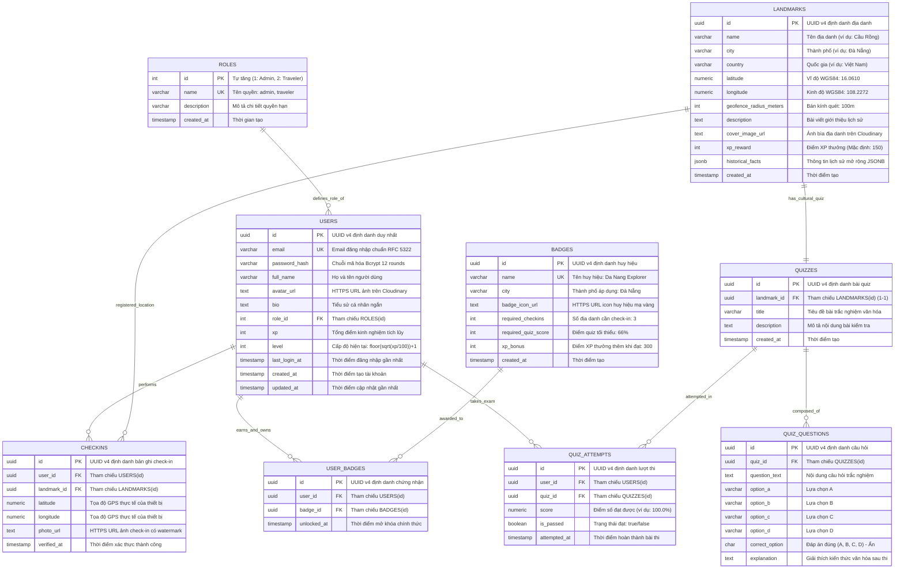
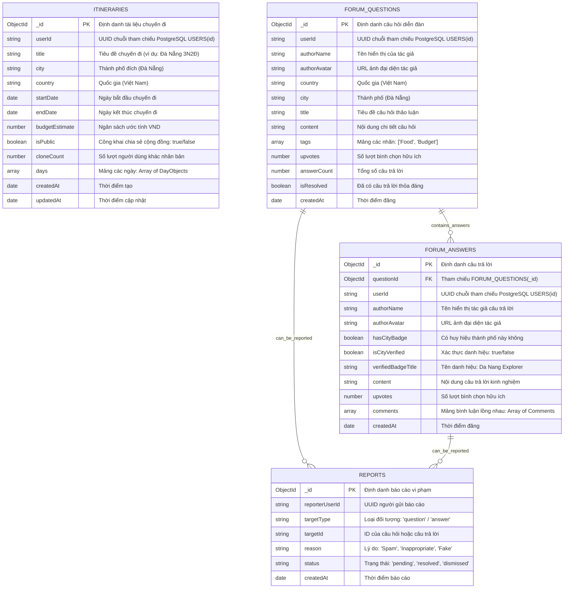
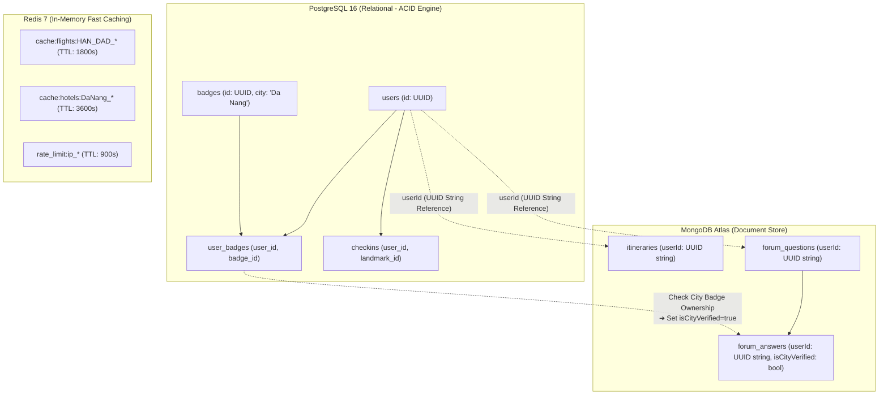

# 01. Comprehensive Entity-Relationship Diagram (ERD)

## Nomadix — All-in-one Smart Travel Platform
**Final Year Project (FYP) — University of Greenwich**  
**Student:** Nguyễn Văn Đức  
**Standard:** Relational 3NF & Document Schemas (Mermaid ERD Specification)  
**Phase:** Day 6 — Database Analysis & ERD Modeling  
**Milestone:** `D6 - Database Analysis` / `W1 - Requirements & Analysis`  

---

## 1. SƠ ĐỒ THỰC THỂ QUAN HỆ TOÀN DIỆN POSTGRESQL (RELATIONAL ERD 3NF)

Sơ đồ dưới đây mô hình hóa **toàn bộ 9 bảng quan hệ** trong cơ sở dữ liệu PostgreSQL của hệ thống Nomadix, tuân thủ chuẩn hóa 3NF (Third Normal Form), thể hiện đầy đủ các trường, kiểu dữ liệu, khóa chính (PK), khóa ngoại (FK) và mối quan hệ (Cardinality):

---

## 2. SƠ ĐỒ CẤU TRÚC TÀI LIỆU MONGODB (DOCUMENT COLLECTIONS ERD)

Sơ đồ dưới đây mô hình hóa cấu trúc tài liệu phân cấp lồng nhau (Embedded & Referenced Documents) của MongoDB Atlas:

---

## 3. SƠ ĐỒ LIÊN KẾT ĐA CƠ SỞ DỮ LIỆU (POLYGLOT PERSISTENCE MAP)

Sơ đồ dưới đây thể hiện sự phối hợp nhịp nhàng giữa **PostgreSQL**, **MongoDB** và **Redis**:

