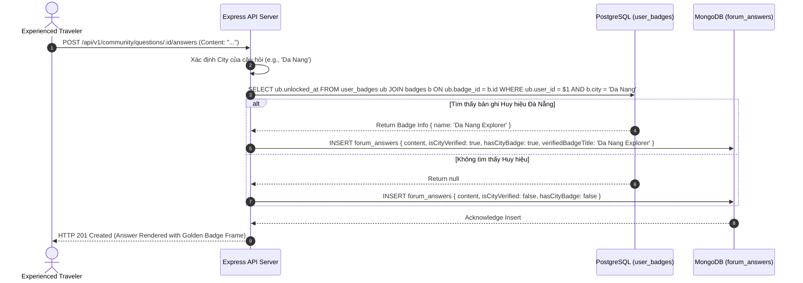

# 03. Polyglot Data Model & Cross-Database Integration Pattern

## Nomadix — All-in-one Smart Travel Platform
**Final Year Project (FYP) — University of Greenwich**  
**Student:** Nguyễn Văn Đức  
**Standard:** Polyglot Persistence Architecture & Data Integrity Pattern  
**Phase:** Day 6 — Database Analysis & ERD Modeling  

---

## 1. NGUYÊN LÝ THIẾT KẾ ĐA CƠ SỞ DỮ LIỆU (POLYGLOT PERSISTENCE PRINCIPLE)

Hệ thống **Nomadix** áp dụng mô hình **Polyglot Persistence** (Sử dụng đồng thời nhiều công nghệ cơ sở dữ liệu chuyên biệt), trong đó mỗi hệ quản trị được giao nhiệm vụ đúng với sở trường tối ưu nhất của nó:

```text
┌────────────────────────────────────────────────────────────────────────┐
│                   POLYGLOT DATABASE RESPONSIBILITY MATRIX              │
├─────────────────┬───────────────────┬──────────────────────────────────┤
│ Hệ Cơ Sở Dữ Liệu│ Trách nhiệm chính │ Tại sao chọn?                    │
├─────────────────┼───────────────────┼──────────────────────────────────┤
│ PostgreSQL 16   │ Identity, Auth,   │ Tính toàn vẹn ACID, chuẩn hóa    │
│ (Relational)    │ Gamification XP,  │ 3NF, bảo vệ điểm số, chống gian  │
│                 │ Badges, Check-ins │ lận check-in trùng lặp.          │
├─────────────────┼───────────────────┼──────────────────────────────────┤
│ MongoDB Atlas 7 │ Itineraries,      │ Cấu trúc tài liệu JSON linh hoạt,│
│ (Document Store)│ Community Q&A,    │ phân cấp nhiều tầng (Days/Items),│
│                 │ Comments, Reports │ tối ưu hóa việc ghi đọc lồng nhau│
├─────────────────┼───────────────────┼──────────────────────────────────┤
│ Redis 7         │ Search Caching,   │ Bộ nhớ RAM siêu tốc, phản hồi    │
│ (In-Memory)     │ Rate Limiting,    │ < 50ms, TTL tự động hủy dữ liệu  │
│                 │ Session Cache     │ cũ, giảm 80% tải API bên ngoài.  │
└─────────────────┴───────────────────┴──────────────────────────────────┘
```

---

## 2. CHIẾN LƯỢC KHÓA NGOẠI THAM CHIẾU CHÉO (CROSS-DB FOREIGN KEY PATTERN)

Do PostgreSQL và MongoDB nằm trên hai hệ quản trị vật lý độc lập, hệ thống không thể sử dụng cơ chế Foreign Key Cascade truyền thống ở tầng database. 

Thay vào đó, Nomadix triển khai **Design Pattern: Application-Level Referential Integrity**:

```text
PostgreSQL: users(id) [UUID v4, e.g., 'a0eebc99-9c0b-4ef8-bb6d-6bb9bd380a11']
                         │
                         ▼ (Lưu chuỗi String đồng nhất)
MongoDB:
  ├── itineraries.userId: 'a0eebc99-9c0b-4ef8-bb6d-6bb9bd380a11'
  ├── forum_questions.userId: 'a0eebc99-9c0b-4ef8-bb6d-6bb9bd380a11'
  └── forum_answers.userId: 'a0eebc99-9c0b-4ef8-bb6d-6bb9bd380a11'
```

---

## 3. GIAO THỨC XÁC THỰC UY TÍN LIÊN DATABASE (CITY VERIFIED PROTOCOL)

Khi một thành viên đăng bài hoặc trả lời trong diễn đàn, hệ thống thực hiện bắt cầu dữ liệu (Data Bridge) theo lưu đồ Mermaid sau:



---

## 4. CHIẾN LƯỢC QUẢN LÝ BỘ NHỚ REDIS & TAXONOMY KHÓA

```text
┌────────────────────────────────────────────────────────────────────────┐
│                        REDIS KEY TAXONOMY MATRIX                       │
├─────────────────┬──────────────────────────────────┬───────────────────┤
│ Loại dữ liệu    │ Cấu trúc Khóa (Key Pattern)      │ Thời hạn sống TTL │
├─────────────────┼──────────────────────────────────┼───────────────────┤
│ Chuyến bay      │ cache:flights:${origin}:${dest}: │ 1800 giây         │
│                 │ ${date}:${pax}:${class}          │ (30 phút)         │
├─────────────────┼──────────────────────────────────┼───────────────────┤
│ Khách sạn       │ cache:hotels:${city}:${checkIn}: │ 3600 giây         │
│                 │ ${checkOut}:${guests}:${rooms}   │ (60 phút)         │
├─────────────────┼──────────────────────────────────┼───────────────────┤
│ Địa danh static │ cache:landmarks:${city}          │ 86400 giây        │
│                 │                                  │ (24 giờ)          │
├─────────────────┼──────────────────────────────────┼───────────────────┤
│ Giới hạn tải    │ rate_limit:${ipAddress}          │ 900 giây          │
│ (Rate Limit)    │                                  │ (15 phút)         │
└─────────────────┴──────────────────────────────────┴───────────────────┘
```

### Ước tính dung lượng bộ nhớ RAM (Memory Sizing Calculation):
* Kích thước trung bình 1 bản ghi tìm kiếm sau chuẩn hóa: $\approx 15\text{ KB}$.
* Với $1,000$ truy vấn tìm kiếm đồng thời được lưu cache:
  $$\text{RAM Capacity} = 1,000 \times 15\text{ KB} \approx 15\text{ MB RAM}$$
* Dung lượng này chiếm chưa tới $5\%$ hạn mức gói Redis Cloud Free Tier ($30\text{ MB}$), bảo đảm hệ thống vận hành cực kỳ an toàn và tiết kiệm tài nguyên.
