# 04. Core Database ERD: Users & Authentication Architecture

## Nomadix — All-in-one Smart Travel Platform
**Final Year Project (FYP) — University of Greenwich**  
**Student:** Nguyễn Văn Đức  
**Standard:** Relational 3NF & OWASP ASVS Enterprise Security Guidelines  
**Phase:** Day 6 — Database Analysis & ERD Modeling  
**Module Focus:** Module 1: Authentication & Identity Management (Core Entity ERD)  

---

## 1. OVERVIEW & DESIGN PRINCIPLES

In modern secure architectures—particularly cross-platform mobile travel applications handling sensitive personal information, credentials, and cross-database references—the **User & Authentication Subsystem** requires a robust, 3NF-compliant relational model.

```
┌────────────────────────────────────────────────────────────────────────────────────────┐
│                        USERS & AUTHENTICATION SUBSYSTEM CORE                           │
├───────────────────────────────┬────────────────────────────────────────────────────────┤
│ Primary Database Engine       │ PostgreSQL 16 (Relational, Strict ACID Compliance)     │
│ Primary Key Strategy          │ RFC 4122 UUID v4 (`gen_random_uuid()`) for Users       │
│ Credential Security           │ Bcrypt (Salt factor = 12) + SHA-256 for Token Hashes   │
│ Access Control Model          │ Granular Role-Based Access Control (RBAC: Role+Perms)  │
│ Session Strategy              │ Short-lived JWT (1 day) + Rotated Refresh Tokens (30d) │
│ Session Invalidation          │ Explicit Token Revocation & Anti-Replay Detection      │
│ Audit & Compliance            │ Security Audit Logging for all Authentication Events   │
└───────────────────────────────┴────────────────────────────────────────────────────────┘
```

---

## 2. MERMAID ENTITY-RELATIONSHIP DIAGRAM (CORE ERD)

```mermaid
erDiagram
    %% ==========================================
    %% 1. CORE IDENTITY & RBAC ENTITIES
    %% ==========================================
    ROLES {
        serial id PK "Role Identifier (1: admin, 2: traveler, 3: moderator)"
        varchar name UK "Unique Role Code: 'admin', 'traveler', 'moderator'"
        varchar display_name "Human-readable Title: 'Administrator', 'Traveler'"
        varchar description "Scope and responsibility summary"
        boolean is_system "Protected system role flag"
        timestamptz created_at "Creation timestamp"
    }

    PERMISSIONS {
        serial id PK "Permission Identifier"
        varchar code UK "Slug: 'landmarks:create', 'forum:moderate', 'itineraries:export'"
        varchar module "Functional Area: 'GAMIFICATION', 'COMMUNITY', 'ADMIN'"
        varchar description "Action authorization description"
        timestamptz created_at "Creation timestamp"
    }

    ROLE_PERMISSIONS {
        int role_id PK,FK "References ROLES(id) ON DELETE CASCADE"
        int permission_id PK,FK "References PERMISSIONS(id) ON DELETE CASCADE"
        timestamptz granted_at "Timestamp permission was linked"
    }

    USERS {
        uuid id PK "UUID v4 Identity Key referenced across Mongo & Postgres"
        varchar email UK "RFC 5322 Normalized Lowercase Email"
        varchar password_hash "Bcrypt 12 rounds hash (NULL if OAuth-only account)"
        varchar full_name "Traveler's legal or display name"
        varchar phone_number "E.164 phone format (+84...)"
        text avatar_url "Cloudinary secure HTTPS URL"
        varchar bio "Short traveler self-introduction"
        varchar status "Account state: 'active', 'suspended', 'pending_verification'"
        boolean is_email_verified "Email verification confirmation status"
        int role_id FK "References ROLES(id)"
        int xp "Total accumulated Gamification Experience Points"
        int level "Calculated rank: floor(sqrt(xp/100)) + 1"
        timestamptz last_login_at "Most recent successful login timestamp"
        timestamptz created_at "Account registration timestamp"
        timestamptz updated_at "Profile modification timestamp"
        timestamptz deleted_at "Soft delete timestamp"
    }

    %% ==========================================
    %% 2. AUTHENTICATION & SECURITY ENTITIES
    %% ==========================================
    USER_REFRESH_TOKENS {
        uuid id PK "Token record UUID identifier"
        uuid user_id FK "References USERS(id) ON DELETE CASCADE"
        varchar token_hash UK "SHA-256 hash of plaintext refresh token"
        varchar device_id "Unique device installation identifier"
        varchar device_name "Device hardware name (e.g., iPhone 15 Pro)"
        varchar device_os "OS version string (e.g., iOS 18.2, Android 15)"
        varchar ip_address "Client IP address for geo-anomaly detection"
        text user_agent "Client HTTP User-Agent string"
        boolean is_revoked "Manual or automated revocation flag"
        timestamptz expires_at "Token lifetime expiration (30 days from issue)"
        timestamptz created_at "Issue timestamp"
        timestamptz revoked_at "Timestamp token was revoked"
    }

    USER_OAUTH_ACCOUNTS {
        uuid id PK "OAuth link identifier"
        uuid user_id FK "References USERS(id) ON DELETE CASCADE"
        varchar provider "Identity provider: 'google', 'apple', 'facebook'"
        varchar provider_user_id "Federated user ID from third-party provider"
        varchar provider_email "Email returned by identity provider"
        timestamptz linked_at "Timestamp third-party login was attached"
    }

    PASSWORD_RESET_TOKENS {
        uuid id PK "Reset token UUID identifier"
        uuid user_id FK "References USERS(id) ON DELETE CASCADE"
        varchar token_hash UK "SHA-256 digest of one-time recovery token"
        boolean is_consumed "Single-use redemption flag"
        timestamptz expires_at "Short expiration (15 minutes from issue)"
        timestamptz consumed_at "Timestamp of password change completion"
        timestamptz created_at "Token generation timestamp"
    }

    USER_PREFERENCES {
        uuid user_id PK,FK "References USERS(id) ON DELETE CASCADE (1:1)"
        char preferred_currency "ISO 4217 Currency Code: 'VND', 'USD', 'EUR'"
        varchar preferred_language "BCP-47 Language Tag: 'vi', 'en'"
        char home_airport_iata "Default departure IATA code (e.g., 'HAN', 'SGN')"
        varchar travel_style "Category: 'budget', 'culture', 'luxury', 'backpacker'"
        boolean push_notifications_enabled "Native APNS/FCM push toggle"
        boolean marketing_emails_enabled "Email newsletter consent flag"
        timestamptz updated_at "Last settings modification timestamp"
    }

    AUTH_AUDIT_LOGS {
        bigserial id PK "Sequenced log entry identifier"
        uuid user_id FK "References USERS(id) ON DELETE SET NULL (Nullable)"
        varchar attempted_email "Submitted email string in login attempt"
        varchar event_type "Event: 'LOGIN_SUCCESS', 'LOGIN_FAILED', 'TOKEN_REVOKED'"
        varchar status "Status outcome: 'SUCCESS', 'FAILURE'"
        varchar failure_reason "Reason: 'INVALID_CREDENTIALS', 'ACCOUNT_LOCKED'"
        varchar ip_address "Origin client IP"
        text user_agent "Client device User-Agent"
        timestamptz created_at "Log event timestamp"
    }

    %% ==========================================
    %% 3. ENTITY RELATIONSHIP CARDINALITIES
    %% ==========================================
    ROLES ||--o{ USERS : "assigned_to"
    ROLES ||--|{ ROLE_PERMISSIONS : "has_grants"
    PERMISSIONS ||--|{ ROLE_PERMISSIONS : "belongs_to"

    USERS ||--|| USER_PREFERENCES : "configures_settings"
    USERS ||--o{ USER_REFRESH_TOKENS : "maintains_active_sessions"
    USERS ||--o{ USER_OAUTH_ACCOUNTS : "authenticates_via"
    USERS ||--o{ PASSWORD_RESET_TOKENS : "requests_credential_recovery"
    USERS ||--o{ AUTH_AUDIT_LOGS : "generates_security_trails"
```



---

## 3. COMPREHENSIVE DATA DICTIONARY (CORE AUTH ENTITIES)

### 3.1 Table `users` (Central Identity Root)
* **Purpose:** Stores core traveler identity, security credentials, status flags, and gamification rank.
* **Primary Key:** `id` (UUID v4 via `gen_random_uuid()`).
* **Foreign Keys:** `role_id` $\rightarrow$ `roles(id)`.

| Column | Data Type | Nullable | Default | Constraints & Checks | Index Strategy | Description |
|---|---|:---:|---|---|:---:|---|
| `id` | `UUID` | NO | `gen_random_uuid()` | PRIMARY KEY | PK Index | Immutable UUID v4 identity key. |
| `email` | `VARCHAR(255)` | NO | None | UNIQUE, RFC 5322 | Unique B-Tree (`lower(email)`) | Normalized login email. |
| `password_hash` | `VARCHAR(255)` | YES | NULL | Bcrypt hash format | None | Bcrypt hash (12 salt rounds); NULL if OAuth-only. |
| `full_name` | `VARCHAR(100)` | NO | None | Min length 2 | Trigram GIN | Traveler's full display name. |
| `phone_number` | `VARCHAR(20)` | YES | NULL | E.164 standard | B-Tree | Optional mobile contact number. |
| `avatar_url` | `TEXT` | YES | NULL | Valid HTTPS URL | None | Cloudinary CDN avatar URL. |
| `bio` | `VARCHAR(500)` | YES | NULL | Max 500 chars | None | Self-written traveler bio. |
| `status` | `VARCHAR(25)` | NO | `'active'` | CHECK in (`active`, `suspended`, `pending_verification`, `deactivated`) | B-Tree Index | Lifecycle state of account. |
| `is_email_verified`| `BOOLEAN` | NO | `false` | None | None | Email verification flag. |
| `role_id` | `INT` | NO | `2` | FOREIGN KEY $\rightarrow$ `roles(id)` | B-Tree Index | Assigned RBAC role ID. |
| `xp` | `INT` | NO | `0` | CHECK (`xp >= 0`) | B-Tree Index | Gamification XP balance. |
| `level` | `INT` | NO | `1` | CHECK (`level >= 1`) | None | Calculated level tier. |
| `last_login_at` | `TIMESTAMPTZ` | YES | NULL | None | None | Timestamp of last session. |
| `created_at` | `TIMESTAMPTZ` | NO | `CURRENT_TIMESTAMP` | None | None | Registration timestamp. |
| `updated_at` | `TIMESTAMPTZ` | NO | `CURRENT_TIMESTAMP` | None | None | Last update timestamp. |
| `deleted_at` | `TIMESTAMPTZ` | YES | NULL | None | Partial Index | Soft-delete timestamp. |

---

### 3.2 Table `roles` (RBAC Role Definitions)
* **Purpose:** Defines distinct user clearance levels.
* **Primary Key:** `id` (SERIAL).

| Column | Data Type | Nullable | Default | Constraints | Description |
|---|---|:---:|---|---|---|
| `id` | `SERIAL` (INT) | NO | Auto | PRIMARY KEY | Unique role ID (1: admin, 2: traveler, 3: moderator). |
| `name` | `VARCHAR(50)` | NO | None | UNIQUE, NOT NULL | Machine code name: `admin`, `traveler`, `moderator`. |
| `display_name` | `VARCHAR(100)`| NO | None | NOT NULL | Human-readable role name (e.g., 'Traveler'). |
| `description` | `VARCHAR(255)`| YES | NULL | None | Detailed permissions and role scope. |
| `is_system` | `BOOLEAN` | NO | `true` | None | Disallows accidental deletion of core roles. |
| `created_at` | `TIMESTAMPTZ` | NO | `CURRENT_TIMESTAMP` | None | Creation timestamp. |

---

### 3.3 Table `permissions` & `role_permissions` (Granular RBAC Matrix)
* **Purpose:** Decouples specific business actions from roles for scalable security administration.

#### Table `permissions`:
* **Columns:** `id` (SERIAL PK), `code` (VARCHAR(100) UNIQUE, e.g. `'landmarks:create'`), `module` (VARCHAR(50), e.g. `'GAMIFICATION'`), `description` (VARCHAR(255)), `created_at` (TIMESTAMPTZ).

#### Table `role_permissions` (Junction Table):
* **Columns:** `role_id` (INT FK $\rightarrow$ `roles(id)` ON DELETE CASCADE), `permission_id` (INT FK $\rightarrow$ `permissions(id)` ON DELETE CASCADE), `granted_at` (TIMESTAMPTZ DEFAULT CURRENT_TIMESTAMP).
* **Composite Primary Key:** `PRIMARY KEY (role_id, permission_id)`.

---

### 3.4 Table `user_refresh_tokens` (JWT Refresh Token Rotation & Session Management)
* **Purpose:** Maintains multi-device persistent authentication sessions, token rotation, and instant revocation capabilities.
* **Primary Key:** `id` (UUID).
* **Foreign Key:** `user_id` $\rightarrow$ `users(id)` ON DELETE CASCADE.

| Column | Data Type | Nullable | Default | Constraints | Description |
|---|---|:---:|---|---|---|
| `id` | `UUID` | NO | `gen_random_uuid()` | PRIMARY KEY | Unique token identifier. |
| `user_id` | `UUID` | NO | None | FOREIGN KEY $\rightarrow$ `users(id)` | Owner user account reference. |
| `token_hash` | `VARCHAR(64)` | NO | None | UNIQUE, NOT NULL | SHA-256 digest of refresh token (plaintext token never stored). |
| `device_id` | `VARCHAR(100)` | YES | NULL | None | Unique hardware/installation identifier. |
| `device_name` | `VARCHAR(100)` | YES | NULL | None | Human-readable device name (e.g. 'iPhone 15'). |
| `device_os` | `VARCHAR(50)` | YES | NULL | None | Operating system name and version. |
| `ip_address` | `VARCHAR(45)` | YES | NULL | None | IPv4/IPv6 client address upon generation. |
| `user_agent` | `TEXT` | YES | NULL | None | Full HTTP User-Agent string. |
| `is_revoked` | `BOOLEAN` | NO | `false` | None | Revocation flag (blacklisting). |
| `expires_at` | `TIMESTAMPTZ` | NO | None | NOT NULL | Lifetime expiry timestamp (30 days). |
| `created_at` | `TIMESTAMPTZ` | NO | `CURRENT_TIMESTAMP` | None | Creation timestamp. |
| `revoked_at` | `TIMESTAMPTZ` | YES | NULL | None | Timestamp when explicitly invalidated. |

---

### 3.5 Table `user_oauth_accounts` (Federated Third-Party Logins)
* **Purpose:** Supports Social Login (Google Sign-In, Apple ID) without storing local passwords.
* **Primary Key:** `id` (UUID).
* **Unique Constraint:** `UNIQUE(provider, provider_user_id)`.

| Column | Data Type | Nullable | Constraints | Description |
|---|---|:---:|---|---|
| `id` | `UUID` | NO | PRIMARY KEY | Unique OAuth link identifier. |
| `user_id` | `UUID` | NO | FOREIGN KEY $\rightarrow$ `users(id)` | Linked Nomadix account. |
| `provider` | `VARCHAR(30)` | NO | CHECK (`provider IN ('google', 'apple', 'facebook')`) | Identity provider slug. |
| `provider_user_id`| `VARCHAR(255)` | NO | NOT NULL | External unique user ID from provider. |
| `provider_email` | `VARCHAR(255)` | YES | None | Email address returned by provider. |
| `linked_at` | `TIMESTAMPTZ` | NO | `CURRENT_TIMESTAMP` | Association timestamp. |

---

### 3.6 Table `user_preferences` (1:1 Traveler Profile Preferences)
* **Purpose:** Stores regional localization, UI defaults, and notification preferences.
* **Primary Key & Foreign Key:** `user_id` (UUID $\rightarrow$ `users(id)` ON DELETE CASCADE).

| Column | Data Type | Nullable | Default | Description |
|---|---|:---:|---|---|
| `user_id` | `UUID` | NO | None | 1:1 Primary Key linking to `users(id)`. |
| `preferred_currency`| `CHAR(3)` | NO | `'VND'` | ISO 4217 Currency code (`VND`, `USD`, `EUR`). |
| `preferred_language`| `VARCHAR(10)` | NO | `'vi'` | BCP-47 Language code (`vi`, `en`). |
| `home_airport_iata` | `CHAR(3)` | YES | NULL | Default origin airport (e.g. `'HAN'`, `'DAD'`, `'SGN'`). |
| `travel_style` | `VARCHAR(50)` | NO | `'budget'` | Traveler profile: `budget`, `culture`, `luxury`, `adventure`. |
| `push_notifications`| `BOOLEAN` | NO | `true` | Mobile push notifications enabled. |
| `marketing_emails` | `BOOLEAN` | NO | `false` | Promotional newsletter opt-in. |
| `updated_at` | `TIMESTAMPTZ` | NO | `CURRENT_TIMESTAMP` | Last updated timestamp. |

---

### 3.7 Table `password_reset_tokens` (Credential Recovery)
* **Purpose:** Facilitates secure, time-delimited, single-use password reset workflows.
* **Primary Key:** `id` (UUID).

| Column | Data Type | Nullable | Default | Description |
|---|---|:---:|---|---|
| `id` | `UUID` | NO | `gen_random_uuid()` | Unique record ID. |
| `user_id` | `UUID` | NO | None | Target user account reference. |
| `token_hash` | `VARCHAR(64)` | NO | None | SHA-256 digest of secret token. |
| `is_consumed` | `BOOLEAN` | NO | `false` | Prevents replay attacks once redeemed. |
| `expires_at` | `TIMESTAMPTZ` | NO | None | Expiration limit (15 minutes from issue). |
| `consumed_at` | `TIMESTAMPTZ` | YES | NULL | Timestamp of password reset. |
| `created_at` | `TIMESTAMPTZ` | NO | `CURRENT_TIMESTAMP` | Generation timestamp. |

---

### 3.8 Table `auth_audit_logs` (Security Audit Logging)
* **Purpose:** Compliance logging for OWASP A09: Security Logging and Monitoring Failures.
* **Primary Key:** `id` (BIGSERIAL).

| Column | Data Type | Nullable | Description |
|---|---|:---:|---|
| `id` | `BIGSERIAL` | NO | Sequential log entry ID. |
| `user_id` | `UUID` | YES | User ID if recognized; NULL for non-existent users. |
| `attempted_email`| `VARCHAR(255)` | NO | Email address used in the attempt. |
| `event_type` | `VARCHAR(50)` | NO | `LOGIN_SUCCESS`, `LOGIN_FAILED`, `LOGOUT`, `PASSWORD_RESET`, `TOKEN_REVOCATION`. |
| `status` | `VARCHAR(20)` | NO | `SUCCESS` or `FAILURE`. |
| `failure_reason` | `VARCHAR(100)`| YES | Failure explanation (`INVALID_PASSWORD`, `ACCOUNT_SUSPENDED`, `EXPIRED_TOKEN`). |
| `ip_address` | `VARCHAR(45)` | YES | Originating client IP address. |
| `user_agent` | `TEXT` | YES | Originating device User-Agent header. |
| `created_at` | `TIMESTAMPTZ` | NO | Immutable event timestamp (`CURRENT_TIMESTAMP`). |

---

## 4. POSTGRESQL DDL IMPLEMENTATION SCRIPT

```sql
-- ============================================================================
-- NOMADIX POSTGRESQL DDL: CORE USERS & AUTHENTICATION SUBSYSTEM
-- ============================================================================

-- Enable pgcrypto for UUID v4 generation
CREATE EXTENSION IF NOT EXISTS "pgcrypto";

-- 1. ROLES TABLE
CREATE TABLE roles (
    id SERIAL PRIMARY KEY,
    name VARCHAR(50) NOT NULL UNIQUE,
    display_name VARCHAR(100) NOT NULL,
    description VARCHAR(255),
    is_system BOOLEAN NOT NULL DEFAULT true,
    created_at TIMESTAMPTZ NOT NULL DEFAULT CURRENT_TIMESTAMP
);

-- 2. PERMISSIONS TABLE
CREATE TABLE permissions (
    id SERIAL PRIMARY KEY,
    code VARCHAR(100) NOT NULL UNIQUE,
    module VARCHAR(50) NOT NULL,
    description VARCHAR(255),
    created_at TIMESTAMPTZ NOT NULL DEFAULT CURRENT_TIMESTAMP
);

-- 3. ROLE_PERMISSIONS JUNCTION TABLE
CREATE TABLE role_permissions (
    role_id INT NOT NULL REFERENCES roles(id) ON DELETE CASCADE,
    permission_id INT NOT NULL REFERENCES permissions(id) ON DELETE CASCADE,
    granted_at TIMESTAMPTZ NOT NULL DEFAULT CURRENT_TIMESTAMP,
    PRIMARY KEY (role_id, permission_id)
);

-- 4. USERS TABLE
CREATE TABLE users (
    id UUID PRIMARY KEY DEFAULT gen_random_uuid(),
    email VARCHAR(255) NOT NULL,
    password_hash VARCHAR(255),
    full_name VARCHAR(100) NOT NULL,
    phone_number VARCHAR(20),
    avatar_url TEXT,
    bio VARCHAR(500),
    status VARCHAR(25) NOT NULL DEFAULT 'active' 
        CHECK (status IN ('active', 'suspended', 'pending_verification', 'deactivated')),
    is_email_verified BOOLEAN NOT NULL DEFAULT false,
    role_id INT NOT NULL DEFAULT 2 REFERENCES roles(id),
    xp INT NOT NULL DEFAULT 0 CHECK (xp >= 0),
    level INT NOT NULL DEFAULT 1 CHECK (level >= 1),
    last_login_at TIMESTAMPTZ,
    created_at TIMESTAMPTZ NOT NULL DEFAULT CURRENT_TIMESTAMP,
    updated_at TIMESTAMPTZ NOT NULL DEFAULT CURRENT_TIMESTAMP,
    deleted_at TIMESTAMPTZ
);

-- Enforce lowercase unique index on email
CREATE UNIQUE INDEX idx_users_email_lower ON users (LOWER(email)) WHERE deleted_at IS NULL;
CREATE INDEX idx_users_role_id ON users(role_id);
CREATE INDEX idx_users_status ON users(status);

-- 5. USER_PREFERENCES TABLE (1:1)
CREATE TABLE user_preferences (
    user_id UUID PRIMARY KEY REFERENCES users(id) ON DELETE CASCADE,
    preferred_currency CHAR(3) NOT NULL DEFAULT 'VND',
    preferred_language VARCHAR(10) NOT NULL DEFAULT 'vi',
    home_airport_iata CHAR(3),
    travel_style VARCHAR(50) NOT NULL DEFAULT 'budget'
        CHECK (travel_style IN ('budget', 'culture', 'luxury', 'adventure', 'backpacker')),
    push_notifications_enabled BOOLEAN NOT NULL DEFAULT true,
    marketing_emails_enabled BOOLEAN NOT NULL DEFAULT false,
    updated_at TIMESTAMPTZ NOT NULL DEFAULT CURRENT_TIMESTAMP
);

-- 6. USER_REFRESH_TOKENS TABLE
CREATE TABLE user_refresh_tokens (
    id UUID PRIMARY KEY DEFAULT gen_random_uuid(),
    user_id UUID NOT NULL REFERENCES users(id) ON DELETE CASCADE,
    token_hash VARCHAR(64) NOT NULL UNIQUE,
    device_id VARCHAR(100),
    device_name VARCHAR(100),
    device_os VARCHAR(50),
    ip_address VARCHAR(45),
    user_agent TEXT,
    is_revoked BOOLEAN NOT NULL DEFAULT false,
    expires_at TIMESTAMPTZ NOT NULL,
    created_at TIMESTAMPTZ NOT NULL DEFAULT CURRENT_TIMESTAMP,
    revoked_at TIMESTAMPTZ
);

CREATE INDEX idx_refresh_tokens_user_id ON user_refresh_tokens(user_id);
CREATE INDEX idx_refresh_tokens_hash ON user_refresh_tokens(token_hash) WHERE is_revoked = false;

-- 7. USER_OAUTH_ACCOUNTS TABLE
CREATE TABLE user_oauth_accounts (
    id UUID PRIMARY KEY DEFAULT gen_random_uuid(),
    user_id UUID NOT NULL REFERENCES users(id) ON DELETE CASCADE,
    provider VARCHAR(30) NOT NULL CHECK (provider IN ('google', 'apple', 'facebook')),
    provider_user_id VARCHAR(255) NOT NULL,
    provider_email VARCHAR(255),
    linked_at TIMESTAMPTZ NOT NULL DEFAULT CURRENT_TIMESTAMP,
    CONSTRAINT uq_provider_user UNIQUE (provider, provider_user_id)
);

CREATE INDEX idx_oauth_user_id ON user_oauth_accounts(user_id);

-- 8. PASSWORD_RESET_TOKENS TABLE
CREATE TABLE password_reset_tokens (
    id UUID PRIMARY KEY DEFAULT gen_random_uuid(),
    user_id UUID NOT NULL REFERENCES users(id) ON DELETE CASCADE,
    token_hash VARCHAR(64) NOT NULL UNIQUE,
    is_consumed BOOLEAN NOT NULL DEFAULT false,
    expires_at TIMESTAMPTZ NOT NULL,
    consumed_at TIMESTAMPTZ,
    created_at TIMESTAMPTZ NOT NULL DEFAULT CURRENT_TIMESTAMP
);

CREATE INDEX idx_password_resets_hash ON password_reset_tokens(token_hash) WHERE is_consumed = false;

-- 9. AUTH_AUDIT_LOGS TABLE
CREATE TABLE auth_audit_logs (
    id BIGSERIAL PRIMARY KEY,
    user_id UUID REFERENCES users(id) ON DELETE SET NULL,
    attempted_email VARCHAR(255) NOT NULL,
    event_type VARCHAR(50) NOT NULL,
    status VARCHAR(20) NOT NULL,
    failure_reason VARCHAR(100),
    ip_address VARCHAR(45),
    user_agent TEXT,
    created_at TIMESTAMPTZ NOT NULL DEFAULT CURRENT_TIMESTAMP
);

CREATE INDEX idx_auth_audit_user_id ON auth_audit_logs(user_id);
CREATE INDEX idx_auth_audit_created_at ON auth_audit_logs(created_at DESC);

-- SEED SYSTEM ROLES
INSERT INTO roles (id, name, display_name, description, is_system) VALUES
(1, 'admin', 'Administrator', 'Full system configuration, moderation, and data curation access', true),
(2, 'traveler', 'Independent Traveler', 'Standard mobile user with trip planning, check-in, and community privileges', true),
(3, 'moderator', 'Community Moderator', 'Content moderation rights over forum Q&A and user reports', true)
ON CONFLICT (id) DO NOTHING;
```

---

## 5. SECURITY & ARCHITECTURAL HIGHLIGHTS

1. **Token Storage Security:**
   * Plaintext JWT Refresh Tokens are generated using `crypto.randomBytes(32).toString('hex')` on the server.
   * Only the **SHA-256 hash** (`crypto.createHash('sha256').update(plaintext).digest('hex')`) is saved in `user_refresh_tokens.token_hash`. Even if the database is breached, active refresh tokens cannot be forged or hijacked.
2. **Refresh Token Rotation (RTR):**
   * Every time a client requests a new Access Token using a Refresh Token, the existing Refresh Token is immediately marked as `is_revoked = true` and replaced with an entirely new token.
   * If a revoked token is used again, the system identifies a potential token reuse breach and revokes all active sessions for that user.
3. **Cross-Database Foreign Key Integrity:**
   * The `users.id` (UUID v4) serves as the immutable foreign reference stored as a string across MongoDB collections (`itineraries.userId`, `forum_questions.userId`, `forum_answers.userId`).
