# 05. Core Database ERD: Booking Models & User Profile Integration

## Nomadix — All-in-one Smart Travel Platform
**Final Year Project (FYP) — University of Greenwich**  
**Student:** Nguyễn Văn Đức  
**Standard:** Relational 3NF & Financial Precision Architecture  
**Phase:** Day 6 — Database Analysis & ERD Modeling  
**Module Focus:** Module 2: Smart Booking Aggregator & Module 1: User Profile Relational Links  

---

## 1. ARCHITECTURAL OVERVIEW & DESIGN PRINCIPLES

While search results in the **Smart Booking Aggregator** (Module 2) are dynamically cached in Redis (with 30-minute TTL for flights and 60-minute TTL for hotels), all **persisted bookings, saved travel wishlists, passenger identity documents, and financial transactions** require strict ACID guarantees in **PostgreSQL 16**.

```
┌────────────────────────────────────────────────────────────────────────────────────────┐
│                        BOOKING & USER PROFILE SUBSYSTEM CORE                           │
├───────────────────────────────┬────────────────────────────────────────────────────────┤
│ Primary Database Engine       │ PostgreSQL 16 (Strict ACID, 3NF Normalization)         │
│ Financial Precision Standard  │ `NUMERIC(12, 2)` (Zero floating-point rounding errors) │
│ User Profile Association      │ Foreign Key `user_id` referencing `users(id)`          │
│ Passenger Information Security│ AES-256 encrypted fields for passport/identity data    │
│ Cross-Module Linkage          │ Itinerary Binding (`itinerary_id` UUID string)         │
│ Monetization / Tracking       │ Outbound Affiliate Click Logs & PNR Confirmation Store │
└───────────────────────────────┴────────────────────────────────────────────────────────┘
```

---

## 2. MERMAID ENTITY-RELATIONSHIP DIAGRAM (BOOKING SUBSYSTEM)

```mermaid
erDiagram
    %% ==========================================
    %% 1. USER PROFILE & PASSENGER ENTITIES
    %% ==========================================
    USERS ||--|| USER_PREFERENCES : "configures_defaults"
    USERS ||--o{ TRAVELER_PROFILES : "maintains_saved_passengers"
    USERS ||--o{ SAVED_OFFERS : "bookmarks_for_later"
    USERS ||--o{ BOOKINGS : "places_and_owns"
    USERS ||--o{ PAYMENT_TRANSACTIONS : "funds"

    USERS {
        uuid id PK "UUID v4 Identity Key"
        varchar email UK "User Login Email"
        varchar full_name "Primary Account Holder Name"
        varchar phone_number "Primary Contact Phone"
        int xp "Gamification XP"
        int level "Calculated User Rank"
    }

    USER_PREFERENCES {
        uuid user_id PK,FK "References USERS(id) (1:1)"
        char preferred_currency "Currency Code (e.g., 'VND', 'USD')"
        char home_airport_iata "Default Departure Airport ('HAN', 'DAD')"
        varchar travel_style "'budget', 'culture', 'luxury'"
    }

    TRAVELER_PROFILES {
        uuid id PK "Traveler Profile UUID"
        uuid user_id FK "References USERS(id) ON DELETE CASCADE"
        varchar first_name "Given name as on passport"
        varchar last_name "Surname as on passport"
        date date_of_birth "Date of birth for age fare calculation"
        varchar gender "Gender: 'MALE', 'FEMALE', 'OTHER'"
        varchar nationality_code "ISO 3166-1 alpha-2 (e.g., 'VN', 'US')"
        varchar passport_number "Encrypted passport / national ID string"
        date passport_expiry_date "Passport validity expiration"
        varchar frequent_flyer_airline "Airline Code (e.g., 'VN', 'VJ')"
        varchar frequent_flyer_number "Frequent flyer account ID"
        boolean is_primary_user "Flag indicating account owner identity"
        timestamptz created_at "Profile creation timestamp"
        timestamptz updated_at "Profile update timestamp"
    }

    SAVED_OFFERS {
        uuid id PK "Bookmark Identifier"
        uuid user_id FK "References USERS(id) ON DELETE CASCADE"
        varchar item_type "Offer Type: 'FLIGHT' or 'HOTEL'"
        varchar provider "Origin: 'AMADEUS', 'RAPIDAPI', 'MOCK'"
        varchar provider_offer_id "Raw identifier from provider"
        varchar title "Summary title (e.g., 'HAN -> DAD VN-128')"
        numeric price_amount "Snapshot price (NUMERIC 12,2)"
        char price_currency "Currency code (DEFAULT: 'VND')"
        jsonb offer_payload "Full normalized JSON payload snapshot"
        timestamptz expires_at "Offer price guarantee expiration"
        timestamptz created_at "Saved timestamp"
    }

    %% ==========================================
    %% 2. CORE BOOKING ENTITIES
    %% ==========================================
    BOOKINGS ||--o{ FLIGHT_BOOKINGS : "contains_flight_segments"
    BOOKINGS ||--o{ HOTEL_BOOKINGS : "contains_hotel_stays"
    BOOKINGS ||--o{ BOOKING_PASSENGERS : "assigns_travelers"
    BOOKINGS ||--o{ PAYMENT_TRANSACTIONS : "billed_under"
    BOOKINGS ||--o{ AFFILIATE_OUTBOUND_CLICKS : "generated_from"

    TRAVELER_PROFILES ||--o{ BOOKING_PASSENGERS : "referenced_in"

    BOOKINGS {
        uuid id PK "Booking Order UUID Identifier"
        uuid user_id FK "References USERS(id) ON DELETE RESTRICT"
        varchar booking_reference UK "Unique PNR or Booking Code (e.g., 'NMDX-88421')"
        varchar booking_type "Category: 'FLIGHT', 'HOTEL', 'COMBO'"
        varchar status "Status: 'DRAFT', 'PENDING', 'CONFIRMED', 'CANCELLED', 'REFUNDED'"
        numeric total_amount "Total Gross Price in VND"
        char currency "ISO 4217 Currency: 'VND'"
        varchar primary_contact_email "Contact Email for E-tickets"
        varchar primary_contact_phone "Contact Phone for SMS Alerts"
        uuid itinerary_id "Optional Cross-Reference to MongoDB Itinerary"
        varchar provider "Source: 'AMADEUS', 'RAPIDAPI', 'DIRECT_PARTNER'"
        varchar external_pnr "Airline/Hotel Vendor PNR Code"
        text deep_link_url "Outbound Partner Confirmation URL"
        timestamptz booked_at "Confirmation timestamp"
        timestamptz created_at "Order record creation timestamp"
        timestamptz updated_at "Order modification timestamp"
    }

    FLIGHT_BOOKINGS {
        uuid id PK "Flight Segment UUID"
        uuid booking_id FK "References BOOKINGS(id) ON DELETE CASCADE"
        varchar airline_code "IATA Airline Code (e.g., 'VN', 'VJ')"
        varchar airline_name "Airline Title (e.g., 'Vietnam Airlines')"
        varchar flight_number "Flight Number (e.g., 'VN-128')"
        char departure_airport "IATA 3-Letter Origin (e.g., 'HAN')"
        char arrival_airport "IATA 3-Letter Destination (e.g., 'DAD')"
        timestamptz departure_time "Scheduled Departure Time (UTC)"
        timestamptz arrival_time "Scheduled Arrival Time (UTC)"
        int duration_minutes "Flight Duration in minutes"
        varchar cabin_class "'ECONOMY', 'PREMIUM_ECONOMY', 'BUSINESS'"
        int baggage_allowance_kg "Included checked baggage weight (kg)"
        int stops_count "Number of layovers (0 = direct)"
    }

    HOTEL_BOOKINGS {
        uuid id PK "Hotel Stay UUID"
        uuid booking_id FK "References BOOKINGS(id) ON DELETE CASCADE"
        varchar hotel_name "Property Name (e.g., 'Novotel Danang')"
        varchar city "Destination City (e.g., 'Đà Nẵng')"
        text hotel_address "Full street address"
        numeric latitude "WGS84 Latitude"
        numeric longitude "WGS84 Longitude"
        date check_in_date "Check-in Date"
        date check_out_date "Check-out Date"
        int number_of_nights "Duration of stay in nights"
        varchar room_type "Room Category (e.g., 'Deluxe Ocean View')"
        int number_of_rooms "Quantity of rooms reserved"
        int number_of_guests "Total registered guests"
    }

    BOOKING_PASSENGERS {
        uuid id PK "Passenger Assignment UUID"
        uuid booking_id FK "References BOOKINGS(id) ON DELETE CASCADE"
        uuid traveler_profile_id FK "References TRAVELER_PROFILES(id) ON DELETE SET NULL"
        varchar passenger_type "'ADULT', 'CHILD', 'INFANT'"
        varchar title "'MR', 'MS', 'MRS', 'MSTR'"
        varchar first_name "Passenger First Name"
        varchar last_name "Passenger Last Name"
        date date_of_birth "Date of Birth"
        varchar passport_number "Passport/National ID Number"
        varchar ticket_number "Airline E-ticket Number"
        varchar seat_assignment "Assigned Seat (e.g., '14A')"
        varchar special_requests "Meal or assistance request"
    }

    PAYMENT_TRANSACTIONS {
        uuid id PK "Transaction UUID"
        uuid booking_id FK "References BOOKINGS(id) ON DELETE RESTRICT"
        uuid user_id FK "References USERS(id) ON DELETE RESTRICT"
        varchar transaction_reference UK "Gateway Payment Reference"
        varchar payment_method "'VNPAY', 'MOMO', 'STRIPE', 'CREDIT_CARD'"
        numeric amount "Charged Amount (NUMERIC 12,2)"
        char currency "ISO 4217 Currency (e.g., 'VND')"
        varchar status "'PENDING', 'SUCCESS', 'FAILED', 'REFUNDED'"
        jsonb gateway_response "Raw Webhook / IPN response from Gateway"
        timestamptz paid_at "Payment capture timestamp"
        timestamptz created_at "Transaction initiation timestamp"
    }

    AFFILIATE_OUTBOUND_CLICKS {
        uuid id PK "Click Log UUID"
        uuid user_id FK "References USERS(id) ON DELETE SET NULL"
        uuid booking_id FK "References BOOKINGS(id) ON DELETE SET NULL"
        varchar provider "Target Provider: 'AMADEUS', 'AGODA', 'BOOKING_COM'"
        varchar item_type "'FLIGHT', 'HOTEL'"
        text target_url "Full affiliate tracking link"
        varchar ip_address "Origin client IP"
        numeric estimated_commission "Projected affiliate referral payout"
        boolean is_converted "Conversion confirmation flag"
        timestamptz clicked_at "Click event timestamp"
    }
```



---

## 3. DATA DICTIONARY: BOOKING & PROFILE ENTITIES

### 3.1 Table `traveler_profiles` (Saved Passengers & Identity Documents)
* **Purpose:** Stores traveler identity details for the account holder and their family/companions for rapid autofill during booking.
* **Primary Key:** `id` (UUID).
* **Foreign Key:** `user_id` $\rightarrow$ `users(id)` ON DELETE CASCADE.

| Column | Data Type | Nullable | Default | Constraints | Description |
|---|---|:---:|---|---|---|
| `id` | `UUID` | NO | `gen_random_uuid()` | PRIMARY KEY | Unique profile identifier. |
| `user_id` | `UUID` | NO | None | FOREIGN KEY | Account holder who manages this profile. |
| `first_name` | `VARCHAR(60)` | NO | None | NOT NULL | First/given name as spelled on passport. |
| `last_name` | `VARCHAR(60)` | NO | None | NOT NULL | Last/family name as spelled on passport. |
| `date_of_birth` | `DATE` | NO | None | CHECK (`dob < CURRENT_DATE`) | Birthdate for infant/child fare calculation. |
| `gender` | `VARCHAR(10)` | NO | None | CHECK (`gender IN ('MALE', 'FEMALE', 'OTHER')`) | Biological gender required by airline manifests. |
| `nationality_code` | `CHAR(2)` | NO | `'VN'` | ISO 3166-1 alpha-2 | Country of citizenship. |
| `passport_number` | `VARCHAR(100)` | YES | NULL | Encrypted string | Passport or national ID number. |
| `passport_expiry` | `DATE` | YES | NULL | None | Passport expiration date. |
| `frequent_flyer_airline` | `VARCHAR(10)`| YES | NULL | None | Loyalty airline code (e.g. `VN`, `VJ`). |
| `frequent_flyer_number` | `VARCHAR(50)` | YES | NULL | None | Frequent flyer account number. |
| `is_primary_user` | `BOOLEAN` | NO | `false` | None | True if profile belongs to the account holder. |
| `created_at` | `TIMESTAMPTZ` | NO | `CURRENT_TIMESTAMP` | None | Creation timestamp. |
| `updated_at` | `TIMESTAMPTZ` | NO | `CURRENT_TIMESTAMP` | None | Last updated timestamp. |

---

### 3.2 Table `saved_offers` (Travel Wishlist / Bookmarks)
* **Purpose:** Enables travelers to save flight and hotel offers found during aggregation searches to view or book later.
* **Primary Key:** `id` (UUID).

| Column | Data Type | Nullable | Default | Description |
|---|---|:---:|---|---|
| `id` | `UUID` | NO | `gen_random_uuid()` | Unique bookmark ID. |
| `user_id` | `UUID` | NO | None | Foreign Key referencing `users(id)`. |
| `item_type` | `VARCHAR(10)` | NO | None | `'FLIGHT'` or `'HOTEL'`. |
| `provider` | `VARCHAR(30)` | NO | None | OTA source (`AMADEUS`, `RAPIDAPI`, `MOCK`). |
| `provider_offer_id` | `VARCHAR(255)`| NO | None | Identifier from original search provider. |
| `title` | `VARCHAR(200)`| NO | None | Display title (e.g. *"Hanoi to Da Nang - Vietnam Airlines"*). |
| `price_amount` | `NUMERIC(12,2)`| NO | None | Snapshot price in VND at the moment of bookmarking. |
| `price_currency` | `CHAR(3)` | NO | `'VND'` | Currency code. |
| `offer_payload` | `JSONB` | NO | None | Full normalized `UnifiedFlight` or `UnifiedHotel` JSON. |
| `expires_at` | `TIMESTAMPTZ` | YES | NULL | Timestamp when provider fare expires. |
| `created_at` | `TIMESTAMPTZ` | NO | `CURRENT_TIMESTAMP` | Timestamp saved. |

---

### 3.3 Table `bookings` (Central Master Order Entity)
* **Purpose:** Master record for all reservations made directly or tracked via partner hand-offs.
* **Primary Key:** `id` (UUID).
* **Foreign Key:** `user_id` $\rightarrow$ `users(id)` ON DELETE RESTRICT (Prevents deleting users who have active bookings).

| Column | Data Type | Nullable | Default | Constraints | Description |
|---|---|:---:|---|---|---|
| `id` | `UUID` | NO | `gen_random_uuid()` | PRIMARY KEY | Unique internal booking identifier. |
| `user_id` | `UUID` | NO | None | FOREIGN KEY | Purchasing traveler. |
| `booking_reference` | `VARCHAR(20)` | NO | None | UNIQUE, NOT NULL | Nomadix order reference (e.g. `NMDX-2026-88421`). |
| `booking_type` | `VARCHAR(15)` | NO | None | CHECK in (`FLIGHT`, `HOTEL`, `COMBO`) | Product type. |
| `status` | `VARCHAR(20)` | NO | `'PENDING'` | CHECK in (`DRAFT`, `PENDING`, `CONFIRMED`, `CANCELLED`, `REFUNDED`) | Lifecycle state. |
| `total_amount` | `NUMERIC(12,2)`| NO | None | CHECK (`total_amount >= 0`) | Total price charged in VND. |
| `currency` | `CHAR(3)` | NO | `'VND'` | ISO 4217 | Standardized currency. |
| `primary_contact_email` | `VARCHAR(255)`| NO | None | RFC 5322 | Email destination for confirmation e-tickets. |
| `primary_contact_phone` | `VARCHAR(20)` | NO | None | E.164 | Mobile contact number for itinerary notifications. |
| `itinerary_id` | `UUID` | YES | NULL | None | Optional cross-DB UUID of linked MongoDB itinerary. |
| `provider` | `VARCHAR(30)` | NO | None | None | Provider code (`AMADEUS`, `RAPIDAPI`, `DIRECT`). |
| `external_pnr` | `VARCHAR(50)` | YES | NULL | None | Official airline PNR or hotel confirmation code. |
| `deep_link_url` | `TEXT` | YES | NULL | None | Partner redirection URL for external checkout. |
| `booked_at` | `TIMESTAMPTZ` | YES | NULL | None | Timestamp of formal booking confirmation. |
| `created_at` | `TIMESTAMPTZ` | NO | `CURRENT_TIMESTAMP` | None | Record creation timestamp. |
| `updated_at` | `TIMESTAMPTZ` | NO | `CURRENT_TIMESTAMP` | None | Last update timestamp. |

---

### 3.4 Table `flight_bookings` (Flight Segment Specifics)
* **Purpose:** Stores specific airline travel details for flight orders.
* **Primary Key:** `id` (UUID).
* **Foreign Key:** `booking_id` $\rightarrow$ `bookings(id)` ON DELETE CASCADE.

| Column | Data Type | Nullable | Description |
|---|---|:---:|---|
| `id` | `UUID` | NO | Flight record identifier. |
| `booking_id` | `UUID` | NO | Parent booking order reference. |
| `airline_code` | `VARCHAR(10)` | NO | Carrier IATA code (e.g. `'VN'`, `'VJ'`, `'QH'`). |
| `airline_name` | `VARCHAR(100)`| NO | Operating airline title (e.g. `'Vietnam Airlines'`). |
| `flight_number` | `VARCHAR(20)` | NO | Flight designator (e.g. `'VN-128'`). |
| `departure_airport`| `CHAR(3)` | NO | Departure airport IATA code (e.g. `'HAN'`). |
| `arrival_airport` | `CHAR(3)` | NO | Destination airport IATA code (e.g. `'DAD'`). |
| `departure_time` | `TIMESTAMPTZ` | NO | Scheduled departure time in UTC. |
| `arrival_time` | `TIMESTAMPTZ` | NO | Scheduled arrival time in UTC. |
| `duration_minutes` | `INT` | NO | Total flight duration in minutes. |
| `cabin_class` | `VARCHAR(20)` | NO | `'ECONOMY'`, `'PREMIUM_ECONOMY'`, `'BUSINESS'`. |
| `baggage_allowance_kg`| `INT` | NO | Included luggage weight (e.g. `23`). |
| `stops_count` | `INT` | NO | Number of stops (`0` = non-stop). |

---

### 3.5 Table `hotel_bookings` (Accommodation Stay Specifics)
* **Purpose:** Stores lodging and room reservation details.
* **Primary Key:** `id` (UUID).
* **Foreign Key:** `booking_id` $\rightarrow$ `bookings(id)` ON DELETE CASCADE.

| Column | Data Type | Nullable | Description |
|---|---|:---:|---|
| `id` | `UUID` | NO | Hotel stay record identifier. |
| `booking_id` | `UUID` | NO | Parent booking order reference. |
| `hotel_name` | `VARCHAR(150)`| NO | Property name (e.g. `'Novotel Danang Premier'`). |
| `city` | `VARCHAR(100)`| NO | Target destination city. |
| `hotel_address` | `TEXT` | NO | Street address of property. |
| `latitude` | `NUMERIC(10,7)`| NO | Geographical latitude. |
| `longitude` | `NUMERIC(10,7)`| NO | Geographical longitude. |
| `check_in_date` | `DATE` | NO | Scheduled arrival date. |
| `check_out_date`| `DATE` | NO | Scheduled departure date. |
| `number_of_nights`| `INT` | NO | Computed stay length (`check_out_date - check_in_date`). |
| `room_type` | `VARCHAR(100)`| NO | Room category (e.g. `'Superior King Room'`). |
| `number_of_rooms`| `INT` | NO | Number of reserved rooms. |
| `number_of_guests`| `INT` | NO | Number of accommodated travelers. |

---

### 3.6 Table `booking_passengers` (Passenger Manifest Assignment)
* **Purpose:** Binds travelers to a booking order, linking back to their `traveler_profiles`.
* **Primary Key:** `id` (UUID).

| Column | Data Type | Nullable | Description |
|---|---|:---:|---|
| `id` | `UUID` | NO | Manifest assignment identifier. |
| `booking_id` | `UUID` | NO | Foreign Key referencing `bookings(id)`. |
| `traveler_profile_id`| `UUID` | YES | Optional link back to `traveler_profiles(id)`. |
| `passenger_type` | `VARCHAR(10)` | NO | `'ADULT'`, `'CHILD'`, `'INFANT'`. |
| `title` | `VARCHAR(10)` | NO | `'MR'`, `'MS'`, `'MRS'`, `'MSTR'`. |
| `first_name` | `VARCHAR(60)` | NO | Legal first name for ticket issue. |
| `last_name` | `VARCHAR(60)` | NO | Legal surname for ticket issue. |
| `date_of_birth` | `DATE` | NO | Passenger date of birth. |
| `passport_number` | `VARCHAR(100)`| YES | National passport or ID number. |
| `ticket_number` | `VARCHAR(50)` | YES | Official 13-digit airline e-ticket number. |
| `seat_assignment` | `VARCHAR(10)` | YES | Seat identifier (e.g. `'12A'`, `'14B'`). |
| `special_requests` | `VARCHAR(255)`| YES | Meal requests or mobility assistance. |

---

### 3.7 Table `payment_transactions` (Financial Ledger)
* **Purpose:** Stores payment processing records with payment gateways (VNPay, MoMo, Stripe).
* **Primary Key:** `id` (UUID).

| Column | Data Type | Nullable | Description |
|---|---|:---:|---|
| `id` | `UUID` | NO | Unique payment transaction ID. |
| `booking_id` | `UUID` | NO | Foreign Key referencing `bookings(id)`. |
| `user_id` | `UUID` | NO | Foreign Key referencing `users(id)`. |
| `transaction_reference` | `VARCHAR(100)`| NO | Gateway order reference (Unique). |
| `payment_method` | `VARCHAR(30)` | NO | Gateway channel (`VNPAY`, `MOMO`, `STRIPE`, `CREDIT_CARD`). |
| `amount` | `NUMERIC(12,2)`| NO | Exact charged amount in VND. |
| `currency` | `CHAR(3)` | NO | Standard currency (`VND`). |
| `status` | `VARCHAR(20)` | NO | `'PENDING'`, `'SUCCESS'`, `'FAILED'`, `'REFUNDED'`. |
| `gateway_response` | `JSONB` | YES | Full webhook payload for dispute resolution. |
| `paid_at` | `TIMESTAMPTZ` | YES | Timestamp payment was authorized. |
| `created_at` | `TIMESTAMPTZ` | NO | Initialization timestamp. |

---

### 3.8 Table `affiliate_outbound_clicks` (Monetization & Redirection Logs)
* **Purpose:** Tracks outgoing clicks to third-party travel portals for commission tracking.
* **Primary Key:** `id` (UUID).

| Column | Data Type | Nullable | Description |
|---|---|:---:|---|
| `id` | `UUID` | NO | Click event identifier. |
| `user_id` | `UUID` | YES | User ID if authenticated; NULL if guest. |
| `booking_id` | `UUID` | YES | Associated booking ID if converted. |
| `provider` | `VARCHAR(30)` | NO | Partner portal (`AMADEUS`, `AGODA`, `BOOKING_COM`). |
| `item_type` | `VARCHAR(10)` | NO | `'FLIGHT'` or `'HOTEL'`. |
| `target_url` | `TEXT` | NO | Destination referral URL with affiliate tags. |
| `ip_address` | `VARCHAR(45)` | YES | Client IP for fraud detection. |
| `estimated_commission`| `NUMERIC(10,2)`| YES | Anticipated affiliate commission. |
| `is_converted` | `BOOLEAN` | NO | Flag indicating post-click booking confirmation. |
| `clicked_at` | `TIMESTAMPTZ` | NO | Event timestamp. |

---

## 4. POSTGRESQL DDL SCRIPT: BOOKING & PROFILE SUBSYSTEM

```sql
-- ============================================================================
-- NOMADIX POSTGRESQL DDL: BOOKING SUBSYSTEM & USER PROFILE INTEGRATION
-- ============================================================================

-- 1. TRAVELER PROFILES TABLE (Saved Passengers)
CREATE TABLE traveler_profiles (
    id UUID PRIMARY KEY DEFAULT gen_random_uuid(),
    user_id UUID NOT NULL REFERENCES users(id) ON DELETE CASCADE,
    first_name VARCHAR(60) NOT NULL,
    last_name VARCHAR(60) NOT NULL,
    date_of_birth DATE NOT NULL CHECK (date_of_birth < CURRENT_DATE),
    gender VARCHAR(10) NOT NULL CHECK (gender IN ('MALE', 'FEMALE', 'OTHER')),
    nationality_code CHAR(2) NOT NULL DEFAULT 'VN',
    passport_number VARCHAR(100),
    passport_expiry_date DATE,
    frequent_flyer_airline VARCHAR(10),
    frequent_flyer_number VARCHAR(50),
    is_primary_user BOOLEAN NOT NULL DEFAULT false,
    created_at TIMESTAMPTZ NOT NULL DEFAULT CURRENT_TIMESTAMP,
    updated_at TIMESTAMPTZ NOT NULL DEFAULT CURRENT_TIMESTAMP
);

CREATE INDEX idx_traveler_profiles_user_id ON traveler_profiles(user_id);

-- 2. SAVED OFFERS TABLE (Travel Wishlists)
CREATE TABLE saved_offers (
    id UUID PRIMARY KEY DEFAULT gen_random_uuid(),
    user_id UUID NOT NULL REFERENCES users(id) ON DELETE CASCADE,
    item_type VARCHAR(10) NOT NULL CHECK (item_type IN ('FLIGHT', 'HOTEL')),
    provider VARCHAR(30) NOT NULL,
    provider_offer_id VARCHAR(255) NOT NULL,
    title VARCHAR(200) NOT NULL,
    price_amount NUMERIC(12, 2) NOT NULL CHECK (price_amount >= 0),
    price_currency CHAR(3) NOT NULL DEFAULT 'VND',
    offer_payload JSONB NOT NULL,
    expires_at TIMESTAMPTZ,
    created_at TIMESTAMPTZ NOT NULL DEFAULT CURRENT_TIMESTAMP
);

CREATE INDEX idx_saved_offers_user_id ON saved_offers(user_id);
CREATE INDEX idx_saved_offers_payload ON saved_offers USING GIN (offer_payload);

-- 3. BOOKINGS MASTER TABLE
CREATE TABLE bookings (
    id UUID PRIMARY KEY DEFAULT gen_random_uuid(),
    user_id UUID NOT NULL REFERENCES users(id) ON DELETE RESTRICT,
    booking_reference VARCHAR(20) NOT NULL UNIQUE,
    booking_type VARCHAR(15) NOT NULL CHECK (booking_type IN ('FLIGHT', 'HOTEL', 'COMBO')),
    status VARCHAR(20) NOT NULL DEFAULT 'PENDING'
        CHECK (status IN ('DRAFT', 'PENDING', 'CONFIRMED', 'CANCELLED', 'REFUNDED')),
    total_amount NUMERIC(12, 2) NOT NULL CHECK (total_amount >= 0),
    currency CHAR(3) NOT NULL DEFAULT 'VND',
    primary_contact_email VARCHAR(255) NOT NULL,
    primary_contact_phone VARCHAR(20) NOT NULL,
    itinerary_id UUID,
    provider VARCHAR(30) NOT NULL,
    external_pnr VARCHAR(50),
    deep_link_url TEXT,
    booked_at TIMESTAMPTZ,
    created_at TIMESTAMPTZ NOT NULL DEFAULT CURRENT_TIMESTAMP,
    updated_at TIMESTAMPTZ NOT NULL DEFAULT CURRENT_TIMESTAMP
);

CREATE INDEX idx_bookings_user_id ON bookings(user_id);
CREATE INDEX idx_bookings_status ON bookings(status);
CREATE INDEX idx_bookings_itinerary_id ON bookings(itinerary_id) WHERE itinerary_id IS NOT NULL;

-- 4. FLIGHT BOOKINGS TABLE
CREATE TABLE flight_bookings (
    id UUID PRIMARY KEY DEFAULT gen_random_uuid(),
    booking_id UUID NOT NULL REFERENCES bookings(id) ON DELETE CASCADE,
    airline_code VARCHAR(10) NOT NULL,
    airline_name VARCHAR(100) NOT NULL,
    flight_number VARCHAR(20) NOT NULL,
    departure_airport CHAR(3) NOT NULL,
    arrival_airport CHAR(3) NOT NULL,
    departure_time TIMESTAMPTZ NOT NULL,
    arrival_time TIMESTAMPTZ NOT NULL,
    duration_minutes INT NOT NULL CHECK (duration_minutes > 0),
    cabin_class VARCHAR(20) NOT NULL CHECK (cabin_class IN ('ECONOMY', 'PREMIUM_ECONOMY', 'BUSINESS')),
    baggage_allowance_kg INT NOT NULL DEFAULT 20,
    stops_count INT NOT NULL DEFAULT 0 CHECK (stops_count >= 0)
);

CREATE INDEX idx_flight_bookings_booking_id ON flight_bookings(booking_id);

-- 5. HOTEL BOOKINGS TABLE
CREATE TABLE hotel_bookings (
    id UUID PRIMARY KEY DEFAULT gen_random_uuid(),
    booking_id UUID NOT NULL REFERENCES bookings(id) ON DELETE CASCADE,
    hotel_name VARCHAR(150) NOT NULL,
    city VARCHAR(100) NOT NULL,
    hotel_address TEXT NOT NULL,
    latitude NUMERIC(10, 7) NOT NULL,
    longitude NUMERIC(10, 7) NOT NULL,
    check_in_date DATE NOT NULL,
    check_out_date DATE NOT NULL,
    number_of_nights INT NOT NULL CHECK (number_of_nights > 0),
    room_type VARCHAR(100) NOT NULL,
    number_of_rooms INT NOT NULL DEFAULT 1 CHECK (number_of_rooms > 0),
    number_of_guests INT NOT NULL DEFAULT 1 CHECK (number_of_guests > 0),
    CONSTRAINT chk_hotel_dates CHECK (check_out_date > check_in_date)
);

CREATE INDEX idx_hotel_bookings_booking_id ON hotel_bookings(booking_id);

-- 6. BOOKING PASSENGERS TABLE
CREATE TABLE booking_passengers (
    id UUID PRIMARY KEY DEFAULT gen_random_uuid(),
    booking_id UUID NOT NULL REFERENCES bookings(id) ON DELETE CASCADE,
    traveler_profile_id UUID REFERENCES traveler_profiles(id) ON DELETE SET NULL,
    passenger_type VARCHAR(10) NOT NULL CHECK (passenger_type IN ('ADULT', 'CHILD', 'INFANT')),
    title VARCHAR(10) NOT NULL CHECK (title IN ('MR', 'MS', 'MRS', 'MSTR')),
    first_name VARCHAR(60) NOT NULL,
    last_name VARCHAR(60) NOT NULL,
    date_of_birth DATE NOT NULL,
    passport_number VARCHAR(100),
    ticket_number VARCHAR(50),
    seat_assignment VARCHAR(10),
    special_requests VARCHAR(255)
);

CREATE INDEX idx_booking_passengers_booking ON booking_passengers(booking_id);

-- 7. PAYMENT TRANSACTIONS TABLE
CREATE TABLE payment_transactions (
    id UUID PRIMARY KEY DEFAULT gen_random_uuid(),
    booking_id UUID NOT NULL REFERENCES bookings(id) ON DELETE RESTRICT,
    user_id UUID NOT NULL REFERENCES users(id) ON DELETE RESTRICT,
    transaction_reference VARCHAR(100) NOT NULL UNIQUE,
    payment_method VARCHAR(30) NOT NULL CHECK (payment_method IN ('VNPAY', 'MOMO', 'STRIPE', 'CREDIT_CARD')),
    amount NUMERIC(12, 2) NOT NULL CHECK (amount > 0),
    currency CHAR(3) NOT NULL DEFAULT 'VND',
    status VARCHAR(20) NOT NULL DEFAULT 'PENDING'
        CHECK (status IN ('PENDING', 'SUCCESS', 'FAILED', 'REFUNDED')),
    gateway_response JSONB,
    paid_at TIMESTAMPTZ,
    created_at TIMESTAMPTZ NOT NULL DEFAULT CURRENT_TIMESTAMP
);

CREATE INDEX idx_payment_booking ON payment_transactions(booking_id);
CREATE INDEX idx_payment_user ON payment_transactions(user_id);

-- 8. AFFILIATE OUTBOUND CLICKS TABLE
CREATE TABLE affiliate_outbound_clicks (
    id UUID PRIMARY KEY DEFAULT gen_random_uuid(),
    user_id UUID REFERENCES users(id) ON DELETE SET NULL,
    booking_id UUID REFERENCES bookings(id) ON DELETE SET NULL,
    provider VARCHAR(30) NOT NULL,
    item_type VARCHAR(10) NOT NULL CHECK (item_type IN ('FLIGHT', 'HOTEL')),
    target_url TEXT NOT NULL,
    ip_address VARCHAR(45),
    estimated_commission NUMERIC(10, 2),
    is_converted BOOLEAN NOT NULL DEFAULT false,
    clicked_at TIMESTAMPTZ NOT NULL DEFAULT CURRENT_TIMESTAMP
);

CREATE INDEX idx_affiliate_user ON affiliate_outbound_clicks(user_id);
CREATE INDEX idx_affiliate_provider ON affiliate_outbound_clicks(provider);
```

---

## 5. CROSS-DATABASE INTEGRATION: LINKING BOOKINGS TO ITINERARIES

Nomadix bridges PostgreSQL bookings with MongoDB itineraries via application-level references:

```text
PostgreSQL: bookings.itinerary_id (UUID string)
                    │
                    ▼ (Cross-DB Pointer)
MongoDB: itineraries._id (ObjectId) / itinerary.days[0].items[0]
  {
    itemType: "flight",
    destinationName: "Da Nang International Airport (DAD)",
    arrivalTime: "09:20",
    bookingReference: "NMDX-2026-88421", // Backlink to PostgreSQL bookings table
    latitude: 16.0538,
    longitude: 108.1994,
    orderIndex: 1
  }
```

This pattern ensures that while transactional billing records remain strictly ACID-compliant in PostgreSQL, the visual timeline and route rendering on Google Maps can be updated flexibly within MongoDB without distributed transactions.
