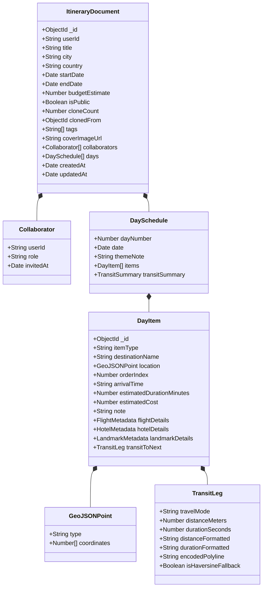

# 06. NoSQL MongoDB Schema Design for Flexible Itinerary Structures

## Nomadix — All-in-one Smart Travel Platform
**Final Year Project (FYP) — University of Greenwich**  
**Student:** Nguyễn Văn Đức  
**Standard:** Document-Oriented Schema Design & Polymorphic Data Modeling  
**Phase:** Day 6 — Database Analysis & ERD Modeling  
**Module Focus:** Module 3: Interactive Itinerary Planner & Maps Routing  
**Database Engine:** MongoDB Atlas 7.0 (Mongoose 8 ODM)  

---

## 1. ARCHITECTURAL RATIONALE & DESIGN PATTERNS

Traditional relational schemas struggle with the dynamic, unpredictable nature of travel itineraries where a scheduled stop could be a flight, hotel check-in, cultural landmark, restaurant, or custom note. MongoDB was chosen for the **Itinerary Subsystem** based on key NoSQL design patterns:

```
┌────────────────────────────────────────────────────────────────────────────────────────┐
│                        NOSQL ITINERARY DESIGN PRINCIPLES                               │
├───────────────────────────────┬────────────────────────────────────────────────────────┤
│ Primary Document Pattern      │ Embedded Sub-documents (1:Few Pattern)                 │
│ Polymorphism                  │ Discriminator Pattern (`itemType` polymorphic schema)  │
│ Geospatial Capabilities       │ GeoJSON `Point` with 2dsphere Indexing                 │
│ Read Performance              │ Single-Trip Atomic Read (Sub-15ms query time)          │
│ Cross-Database Linking        │ Stringified PostgreSQL UUIDs (`userId`, `bookingRef`)  │
│ Concurrency & Reordering      │ Optimistic Concurrency Control (`__v` version key)     │
└───────────────────────────────┴────────────────────────────────────────────────────────┘
```

### 1.1 Embedding vs. Referencing Decision Matrix

* **The Problem:** Should Days and Activities be separate collections referenced by `ObjectId`, or embedded inside the master `Itinerary` document?
* **The Decision:** **Full Embedding (1:Few Pattern)**.
  * **Atomicity:** Dragging an item across days or reordering items requires updating the sequence atomically in a single network round-trip.
  * **Latency:** When a user opens an itinerary on mobile, rendering the map and timeline requires all days and stops simultaneously. Embedding avoids multi-collection `$lookup` joins.
  * **Document Size Safety (16MB BSON Limit):**
    $$\text{Average Item Size} \approx 280\text{ bytes} \times 10\text{ items/day} = 2.8\text{ KB/day}$$
    $$\text{30-Day Itinerary Document Size} \approx 84\text{ KB} \ll 16,384\text{ KB (16MB Limit)}$$
    *(A 30-day trip with 300 activities consumes less than **0.6%** of MongoDB's BSON threshold).*

---

## 2. COMPREHENSIVE DOCUMENT SCHEMA ARCHITECTURE



---

## 3. TYPESCRIPT INTERFACES & POLYMORPHIC DEFINITIONS

```typescript
import { ObjectId, Document } from "mongoose";

// GeoJSON Point Standard
export interface IGeoJSONPoint {
  type: "Point";
  coordinates: [number, number]; // [Longitude, Latitude] in WGS84
}

// Transit Leg between consecutive items
export interface ITransitLeg {
  travelMode: "DRIVING" | "WALKING" | "TRANSIT";
  distanceMeters: number;         // e.g., 1250
  durationSeconds: number;        // e.g., 300 (5 mins)
  distanceFormatted: string;      // "1.2 km"
  durationFormatted: string;      // "5 mins"
  encodedPolyline?: string;       // Google Maps Encoded Polyline algorithm
  isHaversineFallback: boolean;   // true if computed offline via Haversine
}

// Discriminator Sub-metadata: Flight
export interface IFlightMetadata {
  airlineCode: string;            // "VN"
  airlineName: string;            // "Vietnam Airlines"
  flightNumber: string;           // "VN-128"
  departureAirport: string;       // "HAN"
  arrivalAirport: string;         // "DAD"
  departureTime: Date;
  arrivalTime: Date;
  bookingReference?: string;      // Backlink to PostgreSQL bookings table
}

// Discriminator Sub-metadata: Hotel
export interface IHotelMetadata {
  hotelName: string;              // "Novotel Danang Premier"
  hotelAddress: string;
  checkInTime?: string;           // "14:00"
  checkOutTime?: string;          // "12:00"
  bookingReference?: string;      // Backlink to PostgreSQL bookings table
}

// Discriminator Sub-metadata: Cultural Landmark
export interface ILandmarkMetadata {
  landmarkId: string;             // PostgreSQL landmarks(id) UUID
  geofenceRadiusMeters: number;   // 100
  hasCulturalQuiz: boolean;
  xpReward: number;               // 150
}

// Polymorphic Itinerary Day Item
export interface IDayItem {
  _id: ObjectId;
  itemType: "landmark" | "hotel" | "flight" | "restaurant" | "custom";
  destinationName: string;
  location: IGeoJSONPoint;
  orderIndex: number;             // 1, 2, 3... (strictly contiguous)
  arrivalTime?: string;           // "09:30"
  estimatedDurationMinutes: number; // 90
  estimatedCost: number;          // 50000 (in VND)
  note?: string;
  isCompleted: boolean;           // Check-off status on mobile timeline
  flightDetails?: IFlightMetadata;
  hotelDetails?: IHotelMetadata;
  landmarkDetails?: ILandmarkMetadata;
  transitToNext?: ITransitLeg;     // Routing metrics to the next sequential stop
}

// Day Sub-document
export interface IDaySchedule {
  dayNumber: number;              // 1, 2, 3...
  date: Date;                     // ISO Calendar date
  themeNote?: string;             // e.g., "Exploring Old Quarter & Street Food"
  items: IDayItem[];
  transitSummary?: {
    totalDistanceMeters: number;
    totalDurationSeconds: number;
    stopsCount: number;
  };
}

// Trip Collaborator
export interface ICollaborator {
  userId: string;                 // PostgreSQL users(id) UUID
  role: "OWNER" | "EDITOR" | "VIEWER";
  status: "PENDING" | "ACCEPTED" | "DECLINED";
  joinedAt: Date;
}

// Master Itinerary Document
export interface IItinerary extends Document {
  userId: string;                 // PostgreSQL users(id) UUID (Owner)
  title: string;
  city: string;
  country: string;
  startDate: Date;
  endDate: Date;
  budgetEstimate: number;         // Budget limit in VND
  actualExpenseTotal: number;     // Sum of estimatedCost across all items
  isPublic: boolean;
  cloneCount: number;
  clonedFrom?: ObjectId;          // Original parent itinerary if cloned
  tags: string[];                 // ["Budget", "Culture", "SoloTravel"]
  coverImageUrl?: string;
  collaborators: ICollaborator[];
  days: IDaySchedule[];
  createdAt: Date;
  updatedAt: Date;
}
```

---

## 4. MONGOOSE SCHEMA IMPLEMENTATION & VALIDATION HOOKS

```javascript
const mongoose = require("mongoose");
const { Schema } = mongoose;

// 1. GeoJSON Point Sub-schema
const GeoJSONPointSchema = new Schema(
  {
    type: {
      type: String,
      enum: ["Point"],
      default: "Point",
      required: true,
    },
    coordinates: {
      type: [Number], // [longitude, latitude]
      required: true,
      validate: {
        validator: function (coords) {
          return (
            coords.length === 2 &&
            coords[0] >= -180 &&
            coords[0] <= 180 && // Longitude
            coords[1] >= -90 &&
            coords[1] <= 90     // Latitude
          );
        },
        message: "Invalid geographical coordinates [lng, lat]",
      },
    },
  },
  { _id: false }
);

// 2. Transit Leg Sub-schema
const TransitLegSchema = new Schema(
  {
    travelMode: {
      type: String,
      enum: ["DRIVING", "WALKING", "TRANSIT"],
      default: "DRIVING",
    },
    distanceMeters: { type: Number, default: 0 },
    durationSeconds: { type: Number, default: 0 },
    distanceFormatted: { type: String, default: "0 km" },
    durationFormatted: { type: String, default: "0 mins" },
    encodedPolyline: { type: String },
    isHaversineFallback: { type: Boolean, default: false },
  },
  { _id: false }
);

// 3. Polymorphic Day Item Schema
const DayItemSchema = new Schema(
  {
    itemType: {
      type: String,
      required: true,
      enum: ["landmark", "hotel", "flight", "restaurant", "custom"],
      default: "custom",
    },
    destinationName: {
      type: String,
      required: [true, "Destination name is required"],
      trim: true,
      maxlength: 150,
    },
    location: {
      type: GeoJSONPointSchema,
      required: true,
    },
    orderIndex: {
      type: Number,
      required: true,
      min: 1,
    },
    arrivalTime: {
      type: String,
      match: [/^([01]\d|2[0-3]):([0-5]\d)$/, "Arrival time must be HH:MM format"],
    },
    estimatedDurationMinutes: {
      type: Number,
      default: 60,
      min: 5,
      max: 1440,
    },
    estimatedCost: {
      type: Number,
      default: 0,
      min: 0,
    },
    note: {
      type: String,
      maxlength: 500,
    },
    isCompleted: {
      type: Boolean,
      default: false,
    },
    // Discriminator Sub-objects
    flightDetails: {
      airlineCode: String,
      airlineName: String,
      flightNumber: String,
      departureAirport: String,
      arrivalAirport: String,
      departureTime: Date,
      arrivalTime: Date,
      bookingReference: String,
    },
    hotelDetails: {
      hotelName: String,
      hotelAddress: String,
      checkInTime: String,
      checkOutTime: String,
      bookingReference: String,
    },
    landmarkDetails: {
      landmarkId: String, // References PostgreSQL landmarks(id)
      geofenceRadiusMeters: { type: Number, default: 100 },
      hasCulturalQuiz: { type: Boolean, default: true },
      xpReward: { type: Number, default: 150 },
    },
    transitToNext: TransitLegSchema,
  },
  { _id: true }
);

// 4. Day Schedule Sub-schema
const DayScheduleSchema = new Schema(
  {
    dayNumber: {
      type: Number,
      required: true,
      min: 1,
    },
    date: {
      type: Date,
      required: true,
    },
    themeNote: {
      type: String,
      maxlength: 200,
    },
    items: [DayItemSchema],
    transitSummary: {
      totalDistanceMeters: { type: Number, default: 0 },
      totalDurationSeconds: { type: Number, default: 0 },
      stopsCount: { type: Number, default: 0 },
    },
  },
  { _id: false }
);

// 5. Collaborator Sub-schema
const CollaboratorSchema = new Schema(
  {
    userId: {
      type: String,
      required: true,
    },
    role: {
      type: String,
      enum: ["OWNER", "EDITOR", "VIEWER"],
      default: "EDITOR",
    },
    status: {
      type: String,
      enum: ["PENDING", "ACCEPTED", "DECLINED"],
      default: "ACCEPTED",
    },
    joinedAt: {
      type: Date,
      default: Date.now,
    },
  },
  { _id: false }
);

// 6. Master Itinerary Schema
const ItinerarySchema = new Schema(
  {
    userId: {
      type: String,
      required: [true, "Owner userId (PostgreSQL UUID) is required"],
      index: true,
    },
    title: {
      type: String,
      required: [true, "Itinerary title is required"],
      trim: true,
      minlength: 3,
      maxlength: 100,
    },
    city: {
      type: String,
      required: [true, "Target city is required"],
      trim: true,
      index: true,
    },
    country: {
      type: String,
      required: true,
      default: "Việt Nam",
    },
    startDate: {
      type: Date,
      required: true,
    },
    endDate: {
      type: Date,
      required: true,
      validate: {
        validator: function (val) {
          return val >= this.startDate;
        },
        message: "End date must be greater than or equal to start date",
      },
    },
    budgetEstimate: {
      type: Number,
      default: 0,
      min: 0,
    },
    actualExpenseTotal: {
      type: Number,
      default: 0,
    },
    isPublic: {
      type: Boolean,
      default: false,
      index: true,
    },
    cloneCount: {
      type: Number,
      default: 0,
      min: 0,
    },
    clonedFrom: {
      type: Schema.Types.ObjectId,
      ref: "Itinerary",
      default: null,
    },
    tags: [{ type: String, trim: true, lowercase: true }],
    coverImageUrl: {
      type: String,
      default: "https://res.cloudinary.com/nomadix/default_cover.jpg",
    },
    collaborators: [CollaboratorSchema],
    days: [DayScheduleSchema],
  },
  {
    timestamps: true,
    versionKey: "__v", // Optimistic concurrency control
    toJSON: { virtuals: true },
    toObject: { virtuals: true },
  }
);

// Virtual: Total Trip Duration in Days
ItinerarySchema.virtual("totalDays").get(function () {
  if (!this.startDate || !this.endDate) return 0;
  const diffTime = Math.abs(this.endDate - this.startDate);
  return Math.ceil(diffTime / (1000 * 60 * 60 * 24)) + 1;
});

// Virtual: Total Stops across all days
ItinerarySchema.virtual("totalStopsCount").get(function () {
  if (!this.days) return 0;
  return this.days.reduce((acc, day) => acc + (day.items ? day.items.length : 0), 0);
});

// Pre-save Hook: Auto-calculate actualExpenseTotal
ItinerarySchema.pre("save", function (next) {
  if (this.days && this.days.length > 0) {
    let totalExpense = 0;
    this.days.forEach((day) => {
      if (day.items && day.items.length > 0) {
        day.items.forEach((item) => {
          totalExpense += item.estimatedCost || 0;
        });
      }
    });
    this.actualExpenseTotal = totalExpense;
  }
  next();
});

module.exports = mongoose.model("Itinerary", ItinerarySchema);
```

---

## 5. COMPOUND & GEOSPATIAL INDEXING STRATEGY

To maintain **sub-50ms query latency** under high community usage and map rendering, the following indexes are defined on the `itineraries` collection:

```javascript
// 1. User Workspace Index: Rapidly fetches traveler's private trips sorted by newest
ItinerarySchema.index({ userId: 1, createdAt: -1 });

// 2. Community Explore Compound Index: High-speed browsing of popular public trips by city
ItinerarySchema.index({ city: 1, isPublic: 1, cloneCount: -1 });

// 3. Geospatial 2dsphere Index: Powers spatial queries ("Find itineraries visiting nearby places")
ItinerarySchema.index({ "days.items.location": "2dsphere" });

// 4. Text Search Index: Multi-field fuzzy search across itinerary titles and tags
ItinerarySchema.index(
  { title: "text", city: "text", tags: "text" },
  { weights: { title: 10, city: 5, tags: 2 }, name: "ItineraryTextIndex" }
);

// 5. Shared Collaborator Index: Rapidly fetches trips shared with a user
ItinerarySchema.index({ "collaborators.userId": 1 });
```

---

## 6. KEY OPERATIONAL MONGOOSE PIPELINES

### 6.1 Atomic Drag-and-Drop Order Synchronization
When a mobile traveler drags an activity to a new position within Day 1, the backend executes an atomic positional update:

```javascript
async function reorderDayActivities(itineraryId, dayIndex, reorderedItemIds) {
  // 1. Fetch the targeted itinerary
  const itinerary = await Itinerary.findById(itineraryId);
  const targetDay = itinerary.days[dayIndex];

  // 2. Re-map items based on the client's sequential array of IDs
  const itemMap = new Map(targetDay.items.map((item) => [item._id.toString(), item]));
  const updatedItems = reorderedItemIds.map((id, index) => {
    const item = itemMap.get(id);
    item.orderIndex = index + 1; // Enforce contiguous 1, 2, 3...
    return item;
  });

  // 3. Atomically persist updated items array
  return await Itinerary.findOneAndUpdate(
    { _id: itineraryId },
    { $set: { [`days.${dayIndex}.items`]: updatedItems } },
    { new: true, runValidators: true }
  );
}
```

### 6.2 One-Click Trip Cloning Engine (Atomic `$inc`)
When User B clones an itinerary authored by User A:

```javascript
async function clonePublicTrip(sourceItineraryId, targetUserId) {
  // 1. Retrieve the source document (Lean for maximum performance)
  const source = await Itinerary.findOne({ _id: sourceItineraryId, isPublic: true }).lean();
  if (!source) throw new Error("Itinerary not found or is private");

  // 2. Atomically increment the clone count on the source document
  await Itinerary.updateOne({ _id: sourceItineraryId }, { $inc: { cloneCount: 1 } });

  // 3. Instantiate cloned document with new ownership and reset state
  delete source._id;
  delete source.createdAt;
  delete source.updatedAt;

  const clonedTrip = new Itinerary({
    ...source,
    userId: targetUserId,
    title: `${source.title} (Copy)`,
    isPublic: false,
    cloneCount: 0,
    clonedFrom: sourceItineraryId,
    collaborators: [],
  });

  return await clonedTrip.save();
}
```

### 6.3 Companion Invitation & Role Permission Guard Pipeline
Atomically add a companion to the shared itinerary and verify their authorization before any timeline modification:

```javascript
async function inviteTripCompanion(itineraryId, requesterUserId, newCompanionUserId, role = "EDITOR") {
  // 1. Verify that requester is the trip Owner or an Editor
  const trip = await Itinerary.findOne({
    _id: itineraryId,
    $or: [
      { userId: requesterUserId },
      { collaborators: { $elemMatch: { userId: requesterUserId, role: "OWNER" } } }
    ]
  });
  if (!trip) throw new Error("Forbidden: Only trip owner can invite collaborators");

  // 2. Push collaborator atomically if not already present
  return await Itinerary.findOneAndUpdate(
    { _id: itineraryId, "collaborators.userId": { $ne: newCompanionUserId } },
    {
      $push: {
        collaborators: {
          userId: newCompanionUserId,
          role: role,
          status: "ACCEPTED",
          joinedAt: new Date()
        }
      }
    },
    { new: true }
  );
}
```

### 6.4 Cross-Database Group Expense Aggregation
Combines MongoDB trip milestone data with PostgreSQL `trip_expenses` for the unified mobile dashboard:

```javascript
async function getTripBudgetDashboard(itineraryId, pgClient) {
  // 1. Fetch itinerary estimated budget from MongoDB
  const itinerary = await Itinerary.findById(itineraryId, "title budgetEstimate actualExpenseTotal").lean();
  if (!itinerary) throw new Error("Itinerary not found");

  // 2. Fetch actual logged expenses and categorized totals from PostgreSQL
  const expenseSummary = await pgClient.query(`
    SELECT 
      category,
      COUNT(id) as transaction_count,
      SUM(amount) as total_spent
    FROM trip_expenses
    WHERE trip_id = $1
    GROUP BY category
  `, [itineraryId.toString()]);

  const grandTotal = expenseSummary.rows.reduce((sum, row) => sum + parseFloat(row.total_spent), 0);

  return {
    itineraryId,
    title: itinerary.title,
    plannedBudget: itinerary.budgetEstimate,
    actualLoggedTotal: grandTotal,
    remainingBudget: itinerary.budgetEstimate - grandTotal,
    byCategory: expenseSummary.rows
  };
}
```
