# 07. Core Database ERD: Gamification (Badges & Coordinates) & Community Forum Models

## Nomadix — All-in-one Smart Travel Platform
**Final Year Project (FYP) — University of Greenwich**  
**Student:** Nguyễn Văn Đức  
**Standard:** Polyglot Persistence Architecture (Relational 3NF & Document Store)  
**Phase:** Day 6 — Database Analysis & ERD Modeling  
**Module Focus:** Module 4 (Cultural Gamification & Location USP) & Module 5 (Community Forum & Verified Trust Engine)  
**Engines:** PostgreSQL 16 (Strict ACID Gamification) + MongoDB Atlas 7.0 (Flexible Discussion Forum)  

---

## 1. ARCHITECTURAL PERSISTENCE BOUNDARY

The system divides responsibilities between two database engines to guarantee data integrity for gamified rewards while maintaining high throughput for community discussions:

```
┌────────────────────────────────────────────────────────────────────────────────────────┐
│                        GAMIFICATION & COMMUNITY SUBSYSTEMS                             │
├───────────────────────────────┬────────────────────────────────────────────────────────┤
│ Gamification Subsystem        │ PostgreSQL 16 (ACID Relational)                        │
│                               │ WGS84 GPS Coordinates, Geofencing, Photo Verification  │
│                               │ Anti-Spam Constraints: `UNIQUE(user_id, landmark_id)`  │
│                               │ Cultural Quiz Bank, Scoring, Level Progression, Badges │
├───────────────────────────────┼────────────────────────────────────────────────────────┤
│ Community Forum Subsystem     │ MongoDB Atlas 7.0 (Flexible Document Store)            │
│                               │ City-Categorized Question Feeds & Tag Navigation       │
│                               │ Nested Comments & Atomic Upvoting Engine               │
│                               │ Content Moderation & Abuse Reporting Queue             │
├───────────────────────────────┼────────────────────────────────────────────────────────┤
│ Polyglot Trust Bridge (USP)   │ Cross-DB Verification Bridge                           │
│                               │ Attaches Gold "City Verified" Badges to Forum Answers  │
└───────────────────────────────┴────────────────────────────────────────────────────────┘
```

---

## 2. COMPREHENSIVE POLYGLOT ENTITY-RELATIONSHIP DIAGRAM

```mermaid
erDiagram
    %% ===================================================
    %% 1. POSTGRESQL RELATIONAL ENGINE: GAMIFICATION & XP
    %% ===================================================
    USERS ||--o{ CHECKINS : "submits_verified_visit"
    USERS ||--o{ USER_BADGES : "unlocked_and_earned"
    USERS ||--o{ QUIZ_ATTEMPTS : "takes_evaluation"

    LANDMARKS ||--o{ CHECKINS : "verified_at_location"
    LANDMARKS ||--|| QUIZZES : "features_cultural_test"
    
    BADGES ||--o{ USER_BADGES : "awarded_via"
    QUIZZES ||--o{ QUIZ_QUESTIONS : "consists_of"
    QUIZZES ||--o{ QUIZ_ATTEMPTS : "attempted_in"

    USERS {
        uuid id PK "UUID v4 Identity Key"
        varchar email UK "User Email"
        varchar full_name "Traveler Name"
        int xp "Total Experience Points"
        int level "Calculated Rank: floor(sqrt(xp/100))+1"
    }

    LANDMARKS {
        uuid id PK "Landmark UUID"
        varchar name "Landmark Name (e.g. Cầu Rồng)"
        varchar city "City Name (e.g. Đà Nẵng)"
        varchar country "Country (Việt Nam)"
        numeric latitude "WGS84 Latitude (10,7)"
        numeric longitude "WGS84 Longitude (10,7)"
        int geofence_radius_meters "Validation boundary (100m)"
        text description "Historical article"
        text cover_image_url "Cloudinary image URL"
        int xp_reward "Reward points (Default: 150)"
        jsonb historical_facts "Metadata facts (JSONB)"
        boolean is_active "Active landmark flag"
        timestamptz created_at "Created timestamp"
    }

    CHECKINS {
        uuid id PK "Checkin UUID"
        uuid user_id FK "References USERS(id)"
        uuid landmark_id FK "References LANDMARKS(id)"
        numeric latitude "Snapshot device latitude"
        numeric longitude "Snapshot device longitude"
        numeric distance_meters "Computed Haversine distance"
        text photo_url "Watermarked photo URL"
        boolean is_verified "Geofence verified (<= 100m)"
        timestamptz verified_at "Verification timestamp"
    }

    BADGES {
        uuid id PK "Badge UUID"
        varchar name UK "Badge Title (Da Nang Explorer)"
        varchar city "Associated City (Đà Nẵng)"
        varchar badge_tier "Tier: 'EXPLORER', 'EXPERT', 'MASTER'"
        text badge_icon_url "3D Gold Badge Cloudinary URL"
        int required_checkins "Required visits (Default: 3)"
        numeric required_quiz_score "Min quiz score (Default: 66%)"
        int xp_bonus "Bonus reward (Default: 300)"
        timestamptz created_at "Created timestamp"
    }

    USER_BADGES {
        uuid id PK "Certificate UUID"
        uuid user_id FK "References USERS(id) ON DELETE CASCADE"
        uuid badge_id FK "References BADGES(id) ON DELETE CASCADE"
        timestamptz unlocked_at "Unlock timestamp"
    }

    QUIZZES {
        uuid id PK "Quiz UUID"
        uuid landmark_id FK "References LANDMARKS(id) (1:1)"
        varchar title "Quiz Title"
        text description "Cultural quiz summary"
        numeric passing_score_percent "Passing threshold (66.00%)"
        int xp_reward "Passing XP bonus (150)"
        timestamptz created_at "Created timestamp"
    }

    QUIZ_QUESTIONS {
        uuid id PK "Question UUID"
        uuid quiz_id FK "References QUIZZES(id) ON DELETE CASCADE"
        text question_text "Multiple-choice inquiry"
        varchar option_a "Choice A"
        varchar option_b "Choice B"
        varchar option_c "Choice C"
        varchar option_d "Choice D"
        char correct_option "Correct answer ('A','B','C','D') - Hidden"
        text explanation "Cultural historical takeaway"
        int order_index "Sequence order (1, 2, 3)"
    }

    QUIZ_ATTEMPTS {
        uuid id PK "Attempt UUID"
        uuid user_id FK "References USERS(id)"
        uuid quiz_id FK "References QUIZZES(id)"
        numeric score_percent "Percentage scored (0-100)"
        boolean is_passed "Pass status (score >= 66%)"
        int xp_awarded "Awarded XP (0 or 150)"
        jsonb submitted_answers "User choices payload"
        timestamptz attempted_at "Submission timestamp"
    }

    %% ===================================================
    %% 2. MONGODB ATLAS: COMMUNITY Q&A FORUM
    %% ===================================================
    FORUM_QUESTIONS ||--o{ FORUM_ANSWERS : "receives_replies"
    FORUM_ANSWERS ||--o{ FORUM_COMMENTS : "threaded_under"

    FORUM_QUESTIONS {
        ObjectId _id PK "MongoDB Document ObjectId"
        string userId "UUID String referencing USERS(id)"
        string authorName "Display Name"
        string authorAvatar "Avatar URL"
        string city "City tag (e.g. Đà Nẵng)"
        string country "Country tag"
        string category "Topic: 'Food', 'Transport', 'Hidden Gems'"
        string title "Question Title"
        string content "Detailed inquiry"
        array tags "Topic slugs"
        int upvotes "Total upvotes"
        array upvotedBy "Array of user UUIDs"
        int replyCount "Total answers count"
        boolean isResolved "Resolution status"
        date createdAt "Created timestamp"
    }

    FORUM_ANSWERS {
        ObjectId _id PK "Answer Document ObjectId"
        ObjectId questionId FK "References FORUM_QUESTIONS(_id)"
        string userId "UUID String referencing USERS(id)"
        string authorName "Author Display Name"
        string authorAvatar "Author Avatar URL"
        string content "Answer text"
        boolean isCityVerified "Cross-DB verification flag"
        boolean hasCityBadge "True if author holds City Badge"
        string verifiedBadgeTitle "Badge Name (Da Nang Explorer)"
        string verifiedBadgeIcon "Icon URL"
        int upvotes "Upvote counter"
        array upvotedBy "Array of user UUIDs"
        boolean isAcceptedAnswer "Marked best answer"
        date createdAt "Created timestamp"
    }

    FORUM_COMMENTS {
        ObjectId _id PK "Comment ObjectId"
        ObjectId answerId FK "References FORUM_ANSWERS(_id)"
        string userId "UUID String referencing USERS(id)"
        string authorName "Author Name"
        string content "Clarification comment"
        date createdAt "Created timestamp"
    }

    COMMUNITY_REPORTS {
        ObjectId _id PK "Report ObjectId"
        string targetType "'question', 'answer', 'comment'"
        ObjectId targetId "Target Document ObjectId"
        string reporterId "Reporting User UUID"
        string reason "'SPAM', 'OFFENSIVE', 'FALSE_INFO'"
        string status "'PENDING', 'RESOLVED', 'DISMISSED'"
        date createdAt "Report timestamp"
    }

    %% ===================================================
    %% 3. POLYGLOT TRUST ATTACHMENT BRIDGE (USP)
    %% ===================================================
    USER_BADGES }o..o{ FORUM_ANSWERS : "validates_city_authority"
```



---

## 3. DATA DICTIONARY: GAMIFICATION MODELS (POSTGRESQL 16)

### 3.1 Table `landmarks` (Cultural Coordinates & Geofencing Catalog)
* **Purpose:** Stores coordinates, geofence radius, and cultural historical articles for verifiable check-ins.
* **Primary Key:** `id` (UUID v4).

| Column | Data Type | Nullable | Default | Constraints & Checks | Description |
|---|---|:---:|---|---|---|
| `id` | `UUID` | NO | `gen_random_uuid()` | PRIMARY KEY | Unique landmark identifier. |
| `name` | `VARCHAR(150)` | NO | None | NOT NULL | Landmark name (e.g. *"Cầu Rồng Đà Nẵng"*). |
| `city` | `VARCHAR(100)` | NO | None | NOT NULL, Indexed | City name (e.g. *"Đà Nẵng"*). |
| `country` | `VARCHAR(100)` | NO | `'Việt Nam'` | NOT NULL | Country name. |
| `latitude` | `NUMERIC(10, 7)`| NO | None | CHECK (`lat BETWEEN -90 AND 90`) | WGS84 Latitude coordinate. |
| `longitude` | `NUMERIC(10, 7)`| NO | None | CHECK (`lng BETWEEN -180 AND 180`)| WGS84 Longitude coordinate. |
| `geofence_radius_meters` | `INT` | NO | `100` | CHECK (`radius BETWEEN 20 AND 500`)| Proximity threshold for valid check-in. |
| `description` | `TEXT` | NO | None | NOT NULL | Deep cultural and historical narrative. |
| `cover_image_url` | `TEXT` | NO | None | HTTPS URL | Hero banner image on Cloudinary. |
| `xp_reward` | `INT` | NO | `150` | CHECK (`xp_reward >= 50`) | XP points earned upon first check-in. |
| `historical_facts` | `JSONB` | YES | `'{}'` | Valid JSONB | Extended facts (Opening hours, tips, ticket fees). |
| `is_active` | `BOOLEAN` | NO | `true` | Indexed | Availability toggle. |
| `created_at` | `TIMESTAMPTZ` | NO | `CURRENT_TIMESTAMP` | None | Record creation timestamp. |

---

### 3.2 Table `checkins` (GPS Geofence Proofs & Anti-Spam Store)
* **Purpose:** Verifiable record of physical visits with device coordinates and anti-cheat constraints.
* **Primary Key:** `id` (UUID).
* **Unique Constraint:** `UNIQUE(user_id, landmark_id)` (Strictly prevents repetitive XP farming).

| Column | Data Type | Nullable | Default | Constraints | Description |
|---|---|:---:|---|---|---|
| `id` | `UUID` | NO | `gen_random_uuid()` | PRIMARY KEY | Unique checkin record identifier. |
| `user_id` | `UUID` | NO | None | FOREIGN KEY $\rightarrow$ `users(id)` | Verified traveler. |
| `landmark_id` | `UUID` | NO | None | FOREIGN KEY $\rightarrow$ `landmarks(id)` | Target cultural landmark. |
| `latitude` | `NUMERIC(10, 7)`| NO | None | NOT NULL | Real-time GPS latitude captured by device. |
| `longitude` | `NUMERIC(10, 7)`| NO | None | NOT NULL | Real-time GPS longitude captured by device. |
| `distance_meters` | `NUMERIC(6, 2)`| NO | None | CHECK (`distance_meters <= 100.00`)| Exact Haversine distance at validation. |
| `photo_url` | `TEXT` | NO | None | NOT NULL | Cloudinary photo with dynamic watermark. |
| `is_verified` | `BOOLEAN` | NO | `true` | None | Validation status confirmation. |
| `verified_at` | `TIMESTAMPTZ` | NO | `CURRENT_TIMESTAMP` | Indexed | Timestamp of physical check-in. |

---

### 3.3 Table `badges` & `user_badges` (City Explorer Badge Engine)
* **Purpose:** Defines city badge requirements and tracks unlocked achievements.

#### Table `badges`:
| Column | Data Type | Nullable | Default | Constraints | Description |
|---|---|:---:|---|---|---|
| `id` | `UUID` | NO | `gen_random_uuid()` | PRIMARY KEY | Unique badge identifier. |
| `name` | `VARCHAR(100)` | NO | None | UNIQUE, NOT NULL | Title (e.g. *"Da Nang Explorer Badge"*). |
| `city` | `VARCHAR(100)` | NO | None | NOT NULL, Indexed | City authority domain. |
| `badge_tier` | `VARCHAR(20)` | NO | `'EXPLORER'` | CHECK in (`EXPLORER`, `EXPERT`, `MASTER`) | Achievement tier. |
| `badge_icon_url` | `TEXT` | NO | None | NOT NULL | 3D gold spinning medal icon. |
| `required_checkins` | `INT` | NO | `3` | CHECK (`required_checkins >= 1`) | Number of unique checkins required in city. |
| `required_quiz_score`| `NUMERIC(5,2)`| NO | `66.00` | CHECK (`score BETWEEN 0 AND 100`) | Minimum quiz passing percentage. |
| `xp_bonus` | `INT` | NO | `300` | CHECK (`xp_bonus >= 0`) | Instant XP reward upon unlock. |
| `created_at` | `TIMESTAMPTZ` | NO | `CURRENT_TIMESTAMP` | None | Creation timestamp. |

#### Table `user_badges` (Junction Table):
* **Columns:** `id` (UUID PK), `user_id` (UUID FK $\rightarrow$ `users(id)`), `badge_id` (UUID FK $\rightarrow$ `badges(id)`), `unlocked_at` (TIMESTAMPTZ DEFAULT CURRENT_TIMESTAMP).
* **Unique Constraint:** `UNIQUE(user_id, badge_id)`.

---

### 3.4 Table `quizzes`, `quiz_questions` & `quiz_attempts` (Cultural Quiz Bank)
* **Purpose:** Educational validation post check-in to test knowledge of local heritage.

#### Table `quiz_questions`:
| Column | Data Type | Nullable | Constraints | Description |
|---|---|:---:|---|---|
| `id` | `UUID` | NO | PRIMARY KEY | Question identifier. |
| `quiz_id` | `UUID` | NO | FOREIGN KEY $\rightarrow$ `quizzes(id)` ON DELETE CASCADE | Parent quiz. |
| `question_text` | `TEXT` | NO | NOT NULL | Cultural question inquiry. |
| `option_a` | `VARCHAR(255)` | NO | NOT NULL | Option A text. |
| `option_b` | `VARCHAR(255)` | NO | NOT NULL | Option B text. |
| `option_c` | `VARCHAR(255)` | NO | NOT NULL | Option C text. |
| `option_d` | `VARCHAR(255)` | NO | NOT NULL | Option D text. |
| `correct_option` | `CHAR(1)` | NO | CHECK in (`'A'`, `'B'`, `'C'`, `'D'`) | Correct answer choice (Hidden from client). |
| `explanation` | `TEXT` | NO | NOT NULL | Historical explanation shown post-submission. |
| `order_index` | `INT` | NO | Min 1 | Question sequence (1, 2, 3). |

---

## 4. DATA DICTIONARY: COMMUNITY FORUM MODELS (MONGODB ATLAS)

### 4.1 Collection `forum_questions` (City Discussion Threads)
* **Purpose:** Destination-oriented question threads categorized by city and topic tags.

```typescript
interface ForumQuestionDocument {
  _id: ObjectId;
  userId: string;              // UUID referencing PostgreSQL users(id) [Indexed]
  authorName: string;          // "Nguyễn Văn Đức"
  authorAvatar: string;        // "https://res.cloudinary.com/..."
  city: string;                // "Đà Nẵng" [Indexed]
  country: string;             // "Việt Nam"
  category: "Food & Dining" | "Transportation" | "Hidden Gems" | "Accommodation" | "General";
  title: string;               // "Nên đi Cầu Rồng xem phun lửa vào ngày nào?" [Text Indexed]
  content: string;             // Detailed inquiry text [Text Indexed]
  tags: string[];              // ["cau-rong", "da-nang", "nightlife"] [Indexed]
  upvotes: number;             // 12
  upvotedBy: string[];         // Array of user UUIDs who upvoted
  replyCount: number;          // 5
  isResolved: boolean;         // false
  isPinned: boolean;           // false
  isReported: boolean;         // false
  isHidden: boolean;           // false [Indexed]
  createdAt: Date;             // [Indexed]
  updatedAt: Date;
}
```

* **Indexes:**
  * `{ city: 1, category: 1, createdAt: -1 }` (Feed browsing)
  * `{ title: "text", content: "text", tags: "text" }` (Search)

---

### 4.2 Collection `forum_answers` (Answers with "City Verified" Authority)
* **Purpose:** Stores community answers with authenticated badges for proven local travelers.

```typescript
interface ForumAnswerDocument {
  _id: ObjectId;
  questionId: ObjectId;        // Foreign Key referencing forum_questions(_id) [Indexed]
  userId: string;              // UUID referencing PostgreSQL users(id) [Indexed]
  authorName: string;          // "Lê Hoàng Long"
  authorAvatar: string;
  content: string;             // "Cầu Rồng phun lửa vào 21:00 Thứ 7 và Chủ Nhật nhé."
  
  // Cross-DB Trust Indicators (USP)
  isCityVerified: boolean;     // true if user holds City Badge for this city [Indexed]
  hasCityBadge: boolean;       // true
  verifiedBadgeTitle?: string; // "Da Nang Explorer"
  verifiedBadgeIcon?: string;  // Cloudinary 3D gold medal URL
  
  upvotes: number;             // 24
  upvotedBy: string[];         // Array of user UUIDs
  isAcceptedAnswer: boolean;   // true
  isReported: boolean;         // false
  isHidden: boolean;           // false
  createdAt: Date;             // [Indexed]
  updatedAt: Date;
}
```

* **Compound Sorting Hierarchy Index:**
  * `{ questionId: 1, isCityVerified: -1, upvotes: -1, createdAt: 1 }`
  *(Ensures "City Verified" answers automatically float to the top of the discussion thread).*

---

### 4.3 Collection `forum_comments` & `community_reports`

```typescript
// Threaded Comments beneath answers
interface ForumCommentDocument {
  _id: ObjectId;
  answerId: ObjectId;          // References forum_answers(_id) [Indexed]
  userId: string;              // Author UUID
  authorName: string;
  content: string;             // "Cảm ơn bạn nhiều nhé!"
  createdAt: Date;
}

// Moderation Reports Queue
interface CommunityReportDocument {
  _id: ObjectId;
  targetType: "question" | "answer" | "comment";
  targetId: ObjectId;          // Target document ID [Indexed]
  reporterId: string;          // Reporter UUID
  reason: "SPAM" | "OFFENSIVE" | "FALSE_INFO" | "COMMERCIAL_ADS";
  status: "PENDING" | "REVIEWED" | "DISMISSED"; // [Indexed]
  adminNotes?: string;
  createdAt: Date;
}
```

---

## 5. POSTGRESQL DDL IMPLEMENTATION SCRIPT

```sql
-- ============================================================================
-- NOMADIX POSTGRESQL DDL: GAMIFICATION SUBSYSTEM & COORDINATE TRACKING
-- ============================================================================

-- 1. LANDMARKS CATALOG TABLE
CREATE TABLE landmarks (
    id UUID PRIMARY KEY DEFAULT gen_random_uuid(),
    name VARCHAR(150) NOT NULL,
    city VARCHAR(100) NOT NULL,
    country VARCHAR(100) NOT NULL DEFAULT 'Việt Nam',
    latitude NUMERIC(10, 7) NOT NULL CHECK (latitude BETWEEN -90.0 AND 90.0),
    longitude NUMERIC(10, 7) NOT NULL CHECK (longitude BETWEEN -180.0 AND 180.0),
    geofence_radius_meters INT NOT NULL DEFAULT 100 CHECK (geofence_radius_meters BETWEEN 20 AND 500),
    description TEXT NOT NULL,
    cover_image_url TEXT NOT NULL,
    xp_reward INT NOT NULL DEFAULT 150 CHECK (xp_reward >= 50),
    historical_facts JSONB NOT NULL DEFAULT '{}'::jsonb,
    is_active BOOLEAN NOT NULL DEFAULT true,
    created_at TIMESTAMPTZ NOT NULL DEFAULT CURRENT_TIMESTAMP,
    updated_at TIMESTAMPTZ NOT NULL DEFAULT CURRENT_TIMESTAMP
);

CREATE INDEX idx_landmarks_city ON landmarks(city) WHERE is_active = true;
CREATE INDEX idx_landmarks_coords ON landmarks(latitude, longitude);
CREATE INDEX idx_landmarks_facts ON landmarks USING GIN (historical_facts);

-- 2. CHECKINS TABLE (VERIFIED GPS PROOFS)
CREATE TABLE checkins (
    id UUID PRIMARY KEY DEFAULT gen_random_uuid(),
    user_id UUID NOT NULL REFERENCES users(id) ON DELETE CASCADE,
    landmark_id UUID NOT NULL REFERENCES landmarks(id) ON DELETE CASCADE,
    latitude NUMERIC(10, 7) NOT NULL,
    longitude NUMERIC(10, 7) NOT NULL,
    distance_meters NUMERIC(6, 2) NOT NULL CHECK (distance_meters <= 100.00),
    photo_url TEXT NOT NULL,
    is_verified BOOLEAN NOT NULL DEFAULT true,
    verified_at TIMESTAMPTZ NOT NULL DEFAULT CURRENT_TIMESTAMP,
    CONSTRAINT uq_user_landmark CHECK (user_id IS NOT NULL),
    UNIQUE (user_id, landmark_id) -- Strict Anti-Spam Rule
);

CREATE INDEX idx_checkins_user_id ON checkins(user_id);
CREATE INDEX idx_checkins_landmark_id ON checkins(landmark_id);
CREATE INDEX idx_checkins_verified_at ON checkins(verified_at DESC);

-- 3. BADGES TABLE
CREATE TABLE badges (
    id UUID PRIMARY KEY DEFAULT gen_random_uuid(),
    name VARCHAR(100) NOT NULL UNIQUE,
    city VARCHAR(100) NOT NULL,
    badge_tier VARCHAR(20) NOT NULL DEFAULT 'EXPLORER'
        CHECK (badge_tier IN ('EXPLORER', 'EXPERT', 'MASTER')),
    badge_icon_url TEXT NOT NULL,
    required_checkins INT NOT NULL DEFAULT 3 CHECK (required_checkins >= 1),
    required_quiz_score NUMERIC(5, 2) NOT NULL DEFAULT 66.00 CHECK (required_quiz_score BETWEEN 0 AND 100),
    xp_bonus INT NOT NULL DEFAULT 300 CHECK (xp_bonus >= 0),
    created_at TIMESTAMPTZ NOT NULL DEFAULT CURRENT_TIMESTAMP
);

CREATE INDEX idx_badges_city ON badges(city);

-- 4. USER_BADGES JUNCTION TABLE
CREATE TABLE user_badges (
    id UUID PRIMARY KEY DEFAULT gen_random_uuid(),
    user_id UUID NOT NULL REFERENCES users(id) ON DELETE CASCADE,
    badge_id UUID NOT NULL REFERENCES badges(id) ON DELETE CASCADE,
    unlocked_at TIMESTAMPTZ NOT NULL DEFAULT CURRENT_TIMESTAMP,
    UNIQUE (user_id, badge_id)
);

CREATE INDEX idx_user_badges_lookup ON user_badges(user_id, badge_id);

-- 5. QUIZZES TABLE (1:1 with LANDMARKS)
CREATE TABLE quizzes (
    id UUID PRIMARY KEY DEFAULT gen_random_uuid(),
    landmark_id UUID NOT NULL UNIQUE REFERENCES landmarks(id) ON DELETE CASCADE,
    title VARCHAR(150) NOT NULL,
    description TEXT,
    passing_score_percent NUMERIC(5, 2) NOT NULL DEFAULT 66.00,
    xp_reward INT NOT NULL DEFAULT 150,
    created_at TIMESTAMPTZ NOT NULL DEFAULT CURRENT_TIMESTAMP
);

-- 6. QUIZ_QUESTIONS TABLE
CREATE TABLE quiz_questions (
    id UUID PRIMARY KEY DEFAULT gen_random_uuid(),
    quiz_id UUID NOT NULL REFERENCES quizzes(id) ON DELETE CASCADE,
    question_text TEXT NOT NULL,
    option_a VARCHAR(255) NOT NULL,
    option_b VARCHAR(255) NOT NULL,
    option_c VARCHAR(255) NOT NULL,
    option_d VARCHAR(255) NOT NULL,
    correct_option CHAR(1) NOT NULL CHECK (correct_option IN ('A', 'B', 'C', 'D')),
    explanation TEXT NOT NULL,
    order_index INT NOT NULL DEFAULT 1,
    created_at TIMESTAMPTZ NOT NULL DEFAULT CURRENT_TIMESTAMP
);

CREATE INDEX idx_quiz_questions_quiz_id ON quiz_questions(quiz_id);

-- 7. QUIZ_ATTEMPTS TABLE
CREATE TABLE quiz_attempts (
    id UUID PRIMARY KEY DEFAULT gen_random_uuid(),
    user_id UUID NOT NULL REFERENCES users(id) ON DELETE CASCADE,
    quiz_id UUID NOT NULL REFERENCES quizzes(id) ON DELETE CASCADE,
    score_percent NUMERIC(5, 2) NOT NULL CHECK (score_percent BETWEEN 0 AND 100),
    is_passed BOOLEAN NOT NULL DEFAULT false,
    xp_awarded INT NOT NULL DEFAULT 0,
    submitted_answers JSONB NOT NULL,
    attempted_at TIMESTAMPTZ NOT NULL DEFAULT CURRENT_TIMESTAMP
);

CREATE INDEX idx_quiz_attempts_user ON quiz_attempts(user_id, quiz_id);
```

---

## 6. POLYGLOT "CITY VERIFIED" ATTACHMENT PIPELINE

When a user posts an answer in MongoDB's `forum_answers`, the backend bridge runs the following verification transaction:

```javascript
// Express Controller: POST /api/v1/community/questions/:questionId/answers
async function postCommunityAnswer(req, res) {
  const { questionId } = req.params;
  const { content } = req.body;
  const userId = req.user.id; // PostgreSQL UUID

  // 1. Fetch Question from MongoDB to determine target City
  const question = await ForumQuestion.findById(questionId);
  if (!question) return res.status(404).json({ message: "Question not found" });

  // 2. Cross-DB Query: Check PostgreSQL for active City Badge
  const badgeQuery = `
    SELECT b.id, b.name, b.badge_icon_url 
    FROM user_badges ub
    JOIN badges b ON ub.badge_id = b.id
    WHERE ub.user_id = $1 AND LOWER(b.city) = LOWER($2)
    LIMIT 1;
  `;
  const { rows } = await pgPool.query(badgeQuery, [userId, question.city]);
  const hasBadge = rows.length > 0;

  // 3. Construct and Save Answer in MongoDB
  const newAnswer = new ForumAnswer({
    questionId: question._id,
    userId: userId,
    authorName: req.user.fullName,
    authorAvatar: req.user.avatarUrl,
    content: content,
    isCityVerified: hasBadge,
    hasCityBadge: hasBadge,
    verifiedBadgeTitle: hasBadge ? rows[0].name : null,
    verifiedBadgeIcon: hasBadge ? rows[0].badge_icon_url : null,
    upvotes: 0,
    upvotedBy: [],
  });

  await newAnswer.save();

  // 4. Atomically increment replyCount on Question
  await ForumQuestion.updateOne({ _id: question._id }, { $inc: { replyCount: 1 } });

  return res.status(201).json({
    status: "success",
    data: newAnswer,
    verifiedStatus: hasBadge ? "ATTACHED_GOLD_BADGE" : "STANDARD_CONTRIBUTOR",
  });
}
```
