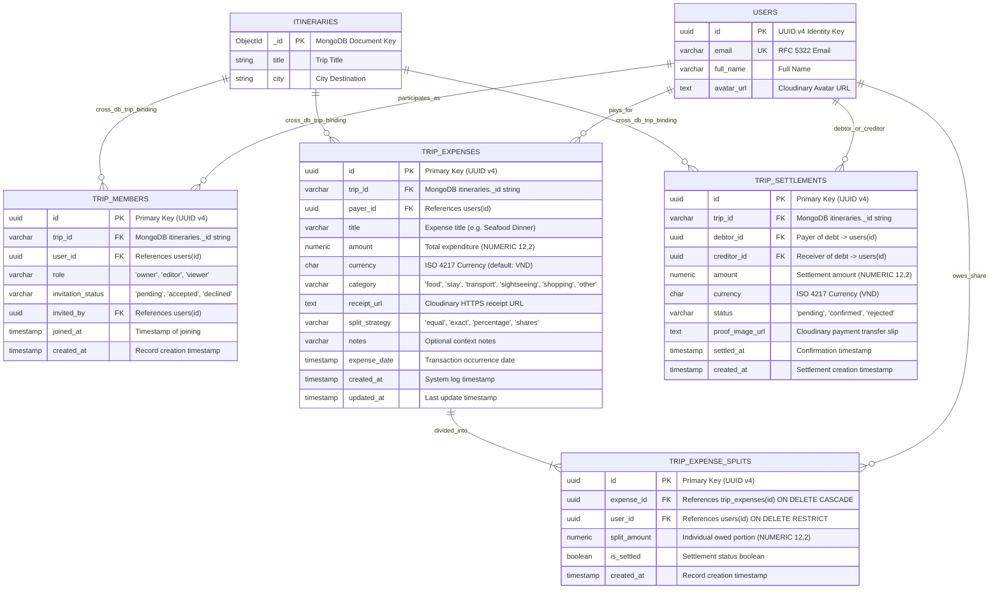

# 08. Core Database ERD: Trip Companionship, Group Expenses & Debt Settlement

## Nomadix — All-in-one Smart Travel Platform
**Final Year Project (FYP) — University of Greenwich**  
**Student:** Nguyễn Văn Đức  
**Standard:** Relational 3NF & Financial Precision Architecture (IEEE/ISO 25010)  
**Phase:** Day 6 — Database Analysis & ERD Modeling  
**Module Focus:** Module 4: Group Expense Tracking & Bill Splitting; Module 3: Collaborative Planning Extension  

---

## 1. ARCHITECTURAL OVERVIEW & DESIGN PRINCIPLES

Group travel coordination requires seamless multi-user collaboration coupled with rigorous financial bookkeeping. When travel companions share rooms, split taxi fares, and pool dining bills, minor mathematical rounding errors or uncommitted transactions cause disputes.

To guarantee zero data loss and absolute financial integrity, Nomadix enforces:

```
┌────────────────────────────────────────────────────────────────────────────────────────┐
│                   GROUP EXPENSE & COLLABORATION ARCHITECTURAL PRINCIPLES               │
├───────────────────────────────┬────────────────────────────────────────────────────────┤
│ Primary Financial Ledger      │ PostgreSQL 16 (Strict ACID, 3NF Normalization)         │
│ Monetary Standard             │ `NUMERIC(12, 2)` (Zero floating-point rounding errors) │
│ Invariant Principle           │ Net Balance Conservation: Σ(NetBalance_i) = 0          │
│ Optimization Algorithm        │ Greedy Minimum Cash-Flow Reduction (Max N-1 transfers) │
│ Bill Receipt Media Engine     │ Cloudinary CDN (/nomadix/receipts/{tripId}/)           │
│ Access Control Model          │ Role-Based: OWNER (full), EDITOR (log/edit), VIEWER    │
│ Cross-Database Binding        │ Stringified MongoDB ObjectId (`trip_id` in PostgreSQL) │
└───────────────────────────────┴────────────────────────────────────────────────────────┘
```

---

## 2. MERMAID ENTITY-RELATIONSHIP DIAGRAM (MODULE D)



---

## 3. DETAILED TABLE SPECIFICATIONS

### 3.1 Table `trip_members`
* **Purpose:** Manages group trip membership, roles, and invitation lifecycle.
* **Primary Key:** `id` UUID v4.
* **Unique Constraint:** `uq_trip_member UNIQUE(trip_id, user_id)`.

| Column | Data Type | Nullable | Default | Constraints / Foreign Keys | Index | Description |
|---|---|:---:|---|---|:---:|---|
| `id` | `UUID` | NO | `gen_random_uuid()` | PRIMARY KEY | PK Index | Unique member record ID |
| `trip_id` | `VARCHAR(50)` | NO | None | Logical FK ➔ `itineraries._id` | B-Tree | Shared itinerary identifier |
| `user_id` | `UUID` | NO | None | REFERENCES `users(id)` ON DELETE CASCADE | B-Tree | Companion user ID |
| `role` | `VARCHAR(20)` | NO | `'editor'` | CHECK (`role IN ('owner', 'editor', 'viewer')`) | None | Group permission level |
| `invitation_status` | `VARCHAR(20)` | NO | `'accepted'` | CHECK (`status IN ('pending', 'accepted', 'declined')`) | None | Invitation workflow state |
| `invited_by` | `UUID` | YES | NULL | REFERENCES `users(id)` ON DELETE SET NULL | None | Inviting user |
| `joined_at` | `TIMESTAMPTZ` | NO | `CURRENT_TIMESTAMP` | NOT NULL | None | Acceptance timestamp |
| `created_at` | `TIMESTAMPTZ` | NO | `CURRENT_TIMESTAMP` | NOT NULL | None | Invitation created timestamp |

### 3.2 Table `trip_expenses`
* **Purpose:** Primary ledger recording expenditures, payers, receipt attachments, and split strategies.
* **Primary Key:** `id` UUID v4.

| Column | Data Type | Nullable | Default | Constraints / Foreign Keys | Index | Description |
|---|---|:---:|---|---|:---:|---|
| `id` | `UUID` | NO | `gen_random_uuid()` | PRIMARY KEY | PK Index | Expense transaction ID |
| `trip_id` | `VARCHAR(50)` | NO | None | Logical FK ➔ `itineraries._id` | B-Tree | Target trip ID |
| `payer_id` | `UUID` | NO | None | REFERENCES `users(id)` ON DELETE RESTRICT | B-Tree | User who paid the bill upfront |
| `title` | `VARCHAR(150)` | NO | None | NOT NULL | None | Expense label (e.g. Seafood Lunch) |
| `amount` | `NUMERIC(12, 2)` | NO | None | CHECK (`amount > 0`) | None | Total expense amount |
| `currency` | `CHAR(3)` | NO | `'VND'` | NOT NULL | None | Currency code (VND) |
| `category` | `VARCHAR(30)` | NO | `'other'` | CHECK (`category IN ('food','stay','transport','sightseeing','shopping','other')`) | None | Spending category |
| `receipt_url` | `TEXT` | YES | NULL | None | None | Cloudinary HTTPS bill image URL |
| `split_strategy`| `VARCHAR(20)` | NO | `'equal'` | CHECK (`split_strategy IN ('equal','exact','percentage','shares')`) | None | Split calculation mode |
| `notes` | `VARCHAR(500)` | YES | NULL | None | None | Additional notes |
| `expense_date` | `TIMESTAMPTZ` | NO | `CURRENT_TIMESTAMP` | NOT NULL | B-Tree DESC | Time expense occurred |
| `created_at` | `TIMESTAMPTZ` | NO | `CURRENT_TIMESTAMP` | NOT NULL | None | Entry timestamp |
| `updated_at` | `TIMESTAMPTZ` | NO | `CURRENT_TIMESTAMP` | NOT NULL | None | Modification timestamp |

### 3.3 Table `trip_expense_splits`
* **Purpose:** Individual breakdown allocation defining each member's owed portion for an expense.
* **Primary Key:** `id` UUID v4.
* **Unique Constraint:** `uq_expense_user_split UNIQUE(expense_id, user_id)`.

| Column | Data Type | Nullable | Default | Constraints / Foreign Keys | Index | Description |
|---|---|:---:|---|---|:---:|---|
| `id` | `UUID` | NO | `gen_random_uuid()` | PRIMARY KEY | PK Index | Split record ID |
| `expense_id` | `UUID` | NO | None | REFERENCES `trip_expenses(id)` ON DELETE CASCADE | B-Tree | Associated expense record |
| `user_id` | `UUID` | NO | None | REFERENCES `users(id)` ON DELETE RESTRICT | B-Tree | Debtor member |
| `split_amount` | `NUMERIC(12, 2)` | NO | None | CHECK (`split_amount >= 0`) | None | Exact amount owed by this member |
| `is_settled` | `BOOLEAN` | NO | `false` | NOT NULL | None | Settlement flag |
| `created_at` | `TIMESTAMPTZ` | NO | `CURRENT_TIMESTAMP` | NOT NULL | None | Entry timestamp |

### 3.4 Table `trip_settlements`
* **Purpose:** Direct peer-to-peer settlement transactions computed by the Debt Simplification Engine.
* **Primary Key:** `id` UUID v4.
* **Integrity Check:** CHECK (`debtor_id <> creditor_id`).

| Column | Data Type | Nullable | Default | Constraints / Foreign Keys | Index | Description |
|---|---|:---:|---|---|:---:|---|
| `id` | `UUID` | NO | `gen_random_uuid()` | PRIMARY KEY | PK Index | Settlement transaction ID |
| `trip_id` | `VARCHAR(50)` | NO | None | Logical FK ➔ `itineraries._id` | B-Tree | Associated trip ID |
| `debtor_id` | `UUID` | NO | None | REFERENCES `users(id)` ON DELETE RESTRICT | B-Tree | Member transferring funds |
| `creditor_id` | `UUID` | NO | None | REFERENCES `users(id)` ON DELETE RESTRICT | B-Tree | Member receiving funds |
| `amount` | `NUMERIC(12, 2)` | NO | None | CHECK (`amount > 0`) | None | Settlement payment amount |
| `currency` | `CHAR(3)` | NO | `'VND'` | NOT NULL | None | Currency code |
| `status` | `VARCHAR(20)` | NO | `'pending'` | CHECK (`status IN ('pending', 'confirmed', 'rejected')`) | None | Settlement audit status |
| `proof_image_url` | `TEXT` | YES | NULL | None | None | Cloudinary bank slip receipt |
| `settled_at` | `TIMESTAMPTZ` | YES | NULL | None | None | Time creditor confirmed receipt |
| `created_at` | `TIMESTAMPTZ` | NO | `CURRENT_TIMESTAMP` | NOT NULL | None | Transaction initiation time |

---

## 4. MATHEMATICAL & ALGORITHMIC FOUNDATIONS

### 4.1 Net Balance Calculation & Conservation Invariant
For any trip with $N$ members $M = \{u_1, u_2, \dots, u_N\}$:
1. **Total Paid by User $u$:**
   $$\text{Paid}(u) = \sum_{e \in \text{Expenses}, \text{payer}(e) = u} \text{amount}(e)$$
2. **Total Owed by User $u$:**
   $$\text{Owed}(u) = \sum_{s \in \text{Splits}, \text{debtor}(s) = u} \text{split\_amount}(s)$$
3. **Net Financial Position:**
   $$\text{NetBalance}(u) = \text{Paid}(u) - \text{Owed}(u)$$
4. **Conservation of Value Invariant:**
   $$\sum_{i=1}^N \text{NetBalance}(u_i) = 0$$

### 4.2 Greedy Debt Simplification Algorithm
Without optimization, settling debts pair-by-pair requires up to $\frac{N(N-1)}{2} = O(N^2)$ transactions.
Nomadix applies a **Greedy Minimum Cash-Flow Reduction** using two priority queues (Max-Heaps) to resolve all debts in at most $N - 1$ payments:

```typescript
interface DebtSettlement {
  debtorId: string;
  creditorId: string;
  amount: number;
}

export function simplifyDebts(netBalances: Map<string, number>): DebtSettlement[] {
  // 1. Separate debtors (< 0) and creditors (> 0)
  const debtors: { userId: string; amount: number }[] = [];
  const creditors: { userId: string; amount: number }[] = [];

  netBalances.forEach((balance, userId) => {
    const rounded = Math.round(balance * 100) / 100;
    if (rounded < -0.01) debtors.push({ userId, amount: -rounded });
    else if (rounded > 0.01) creditors.push({ userId, amount: rounded });
  });

  debtors.sort((a, b) => b.amount - a.amount);
  creditors.sort((a, b) => b.amount - a.amount);

  const settlements: DebtSettlement[] = [];
  let i = 0; // debtor index
  let j = 0; // creditor index

  while (i < debtors.length && j < creditors.length) {
    const settleAmount = Math.min(debtors[i].amount, creditors[j].amount);
    settlements.push({
      debtorId: debtors[i].userId,
      creditorId: creditors[j].userId,
      amount: Math.round(settleAmount * 100) / 100,
    });

    debtors[i].amount -= settleAmount;
    creditors[j].amount -= settleAmount;

    if (debtors[i].amount < 0.01) i++;
    if (creditors[j].amount < 0.01) j++;
  }

  return settlements;
}
```

---

## 5. PRODUCTION POSTGRESQL DDL IMPLEMENTATION

```sql
-- ============================================================================
-- NOMADIX MODULE D: TRIP COMPANIONSHIP & GROUP EXPENSE LEDGER DDL
-- ============================================================================

-- 1. Trip Membership Directory
CREATE TABLE trip_members (
    id UUID PRIMARY KEY DEFAULT gen_random_uuid(),
    trip_id VARCHAR(50) NOT NULL,
    user_id UUID NOT NULL REFERENCES users(id) ON DELETE CASCADE,
    role VARCHAR(20) NOT NULL DEFAULT 'editor'
        CHECK (role IN ('owner', 'editor', 'viewer')),
    invitation_status VARCHAR(20) NOT NULL DEFAULT 'accepted'
        CHECK (invitation_status IN ('pending', 'accepted', 'declined')),
    invited_by UUID REFERENCES users(id) ON DELETE SET NULL,
    joined_at TIMESTAMPTZ NOT NULL DEFAULT CURRENT_TIMESTAMP,
    created_at TIMESTAMPTZ NOT NULL DEFAULT CURRENT_TIMESTAMP,
    CONSTRAINT uq_trip_member UNIQUE (trip_id, user_id)
);

CREATE INDEX idx_trip_members_trip ON trip_members(trip_id);
CREATE INDEX idx_trip_members_user ON trip_members(user_id);

-- 2. Master Expenditure Ledger
CREATE TABLE trip_expenses (
    id UUID PRIMARY KEY DEFAULT gen_random_uuid(),
    trip_id VARCHAR(50) NOT NULL,
    payer_id UUID NOT NULL REFERENCES users(id) ON DELETE RESTRICT,
    title VARCHAR(150) NOT NULL,
    amount NUMERIC(12, 2) NOT NULL CHECK (amount > 0),
    currency CHAR(3) NOT NULL DEFAULT 'VND',
    category VARCHAR(30) NOT NULL DEFAULT 'other'
        CHECK (category IN ('food', 'stay', 'transport', 'sightseeing', 'shopping', 'other')),
    receipt_url TEXT,
    split_strategy VARCHAR(20) NOT NULL DEFAULT 'equal'
        CHECK (split_strategy IN ('equal', 'exact', 'percentage', 'shares')),
    notes VARCHAR(500),
    expense_date TIMESTAMPTZ NOT NULL DEFAULT CURRENT_TIMESTAMP,
    created_at TIMESTAMPTZ NOT NULL DEFAULT CURRENT_TIMESTAMP,
    updated_at TIMESTAMPTZ NOT NULL DEFAULT CURRENT_TIMESTAMP
);

CREATE INDEX idx_trip_expenses_trip ON trip_expenses(trip_id);
CREATE INDEX idx_trip_expenses_payer ON trip_expenses(payer_id);
CREATE INDEX idx_trip_expenses_date ON trip_expenses(expense_date DESC);

-- 3. Individual Expense Splits Allocation
CREATE TABLE trip_expense_splits (
    id UUID PRIMARY KEY DEFAULT gen_random_uuid(),
    expense_id UUID NOT NULL REFERENCES trip_expenses(id) ON DELETE CASCADE,
    user_id UUID NOT NULL REFERENCES users(id) ON DELETE RESTRICT,
    split_amount NUMERIC(12, 2) NOT NULL CHECK (split_amount >= 0),
    is_settled BOOLEAN NOT NULL DEFAULT false,
    created_at TIMESTAMPTZ NOT NULL DEFAULT CURRENT_TIMESTAMP,
    CONSTRAINT uq_expense_user_split UNIQUE (expense_id, user_id)
);

CREATE INDEX idx_trip_expense_splits_expense ON trip_expense_splits(expense_id);
CREATE INDEX idx_trip_expense_splits_user ON trip_expense_splits(user_id);

-- 4. Debt Settlements Table
CREATE TABLE trip_settlements (
    id UUID PRIMARY KEY DEFAULT gen_random_uuid(),
    trip_id VARCHAR(50) NOT NULL,
    debtor_id UUID NOT NULL REFERENCES users(id) ON DELETE RESTRICT,
    creditor_id UUID NOT NULL REFERENCES users(id) ON DELETE RESTRICT,
    amount NUMERIC(12, 2) NOT NULL CHECK (amount > 0),
    currency CHAR(3) NOT NULL DEFAULT 'VND',
    status VARCHAR(20) NOT NULL DEFAULT 'pending'
        CHECK (status IN ('pending', 'confirmed', 'rejected')),
    proof_image_url TEXT,
    settled_at TIMESTAMPTZ,
    created_at TIMESTAMPTZ NOT NULL DEFAULT CURRENT_TIMESTAMP,
    CONSTRAINT chk_debtor_creditor_diff CHECK (debtor_id <> creditor_id)
);

CREATE INDEX idx_trip_settlements_trip ON trip_settlements(trip_id);
CREATE INDEX idx_trip_settlements_debtor ON trip_settlements(debtor_id);
CREATE INDEX idx_trip_settlements_creditor ON trip_settlements(creditor_id);
```
