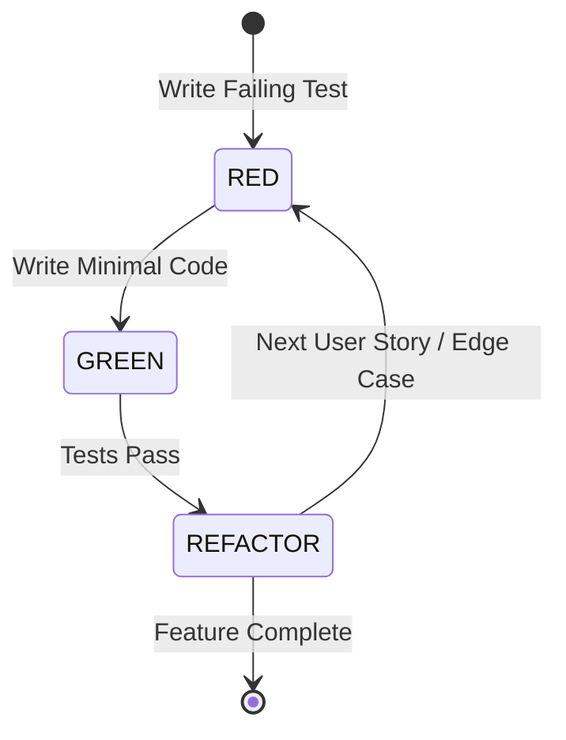

# System Patterns: Nomadix Architecture & Engineering Standards

## 1. Architectural Style & 5-Tier Structure

Nomadix adopts a **Microservice-ready Modular Monolith** architecture backend powered by Node.js/Express, communicating with a **React Native** cross-platform mobile client:

```
┌────────────────────────────────────────────────────────────────────────┐
│               TIER 1: CLIENT PRESENTATION (REACT NATIVE)               │
│ Screens, Atomic Components, Redux Toolkit/Zustand, React Native Maps   │
└───────────────────────────────────┬────────────────────────────────────┘
                                    │ HTTPS / JWT Auth Header
                                    ▼
┌────────────────────────────────────────────────────────────────────────┐
│            TIER 2: API GATEWAY & SECURITY MIDDLEWARE (EXPRESS)         │
│ CORS, Helmet, Rate Limiter (Redis), Joi Input Validation, JWT Auth     │
└───────────────────────────────────┬────────────────────────────────────┘
                                    │ Validated DTOs
                                    ▼
┌────────────────────────────────────────────────────────────────────────┐
│             TIER 3: CORE DOMAIN & APPLICATION SERVICE LAYER            │
│ AuthService, ItineraryService, TripCollaborationService,               │
│ GroupExpenseService, DebtSimplificationEngine, GamificationService     │
└───────────────────────────────────┬────────────────────────────────────┘
                                    │ Business Operations
                                    ▼
┌────────────────────────────────────────────────────────────────────────┐
│               TIER 4: ADAPTER & EXTERNAL INTEGRATION LAYER             │
│ AmadeusAdapter, RapidAPIHotelAdapter, GoogleMapsAdapter, Cloudinary    │
│ (Equipped with Circuit Breaker & Resilient Mock Fallbacks)             │
└───────────────────────────────────┬────────────────────────────────────┘
                                    │ Storage Operations
                                    ▼
┌────────────────────────────────────────────────────────────────────────┐
│              TIER 5: POLYGLOT PERSISTENCE LAYER (3 ENGINES)            │
│   PostgreSQL 16 (ACID)   │  MongoDB Atlas 7 (Documents)  │  Redis 7    │
└──────────────────────────┴───────────────────────────────┴─────────────┘
```

---

## 2. Polyglot Persistence Standardization

Each database engine is deployed exclusively according to its native architectural strength:

```text
┌────────────────────────────────────────────────────────────────────────────────────────┐
│                        POLYGLOT RESPONSIBILITY MATRIX                                  │
├─────────────────┬──────────────────────────────────────┬───────────────────────────────┤
│ Database Engine │ Primary Domain Responsibilities      │ Architectural Rationale       │
├─────────────────┼──────────────────────────────────────┼───────────────────────────────┤
│ PostgreSQL 16   │ • Identity, Users & RBAC (9 tables)  │ Strict ACID transactions,     │
│ (Relational)    │ • Cultural Landmarks & Badges (7)    │ 3NF normalization, zero float │
│                 │ • Bookings & Manifests (8)           │ rounding error NUMERIC(12, 2) │
│                 │ • Group Expenses & Splits (4 tables) │ for shared expense ledgers.   │
├─────────────────┼──────────────────────────────────────┼───────────────────────────────┤
│ MongoDB Atlas 7 │ • Itineraries & Multi-Day Timelines  │ Flexible polymorphic schemas, │
│ (Document)      │ • Squad Collaborators sub-array      │ 1:Few embedded documents,     │
│                 │ • Community Forum Q&A & Answers      │ sub-15ms single-trip reads,   │
│                 │ • Moderation Reports Queue           │ GeoJSON 2dsphere indexing.    │
├─────────────────┼──────────────────────────────────────┼───────────────────────────────┤
│ Redis 7         │ • Flight Search Cache (1800s TTL)    │ Sub-50ms RAM latency,         │
│ (In-Memory)     │ • Hotel Search Cache (3600s TTL)     │ automatic TTL eviction,       │
│                 │ • Landmark Static Cache (24h TTL)    │ rate limiting counter,        │
│                 │ • IP Rate Limiting & Nonce Checks    │ external API quota protection.│
└─────────────────┴──────────────────────────────────────┴───────────────────────────────┘
```

### 2.1 Relational Financial Ledger Standard (PostgreSQL)
* All monetary amounts MUST use `NUMERIC(12, 2)` (e.g. `amount NUMERIC(12, 2) NOT NULL CHECK (amount > 0)`). Never use `FLOAT` or `DOUBLE PRECISION`.
* Every group expense creation and debt settlement MUST execute inside a database transaction:
  ```sql
  BEGIN;
  INSERT INTO trip_expenses (...) VALUES (...);
  INSERT INTO trip_expense_splits (...) VALUES (...);
  COMMIT;
  ```
* Mathematical Invariant: Net balance across all squad members must sum to zero:
  $$\sum_{i=1}^N \text{NetBalance}_i = 0$$

### 2.2 Flexible Itinerary Document Standard (MongoDB)
* **Embedded 1:Few Sub-documents:** Days and stops are fully embedded inside the parent `itineraries` document (`itineraries` $\rightarrow$ `days[]` $\rightarrow$ `items[]` $\rightarrow$ `transitToNext`).
* **Collaborator Array:** Shared trip squad members are embedded directly as:
  ```typescript
  collaborators: [{
    userId: string; // PostgreSQL users(id) UUID string
    role: "OWNER" | "EDITOR" | "VIEWER";
    status: "PENDING" | "ACCEPTED" | "DECLINED";
    joinedAt: Date;
  }]
  ```
* **Compound Indexing:** `db.itineraries.createIndex({ "collaborators.userId": 1 })` ensures instantaneous retrieval of all trips shared with a user.

### 2.3 Cross-Database Referential Integrity Pattern
No physical foreign keys exist across database boundaries. Referential integrity is strictly maintained at the Application Service Layer:
* **PostgreSQL $\rightarrow$ MongoDB:** MongoDB documents store PostgreSQL `users(id)` UUIDs as indexed strings (`userId`).
* **MongoDB $\rightarrow$ PostgreSQL:** PostgreSQL tables (`trip_members`, `trip_expenses`, `trip_settlements`) store MongoDB `itineraries._id` strings in indexed `trip_id VARCHAR(50)` columns.

---

## 3. API Communication & Security Protocols

### 3.1 RESTful Endpoint Standards
* Resource-oriented URLs using plural nouns: `/api/v1/trips/:tripId/expenses`
* Consistent HTTP status codes: `200 OK`, `201 Created`, `400 Bad Request`, `401 Unauthorized`, `403 Forbidden`, `404 Not Found`, `422 Unprocessable Entity`, `500 Internal Error`.
* Mandatory Envelope Response Format:
  ```json
  // Success Response
  {
    "success": true,
    "data": { ... },
    "meta": { "timestamp": "2026-09-28T15:50:00Z", "pagination": { ... } }
  }

  // Error Response
  {
    "success": false,
    "error": {
      "code": "EXPENSE_SPLIT_MISMATCH",
      "message": "Sum of split amounts does not equal total expense amount",
      "details": []
    }
  }
  ```

### 3.2 Authentication & Token Rotation Protocol
* **Dual-Token Scheme:**
  * Short-lived Access Token (JWT, 15-minute expiry) carried in `Authorization: Bearer <token>`.
  * Refresh Token (7-day expiry) stored as a secure, HTTP-only cookie and verified against a SHA-256 hash in PostgreSQL `user_refresh_tokens`.
* **Refresh Token Rotation (RTR):** Every refresh request issues a new token pair and revokes the old refresh token to prevent replay attacks.

---

## 4. Extreme Programming (XP) & Mandatory TDD Laws

Nomadix enforces strict **Test-Driven Development (TDD)** following the **Red-Green-Refactor** discipline for all backend services, mathematical algorithms, and critical UI state reducers:



### 4.1 The Three Immutable Laws of TDD
1. **Law of RED:** You are NOT allowed to write any production code unless it is to make a failing unit/integration test pass.
   * Tests must fail for the *expected reason* (asserting actual behavior, not syntax errors).
2. **Law of GREEN:** You must write only the *minimal production code* necessary to make the failing test pass. Do not speculate or add premature features.
3. **Law of REFACTOR:** Once tests are passing green, clean up code structure, eliminate duplicate logic, enforce clean code standards, and optimize algorithms while ensuring 100% of tests continue to pass.

### 4.2 Required Testing Stack & Coverage Thresholds
* **Unit & Integration Testing (Backend):** Jest + Supertest (mocking external APIs, validating PostgreSQL rollback transactions).
* **Component & Hook Testing (Mobile):** React Native Testing Library (RNTL) + Jest.
* **End-to-End Testing (Mobile):** Detox (simulating full user journeys: login $\rightarrow$ plan trip $\rightarrow$ upload bill $\rightarrow$ check balance).
* **Coverage Standards:**
  * $\ge 85\%$ Branch Coverage on core business services (`GroupExpenseService`, `DebtSimplificationEngine`, `GeofenceVerification`).
  * $100\%$ Statement Coverage on debt simplification algorithms and mathematical balance conservation tests.
